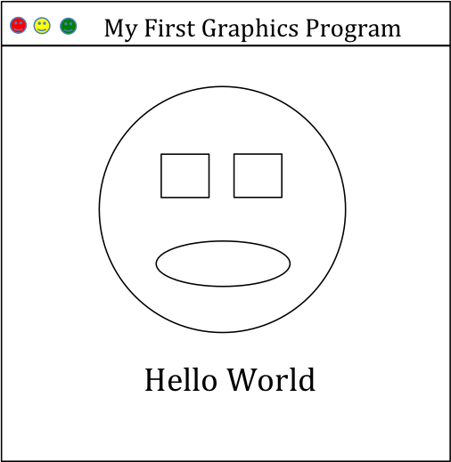

## First Graphics Program

**Points**: Complete this entire section for 10 points.

Create a Java Graphics program that has a ```JPanel``` added to a ```JFrame```.  Overide the ```JPanel’s paintComponent()``` method so that it draws the following window.  You can fill you eyes and mouth with a color if you like.  You are also welcome to add other shapes and text to your window.

 

