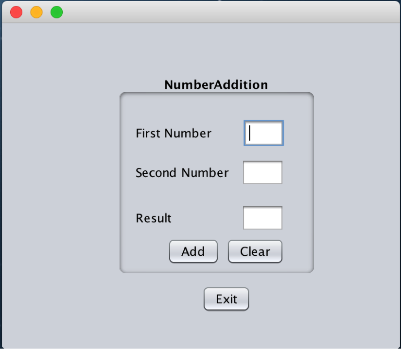

## Netbeans GUI Builder

**Points**: Complete this entire section for 10 points.

This section contains my notes when using the NetBeans GUI builder.  The following link is the Netbeans description of these steps.  You may use either to complete this section.

[Netbeans Description](https://netbeans.org/kb/docs/java/gui-functionality.html)`

This exercise creates a simple adder that looks like the following.

 
 


The Steps to creating this simple adder using the Netbeans GUI builder are the following.

1. Create a project.  Similar to creating a regular project.  
   * a. File > New Project, Java Application, Next, 
   * b. NumberAddition is project name (place in desired folder)
   * c. Deselect Create Main Class checkbox
   * d. Finish

2. Create a JFrame container.  This step creates a top-level JFrame in the Design Panel which you can drag and drop GUI components onto it to build the front-end of your GUI.
   * a. Right-click on NumberAddtion, select New > Other
   * b. In New File dialog box, chose Swing GUI Forms category and the JFrame Form type. Next.
   * c. Enter NumberAdditionUI as class name and my.numberaddition as package.
   * d. Finish

3. Using the Design Panel’s Palette to drag and drop the GUI components on your front end.  The Palette has several categories.  This program uses two categories: Container and Controls.
   * a. Drop a Panel from the Container category.  This is a JPanel that will be in your JFrame.  The JPanel will hold all of the Control components except for the Exit button.  Size the Panel appropriately.  We add the Name Number addition to the Panel by the following.
     * i. Right-click, Properties, ellipsis button next to Border
     * ii. Select Titled Border
     * iii. Change the Title in this Panel to be Number Addition, OK
   * b. Drop 3 labels, 3 text fields, and 2 buttons on your Panel arranged as shown above.  Drop another button on your JFrame (outside of your Panel) that will be the Exit button.  At this point the control components have names like jLabel1, jTextField1, etc.
   * c. Edit the control components (double click slowly on them) so they have the correct names.  First Number, Second Number, etc.  You should make the text fields to be blank.  Make sure the text fields are editable.  Right-click, Properties, edit text check box.  I think they are editable by default.
   * d. You can preview the look of your panel by clicking on the Preview button.  Has an eye-ball in the icon.

4. Adding semantics to your panel so that it actually processes numbers and buttons.  We do this by adding actions to our three buttons.  The steps are similar for each button.
   * a. Exit Button – Right-click on Exit button, select Events > Action > actionPerformed.  This takes you from the Design Panel to the Edit Panel, which is the Netbeans editor we have been using.  You will be placed in the source code such that you are editing the method jButton3ActionPerformed, which is called with the Exit button is selected.  The jButton3ActionPerformed method is an event handler that is called with the Exit button is selected.
     * i. Replace the // TODO comment with System.exit(0);
     * ii. Select Design (at the top of the edit window next to Source) to go back to the GUI designer.
   * b. Clear Button – Right-click on the Clear button, select Events > Action > actionPerformed just like you did for the exit button.  You will edit the Clear button event handler, jButton2ActionPerformed.
     * i. Replace the //TODo comment with the following lines of code.

       ```java
       jTextField1.setText("");
       jTextField2.setText("");
       jTextField3.setText("");
       ```

     * ii. You should realize that the three JFields you dropped on the Panel are variables names jTextField1, jTextField2, and jTextField3.  These variable reference JTextField objects so you are simply calling methods to put an empty string in them.
   * c. Add Button – Right-click on the Add button, select Events > Action > actionPerformed.  You will edit the Add button event handler, jButton1ActionPerformed.
     * i. Replace the //TODO comment with the following lines of code.
       ```java
       double num1, num2, result;
       num1 = Double.parseDouble(jTextField1.getText());
       num2 = Double.parseDouble(jTextField2.getText());
       result = num1 + num2;
       jTextField3.setText(String.valueOf(result));
       ```
     * ii. You should realize this is basic programming.

5. Run your program.  You may have to select my.NumberAddition.NumberAdditionUI as the main class.

6. Creating a stand-alone JAR file for your NumberAddition program.
   * a. Select Run > Clean and Build Main Project
   * b. This creates the file NumberAddition/dist/NumberAddition.jar file.  You can double click on NumberAddition.jar to run your program.

