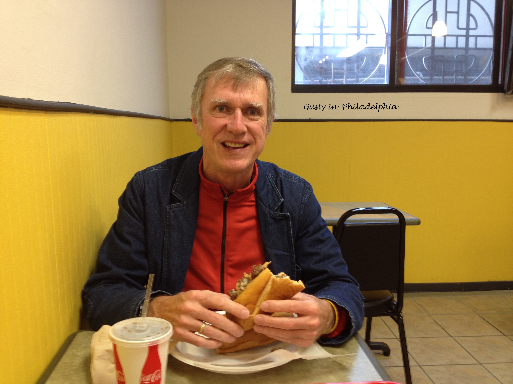

## About Gusty

* Gusty is an older gentleman who has written a lot of software, including the following.

  * operating systems
  * file systems
  * network stack
  * network applications
  * compilers
  * linkers
  * real-time software that prepares a guidance system for launch

* Gusty retired from the Naval Surface Warfare Center in September 2011 after almost 34 years.

* Gusty began teaching at UMW in January 2012.

* Gusty has taught CPSC 110, CPSC 125, and CPSC 220.

* Gusty and Jerri Anne have three grown children - Jeremy, Zachary, and Emily.
  * Jeremy is married to Brandalee and they have one daughter - Coletta

* Coletta's name for Gusty is Pop-pop.

* Some of Gusty's hobbies are the following.
  * Bicycle riding.  Gusty has about a dozen bicycles.  He mostly rides his Gold Rush Replica (a recumbent) and his Motobecane (a titanium road bicycle).  He and Jerri Anne ride a tandem.

  * Guitar playing.  Gusty is a self-taught guitarist and is mostly a hack.  He plays in his church praise band.  As long as the songs have basic chords that do not change too fast, he does ok.

  * Bird watching.  Gusty can identify most birds that frequent his backyard feeder.

  * Programming.  Gusty programs for enjoyment.

* The following is a photo of Gusty eating a Philly Cheestake in downtown Philiadelphia.

 

