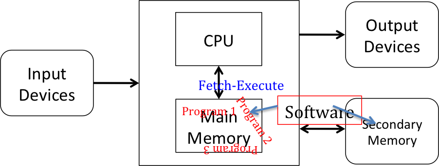
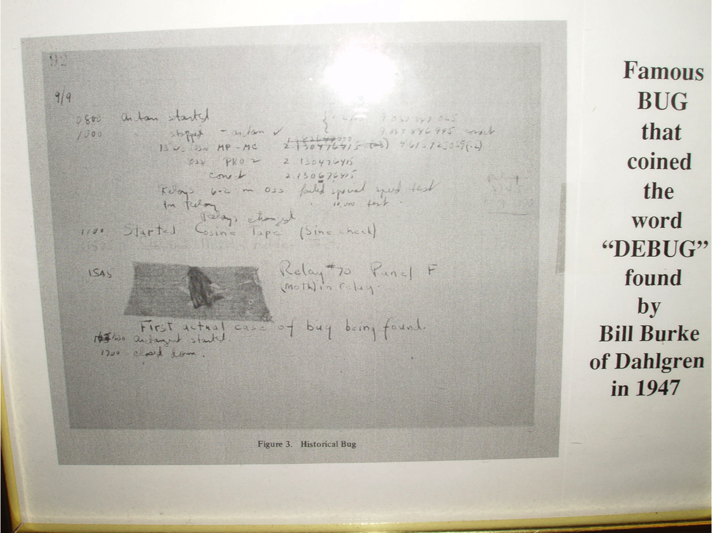
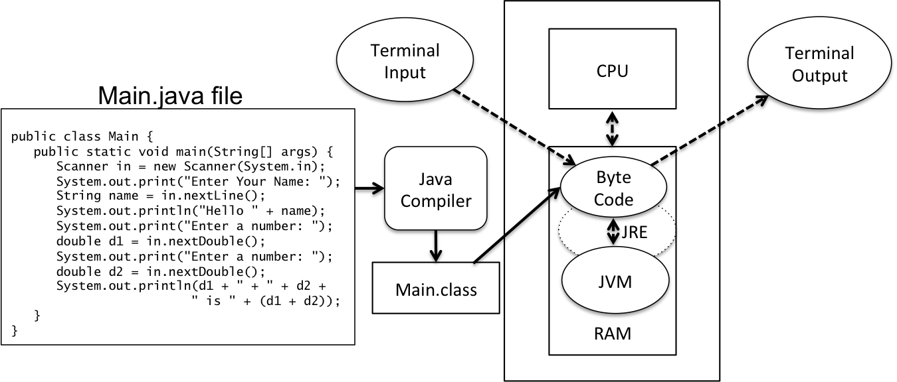

## Program Attributes - Algorithms and Data Structures

The primary goal of CPSC 220 is for everyone to learn how to solve problems in Java.  To do this we will create Java programs that consist of algorithms and data structures.  We have already studied the following concepts, which we will connect together into Java programming.

* people and computers receive information, store and manipluate information, and generate information
* a model of a computer that has input, output, CPU, RAM, and secondary memory
* problem solving
* algorithms
  * accept input
  * manipulate information and are constructed with 
    * sequential steps
    * conditional steps
    * looping steps
    * calling chunks of algorithms that are bottled in a method
  * produce output
* numbers information in computers
* characters information in computers
* Java primitive types

Writing a program is primarily creating algorithms and data structures that solve the problem.  We have a general feel for algorithms that we studied in <a href="{{ "/mydoc_1_algorithms" | prepend: site.baseurl }}">Algorithms</a>.  We began our study of data structures with Java primitive types in [Primitive Types](/gustycooper.github.io/mydoc_1_primitive_types).  We will now create our first Java programs using Java primitive types and some simple intutive control flow.  This will be done precisely inorder to adhere to Java syntax. 

## Programming Languages - Syntax and Semantics

Recall from <a href="{{ "/mydoc_1_problem_solving" | prepend: site.baseurl }}">Problem Solving</a> that we learned knowledge that and knowledge how.  Knowledge that is just facts that you stick in your brain.  Knowledge how is knowing how to do things.  Programming involves both types of knowledge.  Our study of programming involves the following.

* Programming language syntax
  * This is knowledge that
  * The syntax can be tedious and you have to understand it.
  * Programming language syntax is similar to the syntax (or punctuation) of our natural languages.  
* Creating an algorithm and its data structures that solves a problem
  * This is knowledge how
  * This is the semantics or meaning of our program.
  * This is creative that gets better the more you practice.
  * This is the part we really want to learn this semester, and we have lots of labs and projects on which to practice

## First Java Program

Recall from [Problem Solving](/gustycooper.github.io/mydoc_1_problem_solving) we learned about problem solving patterns, including our first pattern - Main Program, which is repeated here.  You should notice that the ```main``` method must be placed within a Java ```class```.  You will learn the details of classes in [Simple Objects](/gustycooper.github.io/mydoc_3_simple_objects) If you did not type it in during your study of Problem Solving, you should do so as you study this section and complete Lab 1.

<div class="alert alert-danger" role="alert"><i class="fa fa-delicious fa-lg"></i>
<b>
Programming Pattern: Main Program Pattern
</b>
<br>
<pre>
public class Main {
   public static void main(String[] args) {
      System.out.println("Hello World");
   }
}
</pre>
</div>

All programs have a main entry point, which by convention is a method named ```main```.  In this section, we will learn a few details about the Main Pattern.  We will eventually understand all of the details contained in the Main Pattern; however at this time you should simply understand that every program has a ```main``` entry point. 

## Java Syntax – Just Enough for Our First Programs

Java syntax can be a bit confusing at first, as it has strategically placed semicolons, curly braces, and parentheses.  The following is just enough syntax to complete our first programs.

* Comments - Java has several forms of comments.

  ```java
  int x = 0;  // Comment goes to end of line
  /* 
     Mulitple line
     comment
   */
  
  /** 
   * JavaDoc comment - we will study in Simple Objects
   */
  ```

* Semicolon – a single statement is terminated with a semicolon.  For example an assignment statement,

  ```java
  x = 3.0;
  ```

* Curly braces – a block of statements is enclosed by curly braces {}.  The closing curly brace is not terminated by a semicolon.  For example the Main Pattern shows curly braces.  Notice there is not a ; after the closing curly brace.

  ```java
  public class Main {
     public static void main(String[] args) {
        System.out.println("Hello World");
     }
  }
  // the following is a block of statements
  {
     x = 3.0;        
     i = 32000;      
     long l = 32000;  // declares l and assigns it a value
  }
  ```

* Parentheses have several uses.  In expressions, parentheses force a specific evaluation order.  We will study the details of expressions in [Expressions](/gustycooper.github.io/mydoc_2_expressions).  The following example shows parentheses to force addition before multiplication.

  ```java
  (a + b) * c;
  ```

* In conditionals and loops, parentheses enclose the controlling expressions of conditionals and loops and curly braces denote a block of statements.  We will study the details of control flow in [Control Flow](/gustycooper.github.io/mydoc_4_control_flow).  We will not use conditionals and loops in our first programs.  The following if statement demonstrates parentheses, curly braces, and semicolons

  ```java
  if (a < b) {
      a = b;
  } else {
      b = a;
  }
  ```

* We will study the details of method defintion and calling in [Methods](/gustycooper.github.io/mydoc_methods).  For now, you should rely upon your previous knowledge of defining and calling functions.

* In method definitions, parenthesis enclose the formal parameters.  For example, the ```main``` method in the Main Pattern has parentheses enclosing the formal parameter ```String[] args```.

  ```java
  public static void main(String[] args) 
  ```

* In calling methods, parentheses enclose the actual parameters.  For example, the call to ```System.out.println``` has parentheses enclosing the actual parameter ```"Hello World"```.  Do not fret about the dotted notation in ```System.out.println```.  We will study this in [Simple Objects](/gustycooper.github.io/mydoc_3_simple_objects).

  ```java
  System.out.println("Hello World");
  ```

* The spacing in Java does not make any difference.  The previous if statement can be coded as follows.

  ```java
  if(a<b){a=b;}else{b=a;}
  ```

* You should establish a good programming style that makes your code easy to read.  You can examine programming style in [Programming Style](/gustycooper.github.io/mydoc_A_programming_style).

* There are other syntax rules such as operators in expressions, keywords for if statements, keywords for loops, etc.  We will tackle these as we move forward.

## Java is a Strongly Typed Language

All variables in Java have a specific type, for example ```int``` or ```double```.  Once you have a variable of a specific type, you cannot change the type – for example an ```int``` variable will always be an ```int```.  Sometimes you have to convert from one type to another, and there are some cases where Java will automatically perform the type conversion.  For example, if you mix ```int``` and ```double``` in expressions, Java will automatically convert the ```int``` to a ```double```.  This makes sense intuitively.  The following demonstrates this automatice conversion from ```int``` to ```double```.

```java
int i = 10;
double d = 3.5;
double dd = d * i + 7; // result is 42.0
```

In other cases, Java considers mixed types an error; however, you can use casting to convert the type of a variable.  Suppose I have the following two variables defined.

```java
int number = 4;
byte byteVariable = 120;
```

We know that an ```int``` is four-bytes while a ```byte``` is just a single byte.  This means the set of values for the variable ```number``` is much larger that the set of values for the variable ```byteVariable```.  Because of the strong typing rules, the following assignment is illegal in Java, resulting in an error messages similar to ```Error: incompatible types: possible lossy conversion from int to byte```.

```java
byteVariable = number; // illegal assignment
```

However, we know that the current value in number is 4, which easily fits into a byte (or 8-bits).  We can cast the ```int``` to a ```byte``` to make the assignment legal.

```java
byteVariable = (byte)number; // legal assignment with (byte) cast
```

The previous example cast a ```int``` variable to a ```byte``` variable.  The following example code demonstrates casting a ```double``` to a ```int```.  You should realize that you can cast an entire expression, which is also shown in the example.  You should also realize casting a ```double``` to an ```int``` truncates the fractional part.  If you want to round-up, you should use the ```Math.round``` method, which must be cast to an ```int``` since it returns a ```long```.

```java
int number = 4;
double myPi = 3.14159;
number = (int)myPi;      // number is  3, fraction is truncated
number = (int)(3.4 * 2); // number is 6, fraction is truncated
number = (int)Math.round(3.4 * 2); // number is 7
```

## Java Assignment Statement

The most used statement in programming is an assignment statement.  Everyone is familiar with assignment statements, and we have used several assignment statements in discussions prior to this.  The meta language for assignment statement is as follows.

<div class="alert alert-info" role="alert"><i class="fa fa-language fa-lg"></i>
<b>
Meta Language - Assignment Statement
</b>
<br>
<pre>
&lt;variable-name&gt; = &lt;exp&gt;;
</pre>
</div>

* = is the assignment operator
  * The assignment operator is just like the other operators.  We will study this attribute of the the assignment operator in [Expressions](/gustycooper.github.io/mydoc_2_expressions).
* ```<variable-name>``` is a variable that has previously been declared.
* ```<exp>``` evaluates to the same type as ```<variable-name>```

The following are some example Java assignment statements where in each case the ```<exp>``` is simply a literal.  You understand expressions from your previous study.  We will study the details of expressions in [Expressions](/gustycooper.github.io/mydoc_2_expressions).

```java
x = 3.0;        
i = 32000;      
long l = 32000;  // declares l and assigns it a value
String s;
s = "Silly";
char c;
c = 'c';
```

## Java ```String```s - Just Enough for our First Programs

```String```s are probably the most used type in programming, and we will use them in our first programs.  ```String``` is a Java type, but ```String``` is **not** a Java primitive type.  We study the details of Java ```String``` in [Strings](/gustycooper.github.io/mydoc_3_strings).  For now we learn just enough to use ```String```s in our first programs.

* A ```String``` is a sequence of characters.  A ```String``` is not a ```char```.  A ```char``` is a single character.  You should realize that ```'a'``` is a ```char``` literal and ```"a"``` is a ```String``` literal.  ```'a'``` and ```"a"``` are two different literals.  

* A ```String``` literal is a sequence of characters enclosed in the double tic-mark quotation.

  ```java
  "This is a string literal"
  "a" // a String with 1 character
  // "a" is not the same as 'a'
  "" // empty String, a String with 0 characters
  ```

* A ```String``` variable is declared using the same technique as we used for declaring variables of primitive types.  We can assign an initial value to a ```String``` variable when it is declared.

  ```java
  String s = "String s is initialized";
  String t; // String t is not initialized
  ```

* ```String```s are concatenated with the + operator.

  ```java
  String gusty = "Gusty";
  String cooper = "Cooper";
  String gustyCooper = gusty + " " + cooper;
  ```

* Java converts primitive types to ```String``` when concatenated.

  ```java
  String gusty = "Gusty" + 23; // gusty is "Gusty23"
  int i = 5;
  String s = "" + 5; // s is "5"
  ```

## Input and Output

Our computer model has input and output.  A computer is a machine that stores and manipulates information under the control of a changeable program.  Our programs have the following attributes. 

* Input – there is input to our program.  Our programs read input into variables, which contain the information to be manipulated. The variables are data structures.  At this point we do not have a complete understanding of data structures; however, we understand simplest of data structures, which is just a variable that is one of the Java primitive data types.  Later we learn to create more complex data structures.
* Algorithms – our program have various algorithms that transform information from one format to another.  Transformations often require our programs to create various intermediate forms of data structures.  
* Output – our program generates some output based upon the input and our algorithms and data structures.

On the following diagram, our programs are in RAM and they execute on the CPU transforming the input into output.

 

There can be various input and output devices.  The following are examples.

* Input
  * a touch panel on a smart phone - like when you touch an icon on your phone.
  * a little keyboard drawn in a smart phone.
  * a laptop keyboard connected to a window on a laptop - like when you are editing a document.
  * a mouse or touch panel connected to windows and icons on a laptop.
  * a thermostat on a home heating and cooling system.
  * a brake pedal in a car
* Output
  * a display on a smart phone
  * a display on a laptop
  * a control system on a home heating and cooling system.
  * a disc brake caliper in a car

The first input and output device that we will study is a **terminal window**.  This is a window on a laptop that displays text and allows a user to type on the keyboard to enter text.  Sometimes a terminal window is called a **console window**.  UNIX and LINUX provide a terminal window for interacting them.  Our CPSC 225 class teaches you how to use UNIX and LINUX.

## Output Programming Pattern

Our initial Java programs write output to the Java standard output stream, which is connected to a terminal window.  All Java implementations support standard output, including BlueJ and Netbeans. The standard output stream is already open, and you do not have to import anything to access the method.  There are two ```print``` methods to place data in the output stream, which are shown in the following Programming Pattern.

<div class="alert alert-danger" role="alert"><i class="fa fa-delicious fa-lg"></i>
<b>
Programming Pattern: Output Pattern
</b>
<br>
<pre>
public class OutputPattern {
   public static void main(String[] args) {
      System.out.print(data);   // prints to current line, leaving terminal on that line
      System.out.println(data); // prints to current line, advancing terminal to the next line
      System.out.println("Hello World");
   }
}
</pre>
</div>

* The parameter ```data``` is a ```String```.  The attributes of ```String```s as defined above apply when passing a string to ```print``` and ```println```.
* The rationale for prefixing ```print``` and ```println``` with ```System.out``` will be explained in [Simple Objects](/gustycooper.github.io/mydoc_3_simple_objects).
* If you have several values to ```print``` you simply concatenate them.  The following is an example.

```java
int num1 = 4;
double num2 = 3.14;
System.out.println("Num 1 is " + num1 + " and num 2 is " + num2 + ".");
```

## Input Programming Pattern

Our initial Java programs read input from the Java standard input stream, which is connected to a terminal window.  All Java implementations support standard input, including BlueJ and Netbeans. Accessing the standard input stream is more complex than accessing the standard output stream.  We will use a Java ```Scanner```.  ```Scanner``` is a Java type similar to ```String```.  ```Scanner``` is not a Java primitive type.  You will learn the details of how this pattern works when we study [Simple Objects](/gustycooper.github.io/mydoc_3_simple_objects).  For examples, we do not know the details of what it means to ```import java.util.scanner```, ```new Scanner(System.in)``` and ```in.nextLine()```.  For now, we want to use the mechanics of the **Input Programming Pattern** in our first Java programs.  We can just mimick for the time being.

<div class="alert alert-danger" role="alert"><i class="fa fa-delicious fa-lg"></i>
<b>
Programming Pattern: Input Pattern
</b>
<br>
<pre>
import java.util.Scanner;

public class InputPattern {
   public static void main(String[] args) {
      Scanner in = new Scanner(System.in);
      System.out.print("Enter Your Name: ");
      String name = in.nextLine();
      System.out.println("Hello " + name);
      System.out.print("Enter a number: ");
      double d1 = in.nextDouble();
      System.out.print("Enter a number: ");
      double d2 = in.nextDouble();
      System.out.println(d1 + " + " + d2 + " is " + (d1 + d2));
   }
}
</pre>
</div>

## Programming Errors

You will encounter errors, which are also called bugs, during your programming.  Errors are not something to be ashamed of.  Every programmer will accidently enter bugs in their code.  Eventually, you get good at debugging your code.   We will encounter two types of errors in our programming.

* Syntax – missing semicolon, missing curly brace (```{}```)
  * These are compile time errors.  For BlueJ, you have to select the Compile button.  For Netbeans, these will be shown as you create code.
  * These are easy to discover.
* Semantics – Code does not do what it is supposed to do.
  * These are runtime errors.
  * These can be difficult to discover.

The best way to get good and discovering and fixing bugs is to program.

Picture of the first computer bug.



## First Java Programs ([Eck 2.1](http://math.hws.edu/javanotes/c2/s1.html))

You are just about ready to create your first Java programs.  First we will revisit the Main program shown in the Input Pattern above in order to understand several important concepts.

* All Java code must be in a ```class```.  The input pattern code is in the ```class Main```.  We will study classes in more detail in [Simple Objects](/gustycooper.github.io/mydoc_2_simple_objects).  For now our classes will have the following structure.

```java
public class Main {
// main method
   public static void main(String[] args) { ... }

}
```

* All Java code must be in a ```.java``` file that has the same name as the ```class``` name.  In this example diagram, the file is ```Main.java```.
* The Java compiler must translate the Java code in the ```Main.java``` file into byte code that is placed in a ```Main.class``` file.
* The Java byte code is placed in RAM, where the Java Virtual Machine (JVM) interprets the byte code.
* The Java Run Time Environment (JRE) is in memory with the JVM.  JRE provides class libraries that are needed by the byte code in ```Main.class```.
* The byte code reads input from the terminal.
* The byte code prints output to the terminal.

These concepts are shown in the following diagram.

 

You are now ready to complete your first Java programs, which have an overview description in [Lab 1 Overview](/gustycooper.github.io/labs_lab01_00).  Once in that section, you will discover all of the labs.

