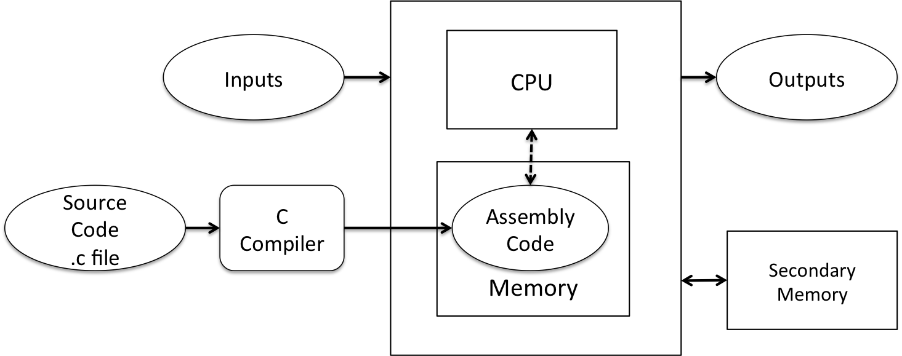
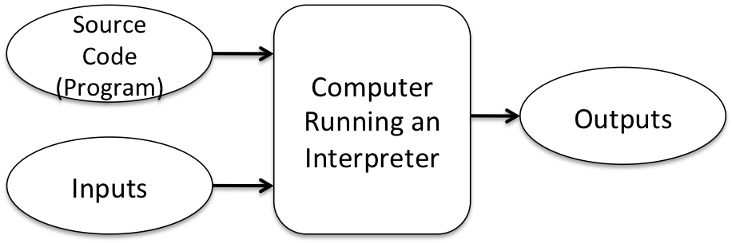
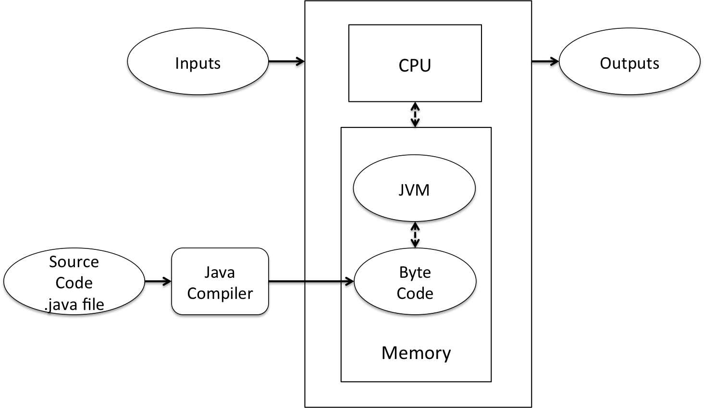

## Creating Programs – Editors and IDE ([Eck 2.6](http://math.hws.edu/javanotes/c2/s6.html))

When we will write Java programs, we need an editor to create Java code.  Since Java code is simply a text file so you can use just about any text editor create the code.  For example, I often use VIM, and old, but trustworthy, UNIX editor.  When using VIM, I can compile my Java code by using the javac compiler from my UNIX command shell.  I can then run the resulting byte code using the java byte-code interpreter from my UNIX command shell.

We will use an Interactive Development Environment (IDE), which contains an editor to create and run our Java code.  We will begin with BlueJ, which is a simple IDE.  I think BlueJ will allow you to more easily become familiar with objects.  BlueJ has a Codepad that allows you to interactively type Java.  This feature is a nice tool for exploring Java.  I still use the BlueJ Codepad when I have a question as to what Java does - I type in the code and observe what it does.  In week 5 we will begin using Netbeans, which is more complex.  Netbeans has many features – I do not know how to use all of the features.

## JVM, JDK, and JRE ([Eck 2.6](http://math.hws.edu/javanotes/c2/s6.html))


JVM, JDK, and JRE area often mentioned when discussing Java.  They can be confusing at first, but with patience and practice you can get them straight.  Until you have them straight in your mind, just look them up.

* JVM – Java Virtual Machine.  This is the program that executes the Java Byte Code.  You can think of Java Byte Code as Java specific assembly language.  The JVM is like a virtual computer that knows how to execute the Java Byte Code.
* JRE – Java Runtime Environment.  The JRE includes the JVM as well as the various class libraries that come with Java and you will need to execute your Java byte code.
* JDK – Java Development Kit.  The JDK includes the JRE as well as the development tools such as the Java compiler and Java debugger.

We will use Java Standard Edition Development Kit 8.


## Computer Diagram With Software ([Eck 1.1](http://math.hws.edu/javanotes/c1/s1.html))

The following diagram expands our computer model to show how programs are stored on secondary memory (a disk, which is either a rotating disk or a solid state disk).  Programs are loaded into main memory and executed by the Central Processing Unit (CPU) following the fetch-execute paradigm.  The Assembly Code section provides some example assembly code. Newer computers are equipped with solid-state disks, which are more expensive per byte than the traditional rotating disk drives.  The Surface Pro and MacBook Pro/Air typically have solid-state disks.


## High Level, Low Level, and Portable Code

* **High level** code is code written in Java, C, C++, and any other modern day programming language.
* **Low level** code is byte code and assembly code, which are describe below.
* Code is **portable** if it can be moved from one computer to another, with minimal (ideally no modifications).  
  * Assembly code is **NOT** portable – it only runs on the computer that has that assembly code.  
  * High level code is portable.  
    * For programs in C/C++ or other compiled languages, you will have to recompile the code before running on another machine.  
    * For programs written in Java or other byte code languages, you can move the byte code and run it in the JRE.

## Compiling High-level Code ([Eck 1.3](http://math.hws.edu/javanotes/c1/s3.html))

A compiler generates machine code that can be directly executed by the CPU of a computer.  Machine code is binary code stored in memory; however, there is assembly language that is a one-to-one correspondence to machine code.  People can read assembly code.  The Assembly Code section demonstrates assembly code.

 


## Interpreting Code ([Eck 1.3](http://math.hws.edu/javanotes/c1/s3.html))

An interpreter reads the source code and interprets the statements.  You will notice that an interpreter is a program executing on a CPU.  An interpreter has been compiled into machine code.  An interpreter is one of the programs we can run on our computer.  The JVM is the Java byte code interpreter.



## Java Byte Code Interpreting ([Eck 1.3](http://math.hws.edu/javanotes/c1/s3.html))

Java is executed by a combination of compiling and interpreting.  

* The Java source code is compiled into a Java-defined “assembly” language that is called Java byte code.  
* The byte code is interpreted by the JVM.  
* The Java source code is contained in files with a .java extension.  
* The Java byte code is contained in files with a .class extension.  
* The .class files can be moved between computers.  
* You simply need the JRE a computer to run the .class files.


 
## JVM, JDK, and JRE Pattern

The JVM, JDK, and JRE pattern figure allows you to easily visualize the software development process.

<div class="alert alert-danger" role="alert"><i class="fa fa-delicious fa-lg"></i>
<b>
Programming Pattern
0. JVM, JDK, and JRE Pattern </b>
<br>

</div>


## C Code Snippet

The following C code shows a simple algorithm, which will be translated into its corresponded assembly language in the next section.  If the following code snippet appears to be Java, that is because Java began with C/C++ syntax.

```c
int x = 1;
int y = 2;
int z;
if (x < y) {
  z = x + y;
}
else {
  z = x – y;
}
```

## Assembly Code - Corresponding to C Code Snippet

The following is the corresponding assembly code for a generic assembly instruction set.  Each CPU has their own assembly language.  For example ARM CPUs (which are used in mobile devices such as smart phones and tablets) have different assembly language than the Intel I5 CPUs (which are used in laptops and desk tops).  You will be wise to realize that the following assembly language example is neither ARM nor Intel; however, it is reflective of most all assembly languages.

```
load 1, R1
store R1, x
load 2, R2
store R2, y
compare R1, R2
jump GEQ, ELSE
add R1,R2,R3
store R3, z
jump ENDIF
ELSE: subtract R1, R2, R3
	Store R3, z
ENDIF: …
```

