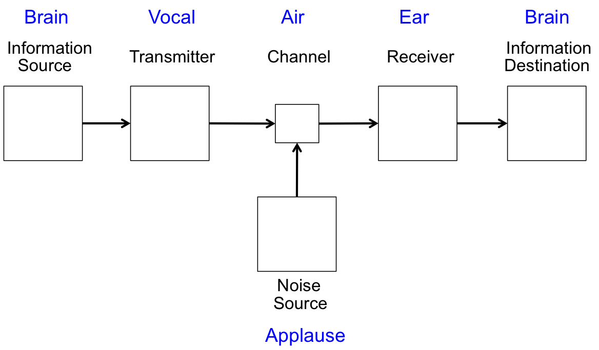

## Information, People, and Computers

We love information. We love to talk, text, and email our friends about everything and anything.  We have been sharing information with each other for as long as we have been.   We talk about weather, food, school, work, love, sports, politics, music, movies, and hobbies. If I hear that we are expecting a snowstorm, I am quick to share that with my friends.  When one of my friends gets a new hairdo, most likely that will be a topic during converstaions with other friends.  We have newspapers, magazines, and websites that are full of information.  When you observe someone constantly staring at their smartphone, that person is observing and creating information.  Perhaps we suffer from information overload.  

[](http://www.eonline.com)

Exactly what is information. The following is an intuitive definition. 

**Information** – Stuff that is good to know and can be communicated.  Information can be encoded in various forms.  We perceive information with our senses (eyes, ears, nose, and touch), store our perceptions in our brain, and share our perceptions with others.

The following diagram (from *The Information* by James Gleick) shows a general form of information communication.  The blue font shows a normal way of two people communicating using their vocal chords and aural canals.  In this communication, the channel is air - sound flows through the air from one person's mouth into the other person's ears.  There can be some noise source that messes up the communication.  The diagram shows applause at some football game that may mess up the communication.

 

**People** - process *input* information, store and manipulate *information* under the control of a *changeable brain*, and produce *output* information.


Our brain serves to store information and to manipulate the information.  We get our input from our eyes, ears, nose.  Some of the input is physical stimulation - like when we are outside or talking with people  Some our our input is reading books or listening to music.  Exactly how we store and manipulate information in our brains is a mystery to me, but nueroscientests are beginnging to unravel the mystery.  I have talked with elder people who could not remember information spoken five minutes ago, but can vividly recall events from 50 years ago.  We produce output with our mouth, facial expressions, hands.

Computers process information similar to the way people process information; however, computers are machines, not people.  In some ways, computers are better at processing information than people.  Google can find more results that I can.  Some of most profitable companies of today simply process information - Google, Facebook - and they rely upon computers to process their infomation.

**Computer** – A *machine* that processes *input* information, stores and manipulates *information* under the control of a *changeable program*, and produces *output* information.

## Computer Information

All information in a computer can be classified as either **numbers** or **characters**.  Computer numbers can be either **integers** or **floating point**. Computer characters can be letters, numbers, and special characters from many different language scripts (English to Chinese).  We will collect a sequence of computer characters into a ```String```.  We will soon learn the ways a computer encodes numbers and characters in bytes of memory, in particular how Java primitive types encode numbers and characters.

## Computer Model

A computer does not have a brain, but it does have memory to store information and it can have many programs, each of which can perform specialized operations that somewhat act as a brain.  We will learn how to write Java programs in this course.  We will create a simple **model of a computer**.  A more complex model can be found in [Eck's Book](http://math.hws.edu/javanotes/c1/s1.html).

 

All computers follow our simple **model**.  The Central Processing Unit (CPU) executes programs stored in memory, which is also called main memory or random access memory (RAM).  The contents of RAM remain as long as the computer has power, but if you turn off the computer, the contents of RAM disappear.  In order for the information to persist across power outages, the information is stored in seconday memory, which is either a hard disk drive or solid state memory.  When you purchase a modern laptop, you most likely get 8 gigabytes (GB) of memory and a terabyte (1,000 gigabytes) of hard disk storage.  When you purcahse a phone, the marketing terminology usually states a 64GB phone, which is referring to the secondary memory.

We want to write Java programs, which must be stored and run on a computer.  Our Java programs will read input information, manipulate the information, and generate output information.  Our Java programs will consist of algorithms and data.  The data is our information and the algorithms manipulate the data.  The data we create will be in variables.  Each variable will have a type.  The algorithms will use assignment statements, expressions, method calls, conditional statements, and loop statements.  All of this is what we want to understand.

## Computer Memory

We do not know much about people memory, but we know exactly what computer memory is.  It is the following.

* a sequence of bytes
* each byte has an address 
* each byte is 8 bits
* each bit is either 1 or 0

The following shows five sequential bytes of memory that contain information.

```
Address	  Value
0004040   00000000
0004041   00001000
0004042   00000101
0004043   11111110
0004044   01010100
```

A computer must encode all of its information in a sequence of bytes.  Determining what information these five bytes of memory encode is dependent upon how they are interpreted.  The bytes could be a program, they could be integers, they could be floating point numbers, or they could be characters. We need to learn some more before we can decode these five bytes of memory.  We will learn enough in the remainder of this section to begin interpreting bytes of memory.  We will also learn how to translate a decimal number to binary and back.

## Computer Science

Computer science can mean several things.  You may think of computer science as writing programs, establishing networks, putting various workstations on the networks, creating websites, creating databases, removing malware from computers, or any combination of these things.  

A more theoretical definition of computer science is studying what can be computed.  By computed we can construct an algorithm (and its accompanying data structures) that will execute its sequence of steps and terminate when finished.  We know that we can write computer programs to perform computations, but computer scientists also use abstract machines to determine computability.  A Turing Machine – named for its creator Alan Turing who had the movie Imitation Game created about him – is an example abstract machine.  The following is a question about the 3N+1 Algorithm discussed earlier.  

Will the algorithm for 3N+1 terminate for all possible initial values of N? 

We know it terminates for everything tried, but we have not answered the general question.

For this class, we will consider **computer science** to be *designing, analyzing, and evaluating algorithms and their accompanying data structure*.
