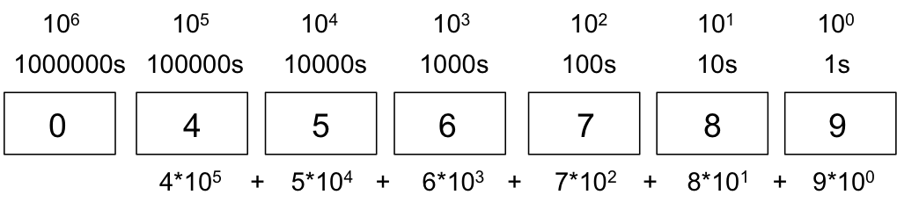
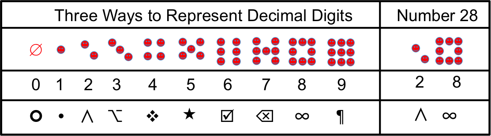
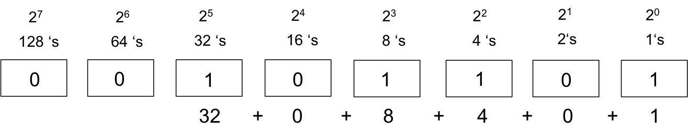

## Numbers – Decimal and People

Everyone understands numbers, but most have forgotten the fundamentals of number systems - base and place value.  Roman numerals are difficult to perform computations because they do not have a base and a place value.  Even the NFL has dropped the Roman numeral from its Superbowl.  We are most familiar with base 10, which has ten digits: 0, 1, 2, 3, 4, 5, 6, 7, 8, 9.  When we examine a number we intuitively know the value of each digits place.  Beginning from the right and moving left, each place in a number has a value that corresponds to base raised to the position.  



The Hindus started using place value numbers around 500.  The Hindus discovered ZERO around 650.  The Hindu numbering system was discovered right around the time of the expansion of Islam.  Arabic mathematicians adopted the system – hence Hindu-Arabic numbers.  Leonardo Fibonacci wrote a book Liber Abaci in 1202 where he extolled the virtues of place-value numbers; however, the western world did not adopt place value until around 1500.  I am certainly glad that we did.  You should realize that our decimal digits evolved over time.  We could select whatever symbols we like.  The following figure shows our decimal digits, two alternative sets of digits, and the number 28 using each set of digits.



Almost all people use decimal numbers today.  If you want to explore an interesting radio article on numbers and what part of numbers are inate to us, you are welcome to listen to the following.

[Radiolab - Innate Numbers](http://www.radiolab.org/story/91698-innate-numbers/ )


## Numbers – Binary and Computers

Computers use binary numbers, not decimal.  This means that all numbers will be encoded in a binary equivalent.  Binary is base-2, which means there are two digits: 0 and 1.  Each digit in a binary number is called a **bit**, which is a contraction of binary-digit.  Binary employs the place-value system  just like decimal.  The following figure shows binary ```0b101101```, which is equivalent decimal 45.  We multiply the digit times its place value.  Since we only have two digits, each position of our number will either be a 0 or its place value.  The bolded 1 in 0b**1**01101 is 1*32.



## Numbers - How Many Numbers in N Digits

When mentally using decimal numbers, we usually do not worry about how many numbers can be represented in N digits.  For example, if we have 3 decimal digits, we can count from 0 to 999, which means 3 decimal digits can represent 1000 numbers.  In this case, we have 10<sup>3</sup> numbers, where 10 is the base and 3 is the number of digits.  

However, within a computer, we often consider how many numbers can be represented in N bits.  Memory is organized into a sequence of bytes where each byte has an address, so we typically consider how many numbers can be represented in 8-bits (1 byte), 16-bits (2 bytes), 32-bits (4 bytes), and 64-bits (8 bytes).  The same formula for computer total numbers applies, so (for example) a 2 byte quantity can hold 2<sup>16</sup> , where 2 is the base and 16 is the number of bits.  We can consider various numbers in the follownig snippet of memory.  For examples, the 1-byte number 0b00000001 is at address 0004040 and the 4-byte number 0b00000000_00000000_00000000_00000101 is at addresses 004044 through 004047.

```
Address	  Binary Value
0004040   00000001
0004041   00001000
0004042   00000101
0004043   11111110
0004044   00000000
0004045   00000000
0004046   00000000
0004047   00000101
```

## Numbers - Converting Between Bases

This section presents an pseudo-code algorithm to convert a number to a particular base.  We will program this algorithm in Java during a future lab.  Thinking in terms of our computer model, we first define the input and output of our algorithm.

* Input 
  * Number to be converted 
  * Base of the converted number
* Output 
  * Number converted to Base

An example call to this algorithm would be Convert(20,16), which is asking us to convert the number 20 to base 16.  The output for this case is 0x14, which is 1\*16<sup>1</sup> + 4\*16<sup>0</sup>.

```
// We will build answer from right to left
Convert(Number, Base)
    while (Number != 0) {
        digit = Number % Base      // modulo
        Number = Number / Base // integer division
        Add digit to answer
    }
```

## Binary Numbers - Positive and Negative

We need to represent both positive and negative numbers in memory.  In this section we will consider 3-bit numbers, but the same concepts apply to 8-bit, 16-bit, 32-bit, and 64-bit numbers.


The following table shows positive decimal numbers for a 3-bit binary numbers.

Binary | Decimal
------ | -------
000    | 0
001    | 1
010    | 2
011    | 3
100    | 4
101    | 5
110    | 6
111    | 7

If we want to represent both positive and negative numbers, we can consider the first bit to be a sign bit to create signed magnitude numbers.  This means that each number has the same magnitude and a sign indicates whether the number is positive or negative   This is how we manipulate numbers in our brains.  For example, 512 is a magnitude with +512 being positive and -512 being negative.  The same 512 is on both the positive and negative numbers.  This results in the following for binary, which has two representations of zero.

Binary | Decimal
------ | -------
011    | 3
010    | 2
001    | 1
000    | 0
100    | -0
101    | -1
110    | -2
111    | -3

Our brains process signed magnitude rather well, but computers do not.  Computers represent signed integers in twos-complement.  The following shows twos-complement for 3 bits.

Binary | Decimal
------ | -------
011    | 3
010    | 2
001    | 1
000    | 0
111    | -1
110    | -2
101    | -3
100    | -4

Notice how twos-complement has only one representation of zero.  You will also notice how we get 3 positive numbers (2<sup>2</sup>-1), one zero, and 4 negative numbers (2<sup>2</sup>).  If we have an 8-bit twos-complement integer, we would have 127 positive numbers (2<sup>7</sup>-1), one zero, and 128 negative numbers (2<sup>7</sup>).  The general formula for a twos-complement number of N bits is the following.

* 2<sup>N-1</sup>-1 positive numbers
* one zero
* 2<sup>N-1</sup> negative numbers

There is a simple algorithm to convert between a positive and negative number in twos-complement, which is reverse all the bits and add one, where the action *reverse all bits* simply changes a 1 to a 0 and a 0 to a 1.  Let’s continue with our 3-bit example and convert a positive 2 to a negative 2.  You can check the resulting value by examining the binary value for -2 in the twos-complement table above.

   Step      |  Binary Value
------------ | -------------
Positive 2   |      010
Reverse bits |      101
Add one      |      110 
Negative 2   | lookup in above table

## Adding Twos Complement Numbers

Twos complement also allows us to simply add numbers and subtraction takes care of itself.  Consider adding 1 and -1 in a 3-bit number.

```
    001	   (1)
   +111  +(-1) 
--------------------
    000	 (0)
```

Let’s add 24 and 37 in 8-bit numbers.

```
  00011000   24      
+ 00100101   37
----------------
  00111101   61
```

Let’s convert 37 to a negative 37 in an 8-bit number.

```
  11011010   Change bits
+        1   Add 1
-----------
  11011011   2’s Comp (-37)  
```

Let’s add 24 and -37.

```
  00011000    24
+ 11011011   -37
-----------------
  11110011   -13
```

Now lets change all of the bits and add 1 to our -13,

```
  11110011   -13
  00001100   Change bits
+        1
-----------------
  00001101    13
```

It is almost like magic.

## Floating Point Numbers in a Computer

The first step in understanding floating-point numbers in a computer is to understand **scientific notation**.  All floating-point numbers can be represented in scientific notation, which has a **fraction** part (also called the **mantissa**) and **exponent** part.  Here are few numbers that have the same fraction, but different exponents.
 
* 3.14159 is equivalent to .314159 * 10<sup>1</sup>
* 31415.9 is equivalent to .314159 * 10<sup>5</sup>
* 31.4159 is equivalent to .314159 * 10<sup>2</sup>
 
The following tables shows those numbers in a somewhat computer form, where all we care about is the exponent and fraction.  

exp   | fraction
----- | --------
  1   |  314159
  5   |  314159
  2   |  314159

We can consider fractions from a place value perspective.  The fraction .314159 is 

3\*.1 + 1\*.01 + 4\*.001 + 1\*.0001 + 5\*.00001 + 9\*.000001

Another way to write this is

3 \* 1/10 + 1 \* 1/100 + 4 \* 1/1000 + 1 \* 1/10000 + 5 \* 1/100000 + 9 \* 1/1000000

Another way to write this is

3 \* 1/10<sup>1</sup> + 1 \* 1/10<sup>2</sup> + 4 \* 1/10<sup>3</sup> + 1 \* 1/10<sup>4</sup> + 5 \* 1/10<sup>5</sup> + 9 \* 1/10<sup>6</sup>

Of course, a computer only has binary so we will represent the fraction as a binary fraction.  For example, suppose we want to represent the number 2.5 as a binary fraction in 8 bits, where 4 bits are for the exponent and 4 bits are for the fraction.  We know that .625 * 2<sup>2</sup> is 2.5.  This means that our exponent must be 2, which is 0b0010.  The fraction .625 can be represented as ½ + ⅛.  We represent this fraction as 0b1010, which is the following.

1 \* ½ + 0 \* ¼ + 1 \* ⅛.  

Putting all of this together in an 8-bit fraction that has 4-bits for a positive exponent and 4-bits for mantissa, we get 0b00101010, which is described in the following table.

exp   | fraction
----- | --------
0010  |  1010

This simple model is just slightly more complicated on real computers.  We can have positive and negative floating-point numbers, and the exponent can be both positive and negative.  This means that a floating point binary numbers have two sign bits: one for the exponent and one for the fraction.  A floating point binary number allocates a bit as the sign of the fraction (mantissa).  The exponent is represented in a bias notation, which is another way of divvying bits into positive and negative numbers.  Suppose you had a 3-bit exponent.  The following represents a bias notation for the exponent.

Binary | Exponent
------ | -------
 000   | -3
 001   | -2
 010   | -1
 011   |  0
 100   |  1
 101   |  2
 110   |  3
 111   |  4

Floating point numbers in computers are stored with normalized mantissas, which means the fractional part has a 1 in the most significant fractional bit.  The decimal floating-point number 1234.567 is normalized as 1.234567 x 10<sup>3</sup>.   Notice that only one digit appears before the decimal.  The exponent expresses the number of positions the decimal point was moved left  (positive exponent) or moved right (negative exponent).  The binary floating-point number 1101.101 is normalized as 1.101101 x 23.  Moving the binary point 3 positions to the left, and multiplying by 23 accomplishes this.  The following shows normalization of binary floating-point numbers.

Binary Value | Normalized As | Exponent
------------ | ------------- | --------
 1101.101    |   1.101101    | 3
 .00101      |   1.01        | -3
 1.0001      |   1.0001      | 0
 10000011.0  |   1.0000011   | 7
 
## IEEE 745 Floating Point

The following figure shows IEEE 745 floating-point numbers.
 


Some examples of floating point numbers in the IEEE format are as follows.

Binary Value      | Biased Exponent | Sign | Exponent | Mantissa	
----------------- | --------------- | ---- | -------- | -----------------------
  -1.11           | 127             |  1   | 01111111 | 11000000000000000000000	
  +1101.101       | 130             |  0   | 10000010 | 10110100000000000000000	
  -.00101         | 124             |  1   | 01111100 | 01000000000000000000000	
  +100111.0       | 132             |  0   | 10000100 | 00111000000000000000000	
  +.0000001101011 | 120             |  0   | 01111000 | 10101100000000000000000

If a decimal fraction can be easily represented as a sum of fractions in the 
 form (1/2 + 1/4 + 1/8 + ... ), it is fairly easy to discover the corresponding binary real.  Here are a few simple examples

 Decimal Fraction | Factored As... | Binary Real	
----------------- | -------------- | ------------
 	1/2    	  | 1/2            | .1	
 	1/4    	  | 1/4	           | .01	
 	3/4    	  | 1/2 + 1/4      | .11	
 	1/8    	  | 1/8	           | .001	
 	7/8    	  | 1/2 + 1/4 + 1/8| .111	
 	3/8    	  | 1/4 + 1/8      | .011	
 	1/16      | 1/16           | .0001	
 	3/16   	  | 1/8 + 1/16     | .0011	
 	5/16      | 1/4 + 1/16     | .0101

## Computer Floating Point Numbers are Approximations

One should realize that a floating point number is just an approximation of the number.  A computer can represent some floating point numbers quite well.  For example, .5 and .125; however most are just approximations.  How well can a computer represent .1?  Not too well.  The following algorithm as typed into the BlueJ Code Pad does not compute 1.0, which is what you think it should.


```java
double y=.1;
y=y+.1;
y=y+.1;
y=y+.1;
y=y+.1;
y=y+.1;
y=y+.1;
y=y+.1;
y=y+.1;
y=y+.1;
y
0.9999999999999999   (double)
```

