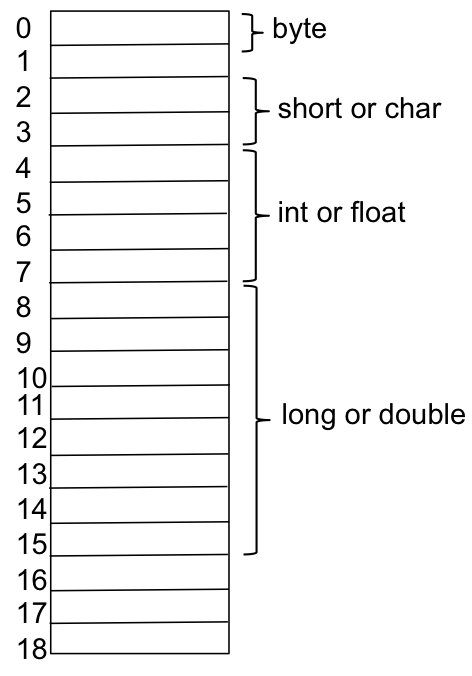

## Program Attributes - Algorithms and Data Structures

The primary goal of CPSC 220 is for everyone to learn how to solve problems in Java.  To do this we will create Java programs that consist of algorithms and data structures.  We have already studied the following concepts, which we will connect together into Java programming.

* people and computers receive information, store and manipluate information, and generate information
* a model of a computer that has input, output, CPU, RAM, and secondary memory
* problem solving
* algorithms
  * accept input
  * manipulate information and are constructed with 
    * sequential steps
    * conditional steps
    * looping steps
    * calling chunks of algorithms that are bottled in a method
  * produce output
* numbers information in computers
* characters information in computers

To demonstrate how writing a program is primarily creating algorithms and data structures, [Niklaus Wirth](https://en.wikipedia.org/wiki/Niklaus_Wirth) (a famous computer scientist, who (among other things) created the programming language Pascal) wrote a book titled, Algorithms + Data Structures = Programs.  We have a general idea of algorithms,  which we will tighten into designing and implemeting Java programs, but first we have to begin our journey into data structure.  We begin with Java primitive data types.

## Variables and Data Types

Recall a computer is a machine that stores and manipulates information under the control of a changeable program.  A data type defines the characteristics of information we want to manipulate.  We use data types to declare variables, which contain the information we manipulate.  In Java variables must be declared to be a specific type, and the declaration must happen before you can use a variable.   

A **variable** has the following

1. a **name**
2. a **data type**
3. a **value**
4. **memory locations**

A **data type** is a set of values and a set of operations.  

We will return to this definition throughout the course.  Let us consider the Java primitive data type ```byte``` as our initial example of this definition.  The following example declares a variable named ```gusty``` that is type ```byte```, initially has value 55, but is immediately changed to have value -55.

```java
byte gusty = 55;
gusty = gusty - 110;
```

In this example code we see

1. The variable name is ```gusty```
2. The data type is ```byte```, which 

   * Has the set of values ```{-128, -127, ..., 0, 1, 2, ... 127}```
   * Has the set of arithmetic operations ```{+ - * / %}```

3. The value is initially 55, but then changed to -55
4. The memory locations are demonstrated in a later section.

## Java Identifiers

Java **identifiers** are used to give variables, methods, and classes names.  The preceding section declared a variable named ```gusty```.  ```gusty``` is a Java identifer.  Java identifiers must be constructed according the following rules.

1. The first character of an identifier must be letter, \$, or \_
2. The remaining characters of an identifer my be letter, \$, \_, or number.  An identifier cannot begin with a number.
3. Upper case and lower case letters are different.  The identifers ```Gusty``` and ```gusty``` are different.

## Java camelCase Identifiers

Java programmers tend to use ```camelCase``` identifiers. As can be seen in this example, a multisyllable identifer will have an upper case letter for each syllable.  For example, if I want to place to age of a person in a variable, I may choose ```personsName``` to be the camelCase identifier.  You can contrast the camelCase style of identifers to a style of using ```_``` as the syllable separator, which would be ```camel_case``` and ```persons_name```.  Both are good styles, but you will see that Java programmers traditionally use ```camelCase```.

I suggest that we follow the Java tradition.  You should always select meaningful variable names, regardless of the style of identifiers.  Good programming style is discussed in [Programming Style](/gustycooper.github.io/mydoc_A_programming_style).

## Java Primitive Data Types

Java primitve data types are ```byte```, ```short```, ```int```, ```long```, ```float```, ```double```, and ```char```.  These are keywords that we will use to declare variables and arrays.  The previous section demonstrated declaring ```byte gusty```.  The meta language for declaring variables of primitvie types is the following.

<div class="alert alert-success" role="alert"><i class="fa fa-language fa-lg"></i>
<b>
Meta Language - Declaring Variables of Primitive Types 
</b>
<br>
<pre>
&lt;type-name&gt; &lt;variable-name&gt; [= &lt;exp&gt;];
</pre>
</div>

* For now ```<type-name>``` will be ```byte```, ```short```, ```int```, ```long```, ```float```, ```double```, ```char```, or ```boolean```.  We will soon learn many more types, including how to define our own types.
* We refer to the types ```byte```, ```short```, ```int```, ```long```, ```float```, ```double``` as numeric types.  Corresponding variables are numeric variables.
* The variable initialization expression (```<exp>```) is optional.
* The ```<exe>``` must evaluate to ```<type-name>```.
* If you do not include the optional ```<exp>``` as part of your declaration, Java initializes variables as follows.
  * numeric variables to 0. 
  * ```char``` variables to the null character, which is ```'\0'``` or 0.
  * ```boolean``` variables to ```false```.
* We study expressions in[Expressions](/gustycooper.github.io/mydoc_3_expressions). 
* You may declare and initialize multiple variables by using a comma to separate them.

The following are example declarations, some of which use the ```<exp>``` to initialize the variable.

```java
int numberOfStudents = 23;
double x = 1.0, y = 2.0;
int i = 0, j = 1;
boolean isFinished;
char firstInitial, middleInitial, lastInitial;
double principal;    // Amount of money invested.
double interestRate; // Rate as a decimal, not percentage.
int number = 4;
byte bb = 120;
double myPi = Math.PI;

```

## Java Numeric, ```char```, and ```boolean``` Literals

A literal is an entity that you know its value when you read it.  The following are examples. 
 
* The numbers ```152``` and ```3.14``` are numeric literals.  
  * The number ```152``` is an ```int`` literal.
  * The number ```3.14``` is a ```double``` literal.
  * The number ```3.14F``` is a ```float``` literal.  You must 
* The characters ```'G'``` and ```'5'``` are ```char``` literals.  
* You should know that ```5``` and ```'5'``` are two distinct literals. ```5``` is a numeric value that can be used in arithmetic expressions.  ```'5'``` is a ```char```.  We know from [Characters as Information](/gustycooper.github.io/mydoc_1_characters) that ```'5'``` is encoded as the Unicode (ASCII) number ```54```.  We will learn that you can use ```char``` values in arithmetic expressions, but you have to be careful.  Consider the following silly example.

```java
char c = '5' + '5';    // c contains 108, which is 'j'
System.out.printnl(c); // prints j to the terminal 
```

* There are two ```boolean``` literals: ```true``` and ```false```.  We will study ```boolean``` expressions in [Expressions](/gustycooper.github.io/mydoc_3_expressions).

## Determining the Minimum and Maximum of Java Primitive Types

Java maps most of its primitive data types to specific bytes of memory.  For example, a ```byte``` is one byte of memory and an ```int``` is four bytes of memory.  We can use our knowledge from [Numbers as Information](/gustycooper.github.io/mydoc_1_numbers) to compute the minimum value for a ```byte```, which we know is 8 bits.

* Minumum value is -2<sup>numOfBits-1</sup>, which is -2<sup>7</sup> or -128.
* Maximum value is 2<sup>numOfBits-1</sup>-1, which is 2<sup>7</sup>-1 or 127.

## Java Primitive Data Types

Java provides the following primitive data types.

type   | num bytes | min value            | max value
------ | --------- | -------------------- | ---------
byte   |     1     |    -128              |   127
short  |     2     |  -32768              |   32767
int    |     4     | -2147483648          |   2147483647
long   |     8     | -9223372036854775808 | 9223372036854775807
float  |     4     | 1.4E-45              |   3.4028235E38
double |     8     | 4.9E-324             |   1.7976931348623157E308
char   |     2     |  -32768              |   32767

We will learn Java boxing classes of ```Byte```, ```Short```, ```Integer```, ```Long```, ```Float```, and ```Double```.  These classes have ```fields``` that are the min and max of the type.  We will soon learn about Java ```classes```, including such things as ```instance methods``` and ```fields```.  The following shows example code that access the fields ```MIN_VALUE``` and ```MAX_VALUE```.

```java
byte minValue = Byte.MIN_VALUE; // minValue is -128
byte maxValue = Byte.MAX_VALUE; // maxValue is 127
```

## Java Primitive Data Types and Memory

The following figure shows memory as bytes and how Java primitive data types align.  We will return to this concept throughout the course.
 


