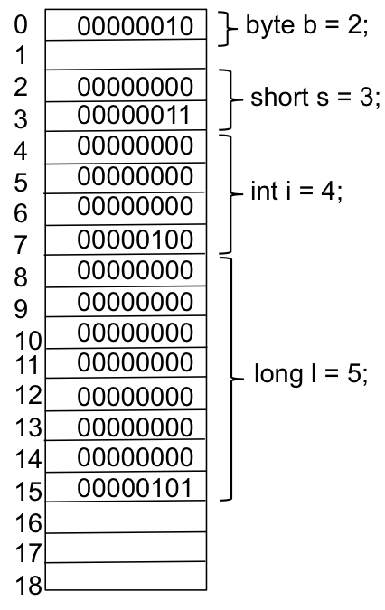

## Programming

CPSC 220 primary goal is for you to learn Java programming.  Java programming consists of solving problems using algorithms and data structures that adhere to the Java programming syntax and semantics.  You have already studied 

* people and computers process information
* a model of a computer that has input, output, CPU, RAM, and secondary memory
* problem solving
* algorithms
* Java primitive types

We want to connect these concepts together into creating our initial Java programs.

Writing a program is primarily creating algorithms and data structures.  In fact you can purchase a book published in 1976 by Niklaus Wirth (the creator of the programming language Pascal) that is titled, Algorithms + Data Structures = Programs.  We have a general feel for algorithms, which we will tighten into Java, but first we have to begin our journey into data structure.  At this point the only data structures we know are the Java primitive data types, but we will learn others and how to create our own.   Creating the algorithms for programs is similar to that <a href="{{ "/mydoc_1_algorithms" | prepend: site.baseurl }}">Algorithms</a>.  We will use the same control flows; however, we have to be more precise and understand the syntax Java.

Recall from <a href="{{ "/mydoc_1_problem_solving" | prepend: site.baseurl }}">Problem Solving</a> that we learned knowledge that and knowledge how.  Knowledge that is just facts that you stick in your brain.  Knowledge how is knowing how to do things.  Programming involves both types of knowledge.  Our study of programming involves the following.

* Programming language syntax
  * This is knowledge that
  * The syntax can be tedious and you have to understand it.
* Creating an algorithm and its data structures that solves a problem
  * This is knowledge how
  * This is the semantics or meaning of our program.
  * This is creative that gets better the more you practice.
  * This is the part we really want to learn this semester, and we have lots of labs and projects on which to practice

## Programming Errors

You will encounter errors, which are also called bugs, during your programming.  Errors are not something to be ashamed of.  Every programmer will accidently enter bugs in their code.  Eventually, you get good at debugging your code.   We will encounter two types of errors in our programming.

* Syntax – missing semicolon, missing curly brace (```{}```)
  * These are compile time errors.  For BlueJ, you have to select the Compile button.  For Netbeans, these will be shown as you create code.
  * These are easy to discover.
* Semantics – Code does not do what it is supposed to do.
  * These are runtime errors.
  * These can be difficult to discover.

Picture of the first computer bug.


## Programming – Input and Output

We have created computer model that has input and output, where our definition of a computer is a machine that stores and manipulates information under the control of a changeable program.  Our programs have the following attributes. 

* Input – there will be some input to our program.  We will read the input into variables, which will be our information. The variables will represent data structures.  At this point we do not have a clear picture of these data structures; however, you can envision the simplest of data structures, which is just a variable that is one of the Java primitive data types.  Later we will learn how variables can be more complex data structures.
* Algorithms – our program will have various algorithms that transform data from one format to another.  In performing this transformation, our program will also create various intermediate forms of data in the form of structures.  
* Output – our program will generate some output based upon the input and our algorithms and data structures.

On the following diagram, our program is in RAM and it executes on the CPU transforming the input into output.

 

## Programming – Literals

**Literals** are entities that you know their values upon examination.  For example, the numbers 1, 3.14159, 10000, and 512.12 are numeric literals. When you examine them, you know their values. 

We will study ```String```s, which also have literals – examples are ```“Gusty”``` and ```“This is a String Literal”```.

We will study ```boolean```, which have the literals ```true``` and ```false```.

## Programming – Declaring Variables of Elementary Data Types

**Variables** are names that we assign values to.  A variable name must begin with a letter and followed by letters, numbers, and underscore.  We first studied variables in [Primitive Types](mydoc_1_primitive_types), where we learned that a **variable** has the following

1. a name
2. a data type
3. a value
4. memory locations

We have learned that Java primitive data occupy memory locations.  For example, an int occupies 4 consecutive bytes.  When we declare a variable of a primitive types, we are allocating memory for that variable.  The contents of that variable are stored in the memory locations allocated to the variable.  For example, if we declare a variable of type int, we are allocating four bytes of memory.  Consider the following declarations and memory diagram.

```java
byte b = 2;
short s = 3;
int i = 4;
long l = 5;
```
 

The meta-language for declaring variables is the following.


```
<type-name> <variable-name-or-names>;
``````


where \<type-name\> is ```byte```, ```short```, ```char```, ```int```, ```long```, ```float```, ```double```, or ```boolean```.  A variable name must begin with a letter and followed by letters, numbers, and underscore.  The following are some example declarations.
 

```java
int numberOfStudents;
double x, y;
char firstInitial, middleInitial, lastInitial;
byte b;
double principal;    // Amount of money invested.
double interestRate; // Rate as a decimal, not percentage.
```


You can also assign a value with the declaration.

```java
int i = 0, j = 1;
int number = 4;
byte bb = 120;
double myPi = Math.PI;
double x = 1.0, y = 2.0;
```

## camelCase

You will notice the style of naming variables where they begin with a lowercase letter with an uppercase letter helping you read the variable (i.e., interestRate).  This style of naming is referred to as camelCase, and it is quite popular in Java programming and object-oriented programming.  You could alternatively use the underscore (_) to help read (i.e, interest_rate).

## Programming – Java is a Strongly Typed Language

All variables in Java will be a specific type, for example int or double.  Once you have a variable of a specific type, you cannot change the type – for example an int variable will always be an int.  Sometimes you have to convert from one type to another, and there are some cases where Java will automatically perform the type conversion.  For example, if you mix int and double in expressions, Java will automatically convert the int to a double.  This makes sense intuitively.  In other cases, Java will not make the conversion; however, you can tell Java to perform the conversion.  Suppose I have the following two variables defined.

```java
int number = 4;
byte bb = 120;
```

We know that an int is four-bytes long while a byte is just a single byte, which means the set of values for the variable number is much larger that the set of values for the variable bb.  This means the following assignment is illegal in Java.


```java
bb = number; // illegal assignment
```


However, we know that the current value in number is 4, which fits into a byte.  We can perform the following cast to make the assignment legal.


```java
bb = (byte)number; // legal assignment with (byte) cast
```


An example of casting a double to a int is shown as follows.


```java
int number = 4;
double myPi = 3.14159;
number = (int)myPi; // assigns 3 to number
```


## Java Syntax – An Introduction

Java syntax can be a bit confusing at first, as it has strategically placed semicolons, curly brackets, and parentheses.
* Semicolon – a single statement is terminated with a semicolon.  For example an assignment statement,
x = 3.0;
* Curly braces – a block of statements is enclosed by curly braces {}.  The closing curly brace is not terminated by a semicolon.  For example the simple class and main function show curly braces.
public class HelloWorld {
   public static void main(String[] args) {
      System.out.println(“Hello World!”);
   }
}
* Parentheses are used in expressions to force a specific expression evaluation; however, parentheses are also used to enclose the controlling expressions of conditionals and loops.  For example, the following if statement shows parentheses, curly braces, and semicolons

```java
if (a < b) {
    a = b;
} else {
    b = a;
}
```


There are other syntax rules such as operators in expressions, keywords for if statements, keywords for loops, etc.  We will tackle these as we move forward.

The spacing in Java does not make any difference.  The previous if statement can be coded as follows.


```java
if (a < b) {a = b;} else {b = a;}
```


You should establish a good programming style that makes your code easy to read.

## Output to the Standard Output Stream

For our first program, we will need to write output to the Java standard output stream, which in BlueJ will be a window called the BlueJ Terminal Window.  A terminal window is a text-based window for interacting with UNIX or LINUX.  Sometimes, I may call the standard output stream the system console.  The standard output stream is already open, and you do not have to import anything to access the method.  There are two methods that we will use which are the following.
* System.out.print(data) – this prints data to the current line on the terminal, leaving the terminal on that line.
* System.out.println(data) – this prints data to the current line on the terminal and puts a line feed afterwards, advancing the terminal to the next line

The data will be converted to a printable format.  If you have several variables to print you have to “concatenate” them.  The following is an example.


```java
System.out.println(“Num 1 is “ + 4 + “ and num 2 is “ + 3.14 + “.”);
```


## Java Blocks, Sequence of Assignment Statements

The most used statement in programming is an assignment statement.  We have already used it in several of the preceding sections.  The following are some example Java assignment statements.


```java
x = 3.0;        
i = 32000;      
long l = 32000;  // declares l and assigns it a value
```


In Java the meta-language for an assignment is the following.


\<variable\> = \<expression\>;


In the previous examples, <expression> was a simple numeric literal.  We will study expressions in more detail shortly.  The third example combines the declaration of a variable with an assignment statement. 

In Java we can create a block of statements by enclosing them between { and }.  The following is a block of the preceding statements.  You should notice that there are no semicolons after { or }.


```java
{
   x = 3.0;        
   i = 32000;      
   long l = 32000;  // declares l and assigns it a value
}
```


We will use a block of statements in our first Java program.  We will use a block of statements many times throughout this course.

We will learn that the assignment operator (=) is just like other operators, and it can be mixed into complex expressions; however, undersanding the semantics of when using assignment in an expression can be difficult.  You are best served by using simple assignment statements.

## First Java Program (Eck 2.1)

Our fist Java program will simply manipulate the primitive Java data types and print some information to the output console.  Every program in Java must be in a class.  We will learn more about classes next week.  The name of the file and class must match.  For the most part the IDE will ensure this for you.  You first program will look something like the following, which is a classic hello world program.  More details are provided in Lab 1.


```java
public class HelloWorld {
   public static void main(String[] args) {
      System.out.println(“Hello World!”);
   }
}
```


## Computer Science

Computer science can mean several things.  You may think of computer science as writing programs, establishing networks, putting various workstations on the networks, creating websites, creating databases, removing malware from computers, or any combination of these things.  

A more theoretical definition of computer science is studying what can be computed.  By computed we can construct an algorithm (and its accompanying data structures) that will execute its sequence of steps and terminate when finished.  We know that we can write computer programs to perform computations, but computer scientists also use abstract machines to determine computability.  A Turing Machine – named for its creator Alan Turing who had the movie Imitation Game created about him – is an example abstract machine.  The following is a question about the 3N+1 Algorithm discussed earlier.  

Will the algorithm for 3N+1 terminate for all possible initial values of N? 

We know it terminates for everything tried, but we have not answered the general question.

For this class, we will consider computer science to be **designing, analyzing, and evaluating algorithms and their accompanying data structure**.
