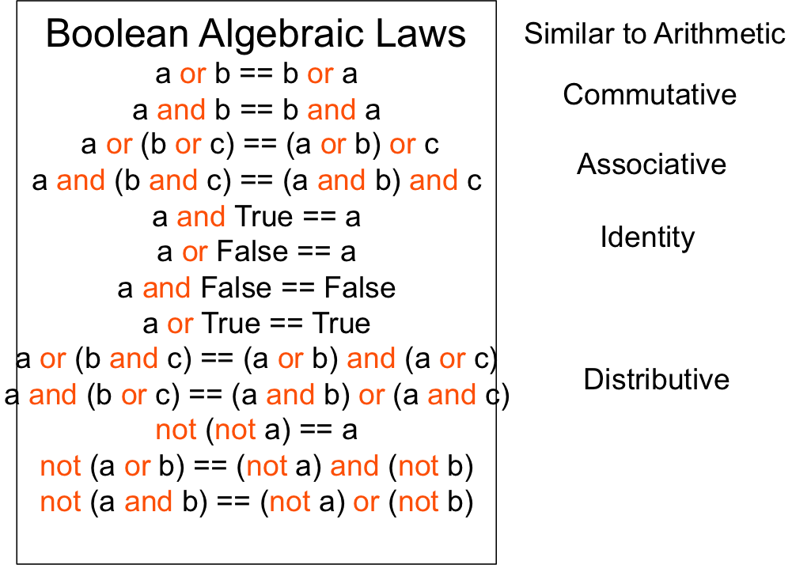
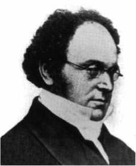

## Relational Expressions ([Eck 2.5](http://math.hws.edu/javanotes/c2/s5.html))

**Expressions** – syntactically correct combination of variables, literals, operators, and method calls that evaluate to a value with a specific type.  The following meta language shows where expressions are found within Java statements

**Relational expressions** compare numeric values using relational operators and result in a ```boolean``` value.  


## Relational and Boolean Operator Precedence

The bolded descriptions in the following table are the operators discussed in this section, listed in order from highest precedence (evaluated first) to lowest precedence (evaluated last):

Description | Operators
--------------------------- | --------------------------------------
Unary                       | ```++``` ```--``` ```!``` ```unary -``` ```unary +``` ```type-cast```
Multiply Divide             | ```*```  ```/```  ```%```
Add Subtract                | ```+```  ```-```
**Relational**                  | ```<```  ```>```  ```<=```  ```>=```
**Equality**                    | ```==```  ```!=```
**Boolean and**                 | ```&&```
**Boolean or**                  | ```||```
Conditional                 | ```?:```
Assignment                  | ```=```  ```+=```  ```-=```  ```*=```  ```/=```  ```%=```


Operators on the same line have the same precedence. When operators of the same precedence are strung together in the absence of parentheses, the relational operators are evlauated left-to-right.  For example, ```A<B>C``` means ```(A<B)>C```.


## Relational Operators:  >  >=  <  <=  ==  !=

NOTE: = is assignment, == is comparison, assignment is an operator that can be used in expressions, but it is wise to simply use it as part of an assignment statement.

## Truth Tables

The truth tables for ```boolean``` Operators are given as follows.  Note the last column !P applies the not operator to the first column P.

P | Q | && | \|\| | \!P
- | - | - | - | -
F | F | F | F | T
F | T | F | T | T
T | F | F | T | F
T | T | T | T | F

## Boolean Operators – And: &&     Or: ||     Not: !

A ```boolean``` expression is an expression that evaluates to ```true``` or ```false```.  To support ```boolean``` expressions, Java has an primitive ```boolean``` data type and two literals ```true``` and ```false```.   For example, I can create the following variable.

```java
boolean b = true;
```

There are several ways to construct an expression that evaluates to ```true``` or ```false```.  
* I can use the relational operators.  The following are examples.

```java
x < 10
a != b
```

* I can use the ```boolean``` operators.  The following are exmaples.

```java
b1 && b2 || b3
bb && !b
```
* I can combine relational operators, ```boolean``` operators, and other operators.

```java
x < y*z || b1 && b2
```

## Short Circuited Boolean Operators

Java can short-circuit the ```boolean``` operators of ```&&``` and ```\\```.  Consider the following example of an ```&& boolean``` expression.

```java
int i = 5;
int j = 6;
boolean b = i > j && x > y;
```

In this case Java evaluates the expression ```i > j && x > y``` from left to right.  We know that ```i > j``` is ```false``` since i is 5 and j is 6.  We also know that ```false && anything``` is ```false```.  Thus we know that ```b``` is ```false``` without having to evaluate ```x > y```.  Java does this exact short circuit – does not evaluate the ```x > y```.  Likewise Java will perform a similar short circuit for logical ```\\``` when the leading expression is ```true```.  The following is an example.

```java
b = j > i  || x > y; // x > y not evaluated
```

For the most part, this short-circuiting is rather innocuous; however, if the subsequent short-circuited expressions have side effects that are executed your algorithm may have a difficult to discover bug.  We will demonstrate this in [Assignment Expressions]().


## The != and ! Operators

Note that the not operator ! is similar to !=

## George Boole

Our computers are a massive Boolean expression fabricated in silicon.  We should be thankful for George Boole, whose work gives us Boolean logic.

George Boole was a 19th century English mathematician, philosopher and logician.  
George was from from a modest family, whose Dad loved math and passed his passion to George. George wrote several books.  Here are two of his books available via the Gutenberg organization.
 
* [Mathematical Analysis of Logic – 1847](http://www.gutenberg.org/files/36884/36884-pdf.pdf) 
* [An Investigation of The Laws of Thought on which are founded the Mathematical Theories of Logic and Probabilities – 1854](http://www.gutenberg.org/files/15114/15114-pdf.pdf)
  * Based on a binary approach, processing only two objects - the yes-no, True-False, on-off, zero-one approach.

## Boolean Algebra

Boolean algebra can be helpful at times to simplify a complicated ```boolean``` expression.  When we study while loops, we will learn that they keep going as long as an expression is ```true```.  Sometimes we know when we want to terminate a while loop, which means we know the NOT of the expression needed to keep the while loop going.  De Morgan’s law can be useful in transforming a termination ```boolean``` expression to a keep going ```boolean``` expression.  

 

## DeMorgan's Law Example

This example applies DeMorgan's Law to an loop, which we study in [Control Flow](/gustycooper.github.io/mydoc_3_control_flow).  In this example, you want to quit a while loop when the user presses Enter with nothing or the command quit.  The basic structure for a while loop is the following.

```java
while (<exp-is-true>) { keep looping }
```

When the Boolean expression 

```java
userInput.equals(“”) || userInput.equals(“Quit”) 
```

becomes true you want to stop the while loop.

The following are steps of applying DeMorgan's law.

1. ```!(userInput.equals(“”) ||  userInput.equals(“Quit”))```
2. ```(!userInput.equals(“”) && !userInput.equals(“Quit”))```

This results in the following ```while``` loop.

```java
while (!userInput.equals(“”) && !userInput.equals(“Quit”)) {
    ... 
}
```

The following is a picture of Augustus DeMorgan.

 

