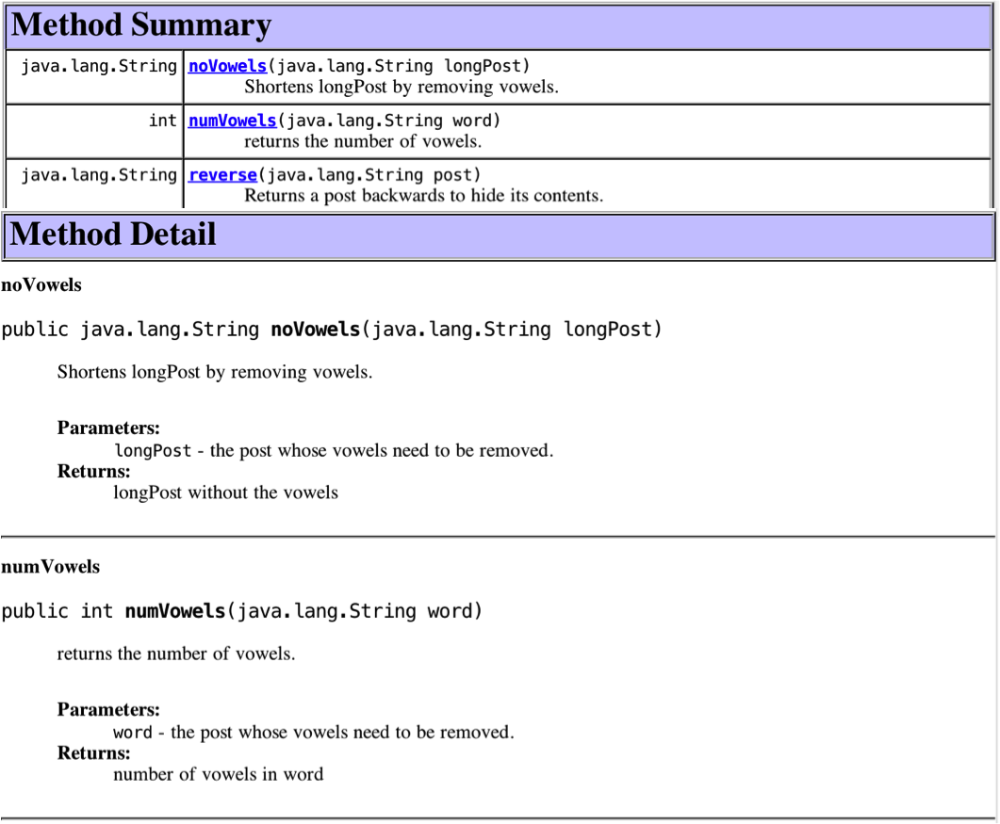

## Java Comments and JavaDoc ([Eck 4.5.4](http://math.hws.edu/javanotes/c4/s5.html))

Java, like all programming languages, allows you to place comments in your code.  The comments should explain your code.  You should develop a coding style that allows people to understand the vast portion of you code by simply reading the code.  You can do this be selecting meaning variable names and programming in simple, easy-to-understand control structures.  Donald Knuth (a famous computer scientist) coined a phrase – literate programming – to mean programs are intended to be read by other programmers as well as executed by computers.  Literate programs are especially important in the maintenance phase of software development.  When creating good, readable programs, there will be large portions of code that do not need superfluous comments.  Consider the following example of a superfluous comment.

```java
personsAge = 23; // set the persons age to 23
```

However, there are important aspects that should be documented.  Java has added several commenting keywords that that allow a readable document to be generated from these comments.  These readable documents can be read using browsers and IDEs.  Both BlueJ and NetBeans show JavaDoc in nice, readable formats.  NetBeans does a really nice job.  These readable comments are the building blocks of JavaDoc.  Before describing the JavaDoc keywords, let’s first examine the two types of comments in Java.  

* Single line comment – These comments continue to the end of the current line.  The above example, repeated here is a single line comment.

  ```java
  personsAge = 23; // set the persons age to 23
  ```

* Multi line comment – These comments begin with /* and continue until a balancing */ is encountered.  There can be as many lines between the /* and */ as desired.  JavaDoc is a multiline comment that begins with ```/**```.  The JavaDoc keywords appear in JavaDoc multi line comments.

One of the best uses of documentation is to document the user interface of a class.  This will define how to construct an object and how to use the methods of an object. The following shows multiline comments that include JavaDoc keywords for the author of a class, the purpose of a method, the values of the methods formal parameters, and the return values of the method.  I have omitted the code for the methods.

```java
/**
 * Twitter helps create twitter posts
 * 
 * @author Gusty
 * @version 6/24/15
 */
public class Twitter {
    /**
     * returns the number of vowels.
     * @param word the post whose vowels need to be removed.
     * @return number of vowels in word
     */
    public int numVowels(String word) { … }
    /**
     * Shortens longPost by removing vowels.
     * @param longPost the post whose vowels need to be removed.
     * @return longPost without the vowels
     */
    public String noVowels(String longPost) { … }
    
    /**
     * Returns a post backwards to hide its contents.
     * @param post the post to be reversed.
     * @return the reverse of post
     */
    public String reverse(String post) { … }
}
```

When using the BlueJ editor, there is a pick menu in the upper right-hand corner that allows you to alternate between ```Source Code``` and ```Documentation```.  You can view JavaDoc by selecting ```Documentation```.  The following is an example of BlueJ's rendition of JavaDoc.
 


