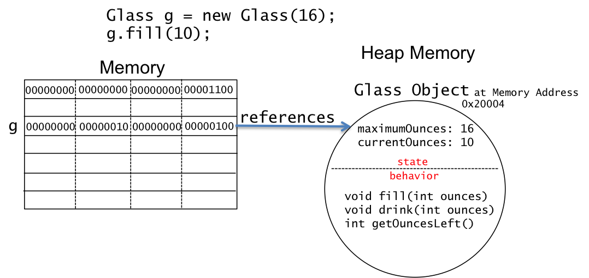
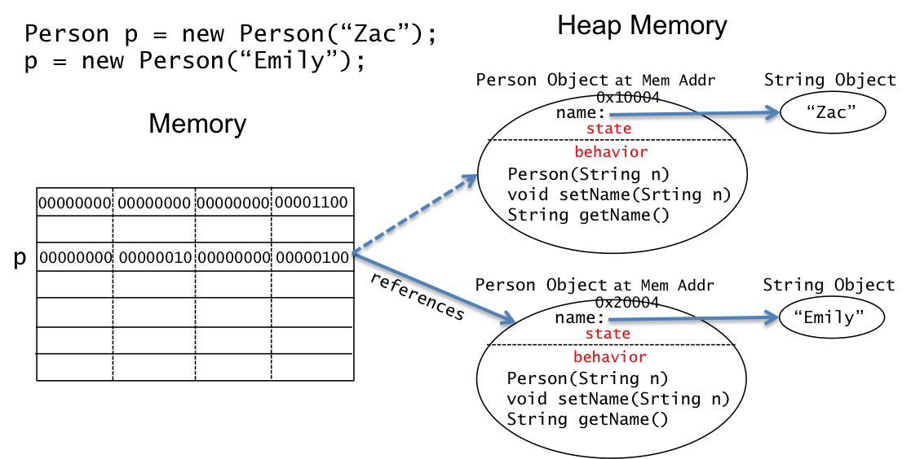

## What We Know with Respect to Java Classes

The following highlight our knowledge about Java ```class```es.

* All code in Java must be in a class.  

* The ```class``` name and the name of the ```.java``` file must match.  Since we are using an IDE for our programming, for the most part the IDE ensures the file name and class name match.  

* We have created programs in a Java  ```class```.  

* In this module, we have learned that Java ```String```, ```Scanner```, and ```Random``` are defined in a Java ```class``` not for the purpose of a program, but rather so we can declare variables of type ```String```, ```Scanner```, ```Random```, and use these variables in our programs.  The following recaps our knowledge of using ```Scanner``` objects.

```java
import java.util.Scanner;           // access Scanner class

public class Main {
   public static void main(String[] args) {
      Scanner in;                   // declare Scanner variable
      in = new Scanner(System.in);  // construct Scanner object
      String name = in.nextLine();  // read with Scanner object
   }
}
```

In this section we learn how to create Java ```class```es that can be used declare variables.  We do this with several examples - ```Glass```, ```Person```, and ```Car```.  Recall from [Simple Objects](/gustycooper.github.io/mydoc_3_simple_objects) that a software object has **state** and **behavior**.  The steps for creating a ```class``` and using it are the following.

1. Create a ```class``` that defines the type
   * The ```class``` has instance variables that define state
   * The ```class``` has instance methods that define behavior

2. Use the ```class``` to define variables

3. Use the ```new``` operator with the ```class``` constructors to construct an object of type ```class```.  When doing this the object is assigned to a variable of type ```class```.

4. Manipulate the object of type ```class``` using the behavior of the class as defined in the ```class```s instance methods.

## A Type and a Tester

As we venture into creating types, we initially create two classes, each in its own ```.java``` file.  One file contains the ```class``` that defines our type.  The other file contains the ```class``` that uses (or tests) our type.

## Defining Type Pattern 

The following is our pattern for creating a ```class``` that defines a type.

<div class="alert alert-danger" role="alert"><i class="fa fa-delicious fa-lg"></i>
<b>
Programming Pattern: Class for Defining Our Types
</b>
<br>
<pre>
public class OurType {

   // Define instance variables

   // Declare constructors

   // Declare instance methods
}
</pre>
</div>

## Defining Tester Pattern

The following is our pattern for creating a ```class``` that is used to test our types.  We place our type class and tester class in the same project, which allows them to reference each other.

The following is our pattern for creating a ```class``` that defines a type.

<div class="alert alert-danger" role="alert"><i class="fa fa-delicious fa-lg"></i>
<b>
Programming Pattern: Class for Testing Our Types
</b>
<br>
<pre>
public class OurTypeTester {

   public static void main(String[] args) {
      OurType x = new OurType();
      x.method();
   }
}
</pre>
</div>


## Glass class Definition

Our first class defines a type ```Glass```.  We pour liquids into real-world glasses and drink from them.  The **state** of a real-world glass includes attributes such as the maximum ounces it holds, the current ounces in the glass, the shape of the glass, and whether the glass is clean or dirty.  The **behavior** we capture of a real-world glass is fill and drink.  Our software ```Glass``` has **state** and **behavior** described as follows.

* State - represented as instance variables in ```class Glass```.

  * Maximum ounces, e.g. 16
  * Current ounces, e.g. 10

* Behavior - represented as instance methods in ```class Glass```.

  * Fill the glass with X ounces of liquid
  * Drink from the glass Y ounces of liquid

The following is our first implmementation of the ```class Glass```, which adheres to our Class for Defining Type pattern..

```java
  1 public class Glass {
  2 
  3    // Define instance variables
  4    private int maximumOunces;
  5    private int currentOunces;
  6 
  7    // Define constructors
  8    public Glass(int maxOunces) {
  9       maximumOunces = maxOunces;
 10       currentOunces = 0;
 11    }
 12 
 13    // Define instance methods
 14    public void fill(int ounces) {
 15       currentOunces = currentOunces + ounces;
 16    }
 17 
 18    public void drink(int ounces) {
 19       currentOunces -= ounces;
 20    }
 21
 22    public int getOuncesLeft() {
 23       return currentOunces;
 24    }
 25 }
```

* The ```class Glass``` code must be placed in a file names ```Glass.java```.

* Line 1 defines our ```class Glass```, which is our type. The ```public``` modifier allows other ```class```es to declared variables of type ```Glass```. The definition of ```class Glass``` is from line 1 to line 25.

* Lines 4 and 5 define two instance variables. The ```private``` modifier keeps other ```class```es from accessing these two instance variables.  Only constructor and methods defined within ```class Glass``` can access ```private``` instance variables.
  * ```maximumOunces``` contains the total ounces a glass can hold.
  * ```currentOunces``` contains the current ounces of liquid in the glass.

* Lines 8 through 10 define a constructor for our type ```Glass```.  
  * The name of a constructor must be the same as the name of the class.  In this case, we have ```class Glass``` and ```public Glass```.
  * A constructor definition is like a method definition, but a constructor does not have a type.  In ```class Glass```, ```fill`` and ```drink``` are type ```void```, ```getOuncesLeft``` is type ```int```, but ```Glass``` does not have a type. 
  * A constructor definition has parameters just like a method definition.  The constructor ```Glass``` has one parameter, ```maxOunces```.
  * The ```public``` modifier allows other ```class```es to call the constructor.

* Lines 14 through 24 define three instance methods, ```fill```, ```drink``` and ```getOuncesLeft```.  The methods we have created prior to now have included the ```static``` modifier.  For example. ```public static void main```.  Methods without the ```static``` modifier are instance methods.  You have to construct an object in order to call instance methods.  When we create an object of type ```String``` and call the method ```substring```, we are calling a ```String``` instance method. 

## Glass class Use

Now that we have defined our ```Glass``` type, we create a ```GlassTester``` class to use/test our ```Glass``` class.  The ```GlassTester``` class is similar is simlar to the programs we have been creating.  We create a single ```main``` method to test ```Glass```.

```java
  1 import java.util.Scanner;
  2 
  3 public class GlassTester {
  4 
  5    public static void main(String[] args) {
  6       Scanner in = new Scanner(System.in);
  7       System.out.print("How big of a glass do you desire? ");
  8       int oz = in.nextInt();
  9       Glass g = new Glass(oz);
 10       System.out.print("How much soda do you desire? ");
 11       oz = in.nextInt();
 12       g.fill(oz);
 13       System.out.print("How much soda do you want to drink in one gulp? ");
 14       oz = in.nextInt();
 15       g.drink(oz);
 16       System.out.println("Your glass now has " + g.getOuncesLeft() + "oz.");
 17    }
 18 }
```
* The ```class GlassTester``` code must be place in a file names ```GlasTester.java```.

* ```GlassTester``` has a ```main``` method, which is our program's entry point.

* Lines 6 and 9 are exactly alike.  The both declare reference type variables.  On line 9, we
  * Declare a variable ```g``` that is type ```Glass```.
  * Use the ```new``` operator to call the ```Glass``` constructor to construct a ```Glass``` object.
  * The variable ```g``` references the ```Glass``` object.

* Lines 8, 11, 12, 14, 15, and 16 call instance methods of ```g``` and ```in```.  For example, we fill ```g``` with soda on line 12 by ```g.fill(oz);```.

## Glass Variable and Memory

The following figure demonstrates declaring and ```Glass``` variable ```g```, assigning a ```Glass``` object to ```g```, and filling ```g``` with 10 ounces.  The four attributes of a variable can be seen in the figure.

* a name
* a type
* a value
* associated memory locations - since ```g``` is a reference type, it has memory for g that references the memory for the object.



## Glass Class Shortcomings

Our ```Glass class``` allows you to ```fill``` more than the ```maximumOunces``` and to ```drink``` more than the ```currentOunces```.  We can fix these shortcomings with conditional expressions added on lines 14a and 18a.  We will also change the types of ```fill``` and ```drink``` to be ```int```, with ```return``` statements added on lines 15a and 19a.  

```java
  1 public class Glass {
  2 
  3    // Define instance variables
  4    private int maximumOunces;
  5    private int currentOunces;
  6 
  7    // Define constructors
  8    public Glass(int maxOunces) {
  9       maximumOunces = maxOunces;
 10       currentOunces = 0;
 11    }
 12 
 13    // Define instance methods
 14    public int fill(int ounces) {
 14a      ounces = ounces + currentOunces <= maxOunces ? ounces : maximumOunces - currentOunces;
 15       currentOunces = currentOunces + ounces;
 15a      return ounces;
 16    }
 17 
 18    public int drink(int ounces) {
 18a      ounces = ounces <= currentOunces ? ounces : currentOunces;
 19       currentOunces -= ounces;
 19a      return ounces;
 20    }
 21
 22    public int getOuncesLeft() {
 23       return currentOunces;
 24    }
 25 }
```

## Person class - Often Used

A ```Person``` type is one of the most used examples in demonstrating object-oriented concepts.  A real-world Person has lots of state and behavior.  The following are few simple examples.

* State - defines the set of values
  * First Name
  * Last Name
  * Age
  * Hair Color

* Behavior - defines the set of operations
  * Birthday - increments age
  * Get married - may change last name
  * Dye hair

Our stroll through the ```Person class``` follows the pattern described above, which is to create two files - one contains a ```Person class``` and the other contains a ```PersonTester class```.

**Person.java file**

```java
public class Person {

   // Define instance variables

   // Declare constructors

   // Declare instance methods
}
```

**PersonTester.java file**

```java
public class PersonTester {

   public static void main(String[] args) {

      Person p = new Persion(); // declares a variable p of type Person
   }
}
```

## Person class - First Rendition

The first rendition of our ```Person class``` is as follows.

```java
  1 public class Person {
  2 
  3    // Define instance variables
  4    private String name;
  5 
  6    // Declare constructors
  7    Person(String n) {
  8       name = n;
  9    }
 10 
 11    // Declare instance methods
 12    public String getName() {        // getter
 13       return name;
 14    }
 15
 16   public void setName(String n) {  // setter
 17      name = n;
 18   }
 19}
```

The following code snippet demontrates using our ```Person``` type.  The line numbers in the code snippet continue from the ```Person class```.

```java
 20 String s = "";
 21 Person p;
 22 p = new Person("Gusty");
 23 s = p.getName();    // s is "Gusty"
 24 p.setName("Cooper");
 25 s = p.getName();    // s is "Cooper"
```

There are a lot of things happening in this simple example.  Let’s take some time to understand all that is happening.  

1. The file ```Person.java``` defines a ```class Person```, which is a new type that we can use to declare variables.  Our ```Person``` type can be used to declare variables exactly like ```int```, ```double```, ```String```, ```char```, and ```Scanner```.  Meta-language for declaring variables followed by declaring a variable of type ```Person``` is the following.

   ```java
   <type-name> <variable-name-or-names>;  // meta language
   Person p; // declaring a variable of type Person
   ```

2. Our class ```Person``` declares one instance variable, ```name``` (on line 4) , which is the **state** information of our class.  ```name``` is a ```private``` variable, which means that only the code within the ```Person class``` can access ```name``` (on lines 8, 13, 17).  Objects assigned to variables of type ```Person``` have a ```name``` instance variable, but it cannot be accessed.  We want surround our **state** information to be manipulated by the **behavior** defined in the instance methods.  

3. Our class ```Person``` declares two ```public``` methods that manipulate the **state**, ```getName``` (lines 12-14) and ```setName``` (lines 16-18).  These methods are called **getters** and **setters**, and most type classes provide them.  The ```public``` modifier users to declare variables of type ```Person``` and call the methods ```getName``` and ```setName```.

4. Numbers 2 and 3 describe fundamental aspects of designing classes and object-oriented programming.  You design a class with parts other programmers can access and parts they cannot.   In this case, we designed ```Person``` so that programmers cannot access the instance variables (or state), but they can access the constructor on instance methods (or behavior).  We will discuss rationale for this dichotomy as the class progresses.  We could allow programmers to access the instance variable ```name```by changing ```private String name;``` to ```public String name;``` (line 4).  If this is done, the following shows how ```name``` is accessed.


   ```java
   Person p = new Person("Gusty");
   String n = p.name;
   p.name = "Cooper"; // access p’s instance variable
   ```

5. ```Person p;``` The code snippet declares a variable ```p``` of type ```Person``` on line 21.  At this point, ```p``` is allocated enough memory to hold a reference which is an address of an object.  At this point, ```p``` does not reference an object.  The value of ```p``` is ```null```.

6. ```p = new Person("Gusty");```.  ```p``` is assigned an object on line 22.  The ```Person``` constructor (lines 7-9) is called by using the ```new``` operator.  Java allocates memory for the ```Person``` object in heap memory.  The resulting address of the object is placed in the memory allocated to ```p```, which now references a ```Person``` object.

7. A reference is Java’s way of saying a pointer to a Person object.  Both a reference and a pointer mean that the variable p will contain an address and that address will be where the Person object is allocated in memory.  When you first declare a Person p you do not have a Person object.  You simply have memory with a null pointer – it is not pointing to anything.

8. Instance variables are unique for each object.  This means the following two Person variables each have a ```name``` instance variable.  This makes perfect sense because ```emily``` and ```coletta```  have different names.

   ```java
   Person emily = new Person("Gusty");
   Person coletta = new Person("Coletta");
   ```

9. Every object of type ```Person``` has its own instance variable ```name```.  This allows us to create lots of ```Person``` objects, each with its own name stored in the instance variable ```name```.  You may think that every object of type ```Person``` has its own set of instance methods.  They sort of do and sort of don’t.  A method is code that is the same for each object.  This means we do not have to duplicate the code for each object.  Each ```Person``` object has its own set of references to same set of instance methods.  This allows Java to have one copy of ```getName``` and ```setName```.

10. A reference type can be used any place a primitive type is used.  You can create methods that return a reference type.  The following code snippet demonstrates a methods that return a ```Person``` object.

    ```java
     1 public static Person makeEmily() {
     2    Person p = new Person("Emily);
     3    return p;
     4 }
     5 
     6 public static Person makeZac() {
     7    return new Person("Zac");
     8 }
     9 
    10 Person p = makeEmily();
    11 p = makeZac();
    12 p = new Person("Brandalee");
    ```

11. A reference variable refers to one object.  Notice lines 10-12 of the previous element assigns ```p``` to three ```Person``` objects. On line 10 ```p``` first refers to an object with name Emily.  On line 11 ```p``` refers to an object with name Zac.  On line 12, ```p``` refers to an object with name Brandalee.  The Emily object and the Zac object are still in heap memory, but they are not referenced.  Eventually, the Java garbage collector will return the memory occupied by Emily and Zac to the heap and it will be reused by some other object.

12.  The following figure demonstrates declaring a ```Person``` variable ```p```, assigning a ```Person``` object with name ```"Zac"```, followed by assigning a ```Person``` object with name ```"Emily"```.  This results in the ```"Zac"``` object being unreferenced, which is shown with a dashed line.  Notice that the instance variable ```name``` is a reference type ```String``` so the diagram shows ```name``` referencing a ```String``` object.



## Person Class - Second Rendition

We update ```Person```s state to include ```age``` and ```friends```.  We update ```Person```s behavior to include a second constructor and instance methods that manipulate ```age``` and ```friends```.

```java
  1 public class Person {
  2 
  3    // Define instance variables
  4    private String name;
  5    private int age;
  6    private String friends;
  7 
  8    // Declare constructors
  9    Person(String n) {
 10       name = n;
 11       age = 22; // default age
 12       friends = "";
 13    }
 14 
 15    Person(String n, int a) {
 16       name = n;
 17       age = a;
 18       friends = "";
 19    }
 20 
 21    // Declare instance methods
 22    public String getName() {        // getter
 23       return name;
 24    }
 25
 26    public void setName(String n) {  // setter
 27       name = n;
 28    }
 28
 29    public int getAge() {            // getter
 30       return name;
 31    }
 32
 33    public void setAge(int a) {      // setter
 34       age = a;
 35    }
 36
 37    public void addFriend(String f) {
 38       friends = friends + " " + f;
 39    }
 40
 41    public String getFriends() {     // getter
 42       return friends;
 43    }
 42 }
```

The following code snippet demonstrates using our updated ```Person class```.

```java
Person gusty = new Person("Gusty",22);
int age = gusty.getAge(); // 22
String name = gusty.getName(); // "Gusty"
String friend = gusty.getFriends(); // ""
gusty.addFriend("Coletta");
gusty.addFriend("Emily");
friend = gusty.getFriend(); // "Coletta Emily"
```

## Car class

We create a ```Car class``` that has **state** and **behavior** described as follows.

* State - represented as instance variables in ```class Car```.

  * Car make, e.g., Ford
  * Car model, e.g., Escape
  * Care year, e.g., 2015
  * Miles per gallon, e.g., 24
  * Gas in tank, e.g., 10 gallons
  * Odometer reading, e.g., 33,102
  * Maximum passengers, e.g., 5
  * Current number of passengers, e.g., 2
  * Current passengers, e.g., Gusty, Jerri Anne

* Behavior - represented as instance methods in ```class Car```.

  * Drive X miles
    * Increases the odometer and decrease gas in tank
  * Add passenger
    * Increases number of passengers 
    * Add a name to the passengers in car
  * Remove passenger
    * Decreases number of passengers
    * Removes name from passengers in car
  * Get gas
    * Returns gas in tank
  * Get odometer
    * Returns the odometer reading
  * Get passengers
    * Returns the passengers in the car


## Class Name, File Name, Constructor Name

The class name, the file name, and constructor name(s) are all the same.  For example, we have ```Person class``` with ```Person``` constructors in a file named ```Person.java```.  Normally, you do not have to worry with file names because the IDE’s help keep them straight.

Java’s convention for naming a class is to capitalize the class name.  The name of a class has to be a valid Java identifier, which does not have to begin with a capital letter, but by convention all Java classes are capitalized.   The classes in this section follow the convention.

Follow the Java class naming conventions on your labs and projects.


