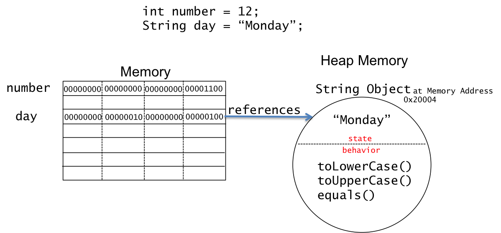

## Java ```String```s Review (Eck 2.3.3)

We have used ```String```s in early programs.  The following highlights our knowledge from [Our First Java Programs](/gustycooper.github.io/mydoc_1_first_programs).

* A ```String``` is probably the most used data type in programming.  If you are creating a mathematical model, numeric types may outnumber ```String```s.
* A ```String``` is not a Java primitive type.
* A ```String``` is a sequence of characters.  A ```String``` is not a ```char```.  A ```char``` is a single character.  You should realize that ```'a'``` is a ```char``` literal and ```"a"``` is a ```String``` literal.  ```'a'``` and ```"a"``` are two different literals.  
* A ```String``` literal is a sequence of characters enclosed in the double tic-mark quotation, e.g., ```"Gusty"```.
* ```String``` variables are declared just like variables of primitive types.

  ```java
  String s; // declare a String variable
  int i;    // declare a primitive type variable
  String gusty = "Gusty"; 
  int j = 21;
  ```

* ```String```s are concatenated with the ```+``` operator, and primitive types are converted to ```String```s when used in concatenation.  A concatenation expression must include at least one operand that is type ```String```.

  ```java
  String cpsc = "CPSC";
  int twentyTwo = 22;
  String cpsc220 = cpsc + " " + twentyTwo + 0;
  ```

In computer programming a string is a collection of readable characters.  For example, “This document is our handout” is a ```String``` literal.  ```String``` variables are variables that hold strings.  Strings and variables of type ```String``` are (probably) the most used literals and data types in programming.  I suppose that if you are creating a mathematical model, numbers may outnumber strings.  

## Java ```String```s - Reference Type and Objects

```String``` variables and literals refer to objects.  An object has state and behavior information.  

* **state** - the value of the ```String```.  A ```String``` has one instance variable that contains the value.
* **behavior** - operations/methods that produce a new ```String```.  These methods are called instance methods.  For examples,
  * ```+``` - concatenation operation
  * ```toLowerCase``` - method that produces a new ```String``` that is the lowercase of the current string.
  * ```equals``` - method that compares one ```String``` to another.
  * In general, ```String``` methods will do such things as extract substrings, capitalize, and compare equality.

Recall the meta language for declaring variables is the following.

The meta language for declaring variables of primitvie types is the following.

<div class="alert alert-info" role="alert"><i class="fa fa-language fa-lg"></i>
<b>
Meta Language - Java's Declarartion Statement
</b>
<br>
<pre>
&lt;type-name&gt; &lt;variable-name&gt; [= &lt;exp&gt;];
</pre>
</div>

We have declared primitive type variables and variables of type ```String``` and ```Scanner```.  Consider the following two variable declarations that we will use to discuss differences.

```java
int number = 12;
String day = "Monday";
```

The variable ```number``` is a primitive type that occupies four bytes of memory, which contains ```0b00000000_00000000_00000000_00001100```.  The variable ```number``` does not contain state and behavior.  The variable ```number``` simply contains an ```int```.  

The variable ```day``` is a reference type that occupies four bytes of memory, which references a ```String``` object.  The ```String``` object is located in *heap* memory.  The ```String``` object that contains *state*, which is the string ```"Monday"``` along with *behavior* in the form of various ```String``` methods such as ```toLowerCase```, ```toUpperCase```, and ```equals```.

The following figure provides a visual for ```number```, ```day```, and memory.



## Accessing ```String``` Methods

The behavior of objects is provided as methods that you call.  The following code demonstrates calling of two ```String``` methods, ```toLowerCase``` and ```toUpperCase```, along with the ```String``` concatenation operation..

```java
String gustysFriends = "";  // Gusty does not have friends.
String friend1 = "Zac";
String friend2 = "Coletta";
gustysFriends = friend1.toLowerCase() + " " + friend2.toUpperCase();
```
Notice this is like a normal method call with the variable name prepended.  The following meta language shows a calling a method of an object, where the variable name is preprended.

<div class="alert alert-info" role="alert"><i class="fa fa-language fa-lg"></i>
<b>
Meta Language - Object Method Call
</b>
<br>
<pre>
&lt;object-variable-name&gt;.&lt;object-method-name&gt; ( &lt;actual-parameter-list&gt; )
&lt;method-name&gt;
   any Java identifier that matches the name of a defined method
&lt;actual-parameter-list&gt; 
   &lt;actual-parameter-exp&gt;, ..., &lt;actual-parameter-exp&gt; 
&lt;actual-parameter-exp&gt;
   any Java expression that evaluates to the type of the corresponding actual parameter
</pre>
</div>

## Java Strings and the new operator

As we have learned, Java ```String```s are defined in a class, which is used to declare variables of type ```String```.  The ```String``` class is defined in the ```java.lang``` package, which does not require an ```import``` statement.  Variables of type ```String``` refer to objects that are allocated on *heap* memory.  All objects, except ```String``` objects, are allocated using the ```new``` operator.  Since ```String```s are used so much, Java provides allows you to allocate a ```String``` object without the ```new``` operator, which is what we have been doing.    Consider the following two ```String``` declaration statements.  They both declare a variable of type ```String```, create a ```String``` object that has ```“Gusty”``` as it *state* information.  The first declaration statement uses the ```new``` operator.  The second declaration statement is much simpler and is what you typically use/encounter.  The third statement is a assignment statement that demonstrates concatenating a ```String``` variable, ```String``` literal, and a ```String``` object created with ```new```.

```java
String name1 = new String("Gusty");
String name2 = "Gusty";
name2 = name2 + " " + new String("teaches");
```

In the next three sections of this module, we will use the ```new``` operator to allocate ```Scanner``` objects, for ```Random``` objects, and objects of ```class```es we define.  All Java classes except ```String``` have to use the ```new``` operator to allocate their objects.  The ```new``` operator is applied to a ```class``` **constructor**, which we learn how to create in [Our First Classes](/gustycooper.github.io/our_first_classes).  

## Java String Equality

In the Expression module, we studied the equality operators (```==``` and ```!=```).  The equality operators compare values in memory, and they works as you would expect for primitive types.  For reference types, equality operators do not work in most cases.  Consider the following figure that shows two ```int```s and two ```String```s.  


The memory allocated to ```number1``` and ```number2``` both contain ```12```, which means that ```number1 == number2``` is ```true```.  The memory allocated to ```day1``` and ```day2``` reference two different ```String``` objects.  ```day1``` contains 131076 (0x20004) and ```day2``` contains 196612 (0x30004), which means ```day1 == day2``` is false.  ```String```s provide the ```equals``` method that should be used when comparing ```Strings```.  The following are examples of using ```equals```.

```java
day1.equals(day2)     // evaluates to true
day2.equals(day1)     // evaluates to true
!day1.equals(day2)    // evaluates to false
day2.equals("Monday") // evaluates to true
```

Java will reuse ```String``` literals, which can serendipitously result in ```==``` giving you a correct result.  Do not fall into this trap.  Always use ```equals``` with ```String```.  The following code shows a couple of examples.

```java
String one = "one";
String oneA = "one";
one == oneA  // evaluates to true

Scanner in = new Scanner(System.in);
String oneB = in.nextLine();  // assume the user types one
one == oneB  // evaluates to false 
```

## Java String Methods

The following are some of Java String methods.  In the following examples, s1 and s2 are variables of type String

* ```char charAt(int index)``` - returns ```char``` at index 
  * ```s1.charAt(N)```, returns ```char``` – the Nth character in the string where ```s1.charAt(0)``` is 1st, ```s1.charAt(1)``` is 2nd, and so on. The las position is ```s1.length() - 1```.  ```"cat".charAt(1)``` is ```’a’```.  An error occurs if the value of the parameter is less than zero or is greater than or equal to ```s1.length()```.
* ```int compareTo(String anotherString)``` 
  * ```s1.compareTo(s2)``` is an integer-valued function that compares the two strings. If the strings are equal, the value returned is zero. If s1 is less than s2, the value returned is a number less than zero, and if s1 is greater than s2, the value returned is some number greater than zero. (If both of the strings consist entirely of lower case letters, or if they consist entirely of upper case letters, then “less than” and “greater than” refer to alphabetical order. Otherwise, the ordering is more complicated.)
  * The ordering of ```String```s is somewhat intuitive.  You compare character by character of two ```String```s until you reach two characters that are different.
    * A < B
    * AA < AB
    * GUSTY < GUTTY
  * Comparing ```String```s with mixed case, numbers, spaces relies upon the Unicode encoding we studied in [Characters as Information](/gustycooper.github.io/mydoc_1_characters).  You should recall that ```'Z'``` is encoded as 90 and ```'a'``` is incoded as 97.
    * Z < a
    * Gusty < gusty
  * ```"Gusty".compareTo("Gusty")``` returns 0
  * ```"Gasty".compareTo("Gusty")``` returns negative
  * ```"Gusty".compareTo("Gasty")``` returns positive
* ```boolean contains(String s)``` - returns ```true``` if string contains s 
  * ```"Gusty".contains("us") returns ```true```
* ```boolean equals(String s)``` - returns ```true``` if string equals s 
  * ```s1.equals(s2)``` returns boolean – ```true``` if ```s1``` and ```s2``` contain the same sequence of characters, and returns false otherwise.
  * ```"Gusty".equals("Gusty")``` returns ```true```
  * ```"Gasty".equals("Gusty")``` returns ```false```
* ```int indexOf(String s [,fromIndex])``` - returns index of ```s``` 
  * ```s1.indexOf(s2)``` returns integer. If ```String s2``` occurs is substring of ```s1```, then the returned value is the starting position of that substring. Otherwise, the returned value is -1. You can also use ```s1.indexOf(ch)``` to search for a ```char, ch```, in ```s1```. To find the first occurrence of x at or after position N, you can use ```s1.indexOf(x,N)```. To find the last occurrence of ```x``` in ```s1```, use ```s1.lastIndexOf(x)```.
* ```boolean isEmpty()``` - returns ```true``` if string is ```""```
  * ```""```.isEmpty() returns ```true``` 
  * ```"Hello"```.isEmpty() returns ```false``` 
* ```int length()``` - returns number of characters in string 
  * ```s1.length()```, returns the number of characters in ```s1```.
  * ```"1234567".length()``` returns 7.
* ```String replace(String s, String t)``` - returns string where ```t``` replaces ```s``` 
  * Replace does not change a ```String```.  Replace creates a new ```String``` object.
  * ```String newString = "Gusty".replace("us", "1234");``` - ```newString``` is ```"G1234ty"```.
* ```String substring(int begin)``` - returns substring from begin to length 
* ```String substring(int begin,int end)``` - returns substring from begin to end 
  * s1.substring(N,M)```, returns ```String```, which is the characters of ```s1``` in positions N through M-1, and the character in position M is not included. The method ```s1.substring(N)``` returns the substring of ```s1``` consisting of characters starting at position N up until the end of the string.
  * ```"Gusty".substring(0,5)``` returns ```"Gusty"```.  You should notice ```'y'``` is in postion 4 - ```"Gusty"```.charAt(4) returns ```'y'```.  Calling ```substring``` with parameters 0 and 5 indicates to get characters from postion 0 through 4.
* ```char[] toCharArray()``` - returns ```char[]``` of string 
* ```String toLowerCase()``` - returns lowercase of string 
* ```String toUpperCase()``` - returns uppercase of string 
  * ```s1.toUpperCase()``` returns ```String``` – returns a new string that is the uppercase of to ```s1```,.  ```"Cat".toUpperCase()``` is the ```string "CAT"```.  ```s1.toLowerCase()``` is the lowercase equivalent.

## New Java Strings Are Created More Than You May Think

Consider the following statements manipulating Strings.

1. ```String s = "A string";```
2. ```s = "B string";```
3. ```String t = s.toUpperCase();```
4. ```s = t.substring(0,1);```

Java will create the following strings: ```"A string"```, ```"B string"```, ```"A STRING"```, and ```"B"```.  Key concepts to remember are the following.

* When the assignment statement in 2 is executed, the string ```"A string"``` is lost in memory.  Eventually, the Java garbage collector will return that memory for reuse.
* The ```s.toUpperCase()``` in statement 3 does not change the value of ```s```.  This computes a new string which is returned and assigned to ```t```.
* The ```t.subString(0,1)``` also computes a new string (```“B”```) that is assigned to ```s```.

## Java Strings are Immutable

Java Strings are immutable.  The term immutable means cannot be changed; however, we can do the following, which looks like we are changing a String.

```java
String s = "I am Gusty";
s = "I am also Cooper";
```

We have learned the variable ```s``` references a ```String``` object.  We can change the value of ```s``` so it references a new object, but we are not changing the ```String``` ```"I am Gusty"```.  The following figure demonstrates this.  The dashed arrow shows ```s``` referencing ```"I am Gusty"```.  The solid arrow shows ```s``` referencing ```"I am also Cooper"```.


## Instance Variables and Methods

The term **instance** is used to indicate attributes that are availble in each object.  An object is an instance of a particular class.  For example, a ```String``` object is an instance of a ```String``` class.  A class has instance variables and instance methods.  A ```String``` has one instance variable, which contains the value of the ```String```.  A ```String``` has many instance methods.  We have discussed some of the most used in this section.  We will study instance variables and methods in more detail when we create our own class.
