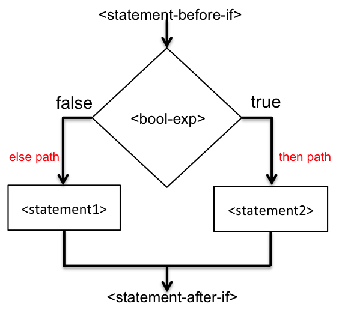

## Conditional Statements

A conditional statement evaluates an expression and selects a specific path for execution based upon the result of the expression.  Java provides two conditional statements - ```if``` and ```switch```.  The ```if``` statement evaluates a ```boolean``` expression.  The ```switch``` statement evaluates an expression that must evaluate to evaluate to ```int```, ```short```, ```byte```, ```char```, ```String```, or an ```enum``` type.  We study ```enum``` in [Classes, Objects, and more](/gustycooper.github.io/mydoc_5_classes_objects).

if statement (Eck 3.5)

## Two-way ```if``` Statement

A two-way ```if``` statement evaluates a ```boolean``` expression and executes one of two paths.  If the expression is ```true```, the ```then``` path is executed.  If the expression is ```false```, the ```else``` path is executed.   A Java ```if``` statement does not have ```then``` as a keyword.  The following is an example two-way ```if``` statement that computes ounces of water based upon the type of plant.  The ```they``` path follows the ```if```.  The ```else``` path folows the ```else```.

```java
if (plant.equals("cactus"))
   water = 0; // ounces
else
   water = 5; // ounces
```

You should notice the ```boolean``` expression is enclosed in parentheses, which is required.  The following is an incorrect version of the same statement because the parentheses are omitted.

```java
if plant.equals("cactus")  // missing parens around boolean exp
   water = 0; // ounces
else
   water = 5; // ounces
```

If you want to include more than one statement on the ```then``` or the ```else``` path, you must use a block.  The following expands the example to include multiple statements.

```java
if (plant.equals("cactus")) {
   water = 0; // ounces
   time = "not applicable";
} else {
   water = 5; // ounces
   time = "12:00PM";
}
```

Omitting the block for multiple statements is an error.  The following is an error because the parentheses have been omitted.

```java
if (plant.equals("cactus"))
   water = 0; // ounces
   time = "not applicable";
else
   water = 5; // ounces
   time = "12:00PM";
```

You can use a block with one statement by simply enclosing the statement with parentheses.  The following demonstrates our original two-way ```if``` where the single statements are part of blocks.

```java
if (plant.equals("cactus")) 
   {
   water = 0; // ounces
   }
else
   {
   water = 5; // ounces
   }
```

## Two-way ```if``` Flowchart

The following figure shows a two-way ```if``` flow chart.

 


## One-way ```if``` Statement

An ```if``` statement does not require an ```else```.  If the ```else``` is omitted, the result is a one-way ```if```.  A one-way ```if``` can have a single statement or a block.  The following demonstrates an one-way ```if```.  

```java
water = 5;
if (plant.equals("cactus") {
   water = 0;
}
```

## One-way ```if``` Flowchart

 

## ```if``` Statement Meta Language

The meta language for two-way and one-way ```if``` statements is given by the following.

<div class="alert alert-info" role="alert"><i class="fa fa-language fa-lg"></i>
<b>
Meta Language - If Statement
</b>
<br>
<pre>
if ( &lt;boolean-expression&gt; ) // two-way
   &lt;statement1&gt;;
else
   &lt;statement2&gt;;

if ( &lt;boolean-expression&gt; ) // one-way
   &lt;statement&gt;;

if ( &lt;boolean-expression&gt; ) { // two-way with block
   &lt;statement-list&gt;
}
else {
   &lt;statement-list&gt;
}

if ( &lt;boolean-expression&gt; ) { // one-way with block
   &lt;statement-list&gt;
}
</pre>
</div>

## ```if``` Statement when an Assignment Works

Beginner programmers do not always think ```boolean``` expressions.  A ```boolean``` expression can be placed on the right-hand of an assignment statement.  Often times a new programmer uses a two-way ```if``` when an assignment is more appropriate.  Consider the following two-way ```if``` statement that assigns a ```boolean``` variable ```teacher``` based upon the value of a ```String``` variable ```name```.

```java
if (name.equals("Gusty"))
   teacher = true;
else
   teacher = false;
```

The two-way ```if``` is unnecessary.  The following statement is equivalent.

```java
teacher = name.equals("Gusty");
```

## Multi-way If Statements

You can connect an ```if``` statement on the ```else``` path to create multi-way ```if``` statements.  The following is an example.

```java
if (g.equals(“Gusty”)) {
  g = “Bicyclist”;
} else if (g.equals(“Jerri Anne”)) {
  g = “Chef”;
} else if (g.equals(“Barrack”)) {
  g = “President”;
} else {
  g = “nobody”;
}
System.out.println(“The occupation is “ + g);
```

## Dangling Else

Java pairs an ```else``` to the closest ```if``` without an ```else```.  Sometimes you create code thinking an ```else``` is paired with the correct ```if```, but it is not.  An incorrectly paired ```else``` is called a dangling ```else```.  Consider the following code where someone desires to print ```"aaa"``` when ```num``` is between 1 and 100 and print ```bbb``` when ```num``` <= 0.

```java
int num = -1;
if (num > 0)   
   if (num <= 100) 
      System.out.println( "aaa" );
else
   System.out.println( "bbb" );
System.out.println(“Done”);
```

Do not be fooled by my placing the ```else``` under the first ```if```.  Java does not care about spacing.  The above code prints the following.

```java
Done
```

The above code prints ```bbb``` when ```num``` is >= 10.  The above code is re-written with indentation that shows which ```if``` the ```else``` is paired with.

```java
int num = -1;
if (num > 0)   
   if (num <= 100) 
      System.out.println("aaa");
   else
      System.out.println("bbb");
System.out.println(“Done”);
```

We use a block, ```{ }``` to force the ```else``` to pair with the first ```if``` as follows.

```java
int num = -1;
if (num > 0) 
{
   if (num <= 100) 
      System.out.println("aaa");
}
else
   System.out.println("bbb");
System.out.println(“Done”);
```

You may encounter an unwelcome dangling else in your programming, but maybe you not.  The preceding code is rather contrived.  The code does not print anything for positive numbers greater than 100.  Most likely, I would have used a ```boolean``` expression with the first ```if``` as follows.  Note: this code is not exactly the same as the earlier code.

```java
int num = -1;
if ((num > 0) and (num <= 100))
   System.out.println("aaa");
else
   System.out.println("bbb");
System.out.println(“Done”);
```

## Blocks and Scope (Eck 3.1)

In Java, you can declare a variable wherever you need one, but you must be aware of the scope of the variable.  The scope of a variable is the block in which it is enclosed.  Consider the following code that swaps the contents of x and y when x is greater than y.  The code introduces a temp variable that is only available within the if statement’s scope.

```java
if ( x > y ) {
   int temp;  // A temporary variable for use in this block.
   temp = x;  // Save a copy of the value of x in temp.
   x = y;     // Copy the value of y into x.
   y = temp;  // Copy the value of temp into y.
}
if (temp > 0) {...} // This is illegal because temp is not defined
```

## ```if``` Statement Style

There are several style related items we can discuss with ```if``` statements.  Most of this discussion applies to loops.

* The first style discussion concerns placement of ```{ }``` for blocks within ifs.  There is not a correct answer, but which of the following is a better style.  This is up to each individual programmer.  Someday you will work for a company that may impose a particular style.  Whatever style you select, you should remain consistent and not oscilate between styles.

  ```java
  if (plant.equals("cactus"))        if (plant.equals("cactus")) {
  {                                     water = 0; // ounces      
     water = 0; // ounces               time = "not applicable";  
     time = "not applicable";        } else {                     
  }                                     water = 5; // ounces      
  else                                  time = "12:00PM";
  {                                  }
     water = 5; // ounces                                         
     time = "12:00PM";          
  }                             
  ```

* The second style discussion is where you should place ```{ }``` around single statements.  We know they are not required for single statements, but some programmers choose to use them for all ifs.   
Either way is equivalent in this case.  Some programmers always use a block of statements even when there is only one statement.  This allows them to insert additional statements without having to back fit ```{``` and ```}``` in the code to create a block – you  already have them.  This results in the following style.

  ```java
  if (plant.equals("cactus")) 
     {
     water = 0; // ounces
     }
  else
     {
     water = 5; // ounces
     }
  ```

* A two-way ```if``` can sometimes be replaced with a one-way ```if```.  Consider the two code sequences shown as follows.

  ```java
  if (plant.equals("cactus"))        water = 5;
     water = 0; // ounces            if (plant.equals("cactus")
  else                                  water = 0;
     water = 5; // ounces            
  ```

## ```if else if else``` - One Path Only

The following statements should be obvious at this point.  All statements are the same.

* A two-way if executes either the if-path or the else-path.  
* A two-way ```if``` never executes both paths.
* The paths of a two-way ```if``` are mutually exclusive.

The same principle is true for multi-way ```if``` statements.  A multi-way ```if``` executes one of the paths.  Consider the following example.  Each path is mutually exclusive.  Only one of the following is printed, ```"Bicyclist"```, ```"Chef"```, ```"Barrack"```, ```"Do not know"```.

```java
if (name.equals("Gusty"))
   System.out.println("Bicyclist");
else if (name.equals("Jerri Anne"))
   System.out.println("Chef");
else if (name.equals("Barrack"))
   System.out.println("President");
else
   System.out.println("Do not know");
```

Now consider the following multi-way ```if```, which still executes one (and only one) of the paths even though the ```boolean``` expressions for two paths are true.  The first path with a ```true boolean``` expression is executed, which in this case is ```if (xp > 70)```.  This example prints ```'C'```.

```java
int xp = 92;
if (xp > 70)
   System.out.println('C');
else if (xp > 80)	               
   System.out.println('B');
else
   System.out.println('A');
```

## Use a two-way ```if``` When Mutual Exclusive

The two-way ```if``` that assigns ```water``` based on the value of ```plant``` is an example of mutual exclusive assignments.  You only execute one of the two assignments.  You should always use a two-way ```if``` for mutual exclusion.  You should not use stacked ```if```s.  Consider the following two algorithms - one with a two-way ```if``` and the other with stacked ```if```s - that assign ```x``` to 1 when ```x``` is negative; otherwise assign ```x``` to 2.  Both of the algorithms accomplish this goal; however, the algorithm two-way ```if``` is better.  When someone reading code encounters stacked ```if```s, they assume there is some condition which will cause the ```then``` path for both ```if```s to execute.

```java
int x = -1;        int x = -1;
if (x < 0)         if (x < 0)
   x = 1;             x = 1;
else               if (x >= 0)
   x = 2;             x = 2;
```

## ```int``` is not ```boolean```

Some languages treat an integer 0 as ```false``` and all other integers as ```true```.  Likewise some languages (like Python) treat an empty string ```""``` as ```false``` and any other ```String``` as ```true```.  This allows code such as the following.

```java
int x = 1;
if (x) { // do this since x is not zero }
```

You cannot do this type of programming in Java because ```if``` expressions must be ```boolean```.  You must to do something like the following.

```java
if (x != 0) { // do this since x is not zero }
```

## ```switch``` Statement (Eck 3.6)

The Java ```switch``` statement is similar to a multi-way ```if```.  There are usually multiple paths in a ```switch```, with the last path being similar to the last ```else``` of a mult-way ```if```.  You can create a ```switch``` with one path, but they are rare.  A ```switch``` statement expression must evaluate to must evaluate to ```int```, ```short```, ```byte```, ```char```, ```String```, or an ```enum``` type.   A ```switch``` statement has ```case```s that execute when the expression evaluates to a specific value.  Consider the following code that demonstrates a multi-way ```if``` statement where the ```boolean``` expressions compare a variable to simple ```int``` constants and its equivalent ```switch``` statement.

```java
if (x == 1)      { // do something }
else if (x == 2) { // do something }
else if (x == 3) { // do something }
else             { // do something }

switch (x) {
   case 1:
      // do something
      break;
   case 2:
      // do something
      break;
   case 3:
      // do something
      break;
   default:
      // do something
} // end of switch
```

## ```switch``` and ```break``` Statements

Understanding a ```switch``` statement is rather intuitive except for the ```break``` statement.  Java borrowed the ```switch``` statement from C/C++, retaining the awkward ```break``` statement as part of its semantics.  Without the ```break``` statement, the ```switch``` continues from one ```case``` to the next.  Consider the following example that does not have ```break``` statements.

```java
int a = 1;
switch (a) {
   case 1:
      System.out.println(“case 1”);
   case 2:
      System.out.println(“case 2”);
   default:
      System.out.println(“default”);
} // end of switch
```

The output for the preceding example is the following.

```java
case 1
case 2
default
```

## Switch Meta-language

The meta language for ```switch``` statements is given by the following.

<div class="alert alert-info" role="alert"><i class="fa fa-language fa-lg"></i>
<b>
Meta Language - Switch Statement
</b>
<br>
<pre>
switch (&lt;expression&gt;) { 
   case &lt;constant-1&gt;:
      &lt;statement-list1&gt;
      break;		// required or flow goes to next case
   case &lt;constant-2&gt;:
      &lt;statement-list2 &gt; 
      break;
     .
     . // (more cases) 
     .
   case &lt;constant-N&gt;: 
      &lt;statement-listN&gt; 
      break;
   default:  // optional default case
      &lt;statement-listN1&gt;
} // end of switch statement
</pre>
</div>

* ```<expression>``` must evaluate to ```int```, ```short```, ```byte```, ```char```, ```String```, or an ```enum``` type.
* Multiple ```case```s can be used.  The following is an example.
  ```java
  case 1: case 2: case 3:
     i = 10;
     break;
  ```
* The ```break``` is required to cause flow to the end of the ```switch```; otherwise, flow continued with the next ```case```.

## Switch for Rock-Paper-Scissors

The following code demonstrates a switch statement that is playing rock-paper-scissors.  Perhaps you want to try this to see who wins – you are the computer.

```java
String computerMove;
switch ( (int)(3*Math.random()) ) {
   case 0:
      computerMove = "Rock";
      break;
   case 1:
      computerMove = "Paper";
      break;
   default:
      computerMove = "Scissors"; 
      break;
}
```
System.out.println("The computer’s move is " + computerMove);  // OK!

