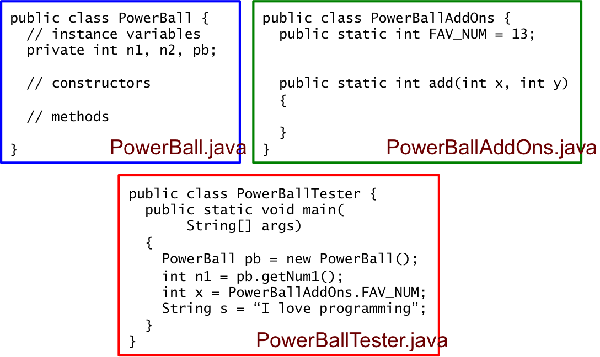
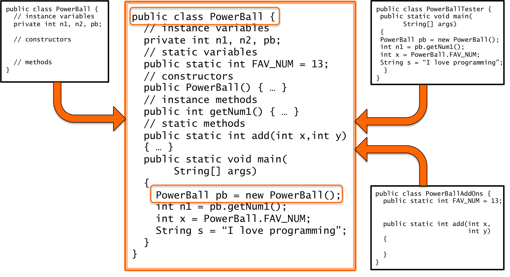

## Instance and Static

This section concisely defines instance and ```static```, discusses sample code to demonstrate the definitions, and repeats the definitions after the code discussion.

* **Instance variables and methods** exist inside of of objects.  You must construct objects in order to have instance variables and methods.
* **```static``` variables and methods** exist inside of classes.  You do not construct objecst in order to access static variables and methods.

In [Our First Java Programs](/gustycooper.github.io/mydoc_1_first_programs) we learned how to create a program with a single ```public static void main(String[] args)``` method.  In [Methods](/gustycooper.github.io/mydoc_1a_methods) we learned how to create a program with multiple ```static``` methods (e.g., ```public static void main``` and ```public static String getName```).  In [Simple Objects](/gustycooper.github.io/mydoc_3_simple_objects) we learned how to define our own types in a ```class```.  When doing this we created one class with our type (e.g., ```Person```) and a second class to test our type (e.g., ```PersonTester```).  Our ```Person``` class contained instance variables, constructors, and instance methods - none of these has ```static``` modifier.  Our ```PersonTester``` class contained ```public static void main``` and perhaps other ```static``` methods.  This section develops the full concept of ```instance``` and ```static``` by devoloping an example ```PowerBall``` type, addons, and a tester.

## ```PowerBall``` Type

The ```PowerBall``` type models a three number Powerball game - two regular numbers between 1 and 69 and a powerball number between 1 and 26.  The programmer interface for our ```PowerBall``` type is the following.

* ```PowerBall()``` - constructor that selects three random numbers for you.
* ```PowerBall(int n1, int n2, int pb)``` - constructor that you select three numbers.
* ```int getNum1()``` - return first powerball number
* ```int getNum2()``` - return second powerball number
* ```int getPowerBall()``` - return the powerball number
* ```void newNumbers()``` - update my numbers with three random numbers.
* ```void newNumbers(int n1, int n2, int pb)``` - update my numbers with three I select
 
The code for our ```PowerBall``` class contains instance variables, constructors, and instance methods.  There are no ```static``` variables or methods.

```java
public class PowerBall {
    // instance variables
    private int num1;
    private int num2;
    private int powerBall;
    
    public PowerBall(int n1, int n2, int pb) {
        num1 = n1;
        num2 = n2;
        powerBall = pb;
    }
    
    public PowerBall() {
        newNumbers();
    }
    
    public int getNum1() { return num1; }
    
    public int getNum2() { return num2; }
    
    public int getPowerBall() { return powerBall; }

    public String getNumbers() {
        String retVal = num1 + " " +
                        num2 + " " +
                        powerBall;
        return retVal;
    }
    
    public void newNumbers() {
        num1 = (int)(Math.random()*69)+1;
        num2 = (int)(Math.random()*69)+1;
        powerBall = (int)(Math.random()*26)+1;
    }
    
    public void newNumbers(int n1, int n2, int pb) {
        num1 = n1;
        num2 = n2;
        powerBall = pb;
    }
}
```

## ```PowerBallAddOns``` Class

The ```PowerBallAddOns class``` contains two ```static``` items, ```public static int FAV_NUM``` and ```public static int specialAdd```.  ```PowerBallAddOns``` is not a program because it does not contain a ```main``` method.  Other ```class```es can access the ```public static``` items by prefixing them with ```PowerBallAddOns```, i.e., the ```class``` name.  For example, a ```class``` can perform an assignment by ```int i = PowerBallAddOns.FAV_NUM;```.  The code for ```PowerBallAddOns``` is given as follows.

```java
public class PowerBallAddOns {
    public static int FAV_NUM = 13;
    
    public static int specialAdd(int num1, int num2) {
        return ((num1 * (int)(Math.random()*23) + num2 * (int)(Math.random()*32)) % 69) + 1;
    }
}
```

## ```PowerBallTester``` Class
The ```PowerBallTester``` follows the pattern we established in [Simple Objects](/gustycooper.github.io/mydoc_3_simple_objects).  We accomplish testing with a single ```public static void main``` method.  Notice ```PowerBallTester``` uses ```PowerBall``` and ```PowerBallAddOns```.

```java
public class PowerBallTester
{
    public static void main(String[] args) {
        // Pick my numbers
        PowerBall myNums = new PowerBall(10,5,PowerBallAddOns.FAV_NUM);
        System.out.println("My numbers: " + myNums.getNumbers());        

        // Pick random numbers
        PowerBall randomNums = new PowerBall();
        System.out.println("Random numbers: " + randomNums.getNumbers());
        
        int num1 = randomNums.getNum1();
        int num2 = randomNums.getNum2();
        int pb   = randomNums.getPowerBall();
        System.out.print(PowerBallAddOns.specialAdd(num1,num2) + pb);
}
```

## Powerball Figure

The following figure shows our three powerball classes.  We have purposely separated our program into three ```.java``` files.  ```PowerBall.java``` contains our ```PowerBall``` type, which only has instance items.  ```PowerBallAddOns.java``` is not a program - it contains ```static``` information that we can use in our program.  ```PowerBallTester``` contains our program - it uses our ```PowerBall``` type and ```PowerBallAddOns```.




## Powerball Code in One File

The three files of our Powerball program allow us to easily see the components of our program, but Java does not require us to separate our Powerball program into three files.  We can put everything into one file, but it is hard to grasp when you first do this.  You have a mixture of ```instance``` and ```static``` items.  Before putting our Powerball program into one file, we consider a simple ```main``` program that generates an error in order to explain the error.

```java
 1 public class Main {
 2 
 3    public double d = 2.0;
 4 
 5    public static void main(String[] args) {
 6       System.out.println(d);
 7    }
 8 }
```

The above program generates a compile error on line 6 - "non-static variable d cannot be referenced from a static context".  Variable ```d``` declared on line 3 is an instance variable within class ```Main```.  ```d``` only exists in objects of type ```Main```.  You know how to declare variables of type ```Main``` and assigne an object to it.  We did this many times in [Simple Objects](/gustycooper.github.io/mydoc_3_simple_objecs).  The following code snippet demonstrates what we already know how to do.

```java
Main m = new Main();
System.out.println(m.d);
```

The following re-write of ```Main``` may look strange, but it is good Java code.  ```Main``` is a class with a ```public``` instance ```double d```.  We use ```Main``` to declare a variable ```m``` of type ```Main``` and allocate an object to ```m``` by calling a constructor.


```java
 1 public class Main {
 2 
 3    public double d = 2.0;
 4 
 5    public static void main(String[] args) {
 5a      Main m = new Main();
 6       System.out.println(m.d);
 7    }
 8 }
```

The following code places our three Powerball components in one ```PowerBall.java``` file.  This may seem awkward, but it is good Java code.  You will see this repeatedly in our study of Java graphics.

```java
public class PowerBall {
    // instance variables
    private int num1;
    private int num2;
    private int powerBall;
    
    public PowerBall(int n1, int n2, int pb) {
        num1 = n1;
        num2 = n2;
        powerBall = pb;
    }
    
    public PowerBall() {
        newNumbers();
    }
    
    public int getNum1() { return num1; }
    
    public int getNum2() { return num2; }
    
    public int getPowerBall() { return powerBall; }

    public String getNumbers() {
        String retVal = num1 + " " +
                        num2 + " " +
                        powerBall;
        return retVal;
    }
    
    public void newNumbers() {
        num1 = (int)(Math.random()*69)+1;
        num2 = (int)(Math.random()*69)+1;
        powerBall = (int)(Math.random()*26)+1;
    }
    
    public void newNumbers(int n1, int n2, int pb) {
        num1 = n1;
        num2 = n2;
        powerBall = pb;
    }

    public static int FAV_NUM = 13;
    
    public static int specialAdd(int num1, int num2) {
        return ((num1 * (int)(Math.random()*23) + num2 * (int)(Math.random()*32)) % 69) + 1;
    }

    public static void main(String[] args) {
        // Pick my numbers
        PowerBall myNums = new PowerBall(10,5,PowerBallAddOns.FAV_NUM);
        System.out.println("My numbers: " + myNums.getNumbers());        

        // Pick random numbers
        PowerBall randomNums = new PowerBall();
        System.out.println("Random numbers: " + randomNums.getNumbers());
        
        int num1 = randomNums.getNum1();
        int num2 = randomNums.getNum2();
        int pb   = randomNums.getPowerBall();
        System.out.print(PowerBallAddOns.specialAdd(num1,num2) + pb);

}
```

The following figure demonstrates ```PowerBall``` with instance, ```static```, and ```main``` merged into one class.



## Instance and Static

* **Instance variables and methods** exist inside of of objects.  You must construct objects in order to have instance variables and methods.
* **```static``` variables and methods** exist inside of classes.  You do not construct objecst in order to access static variables and methods.


