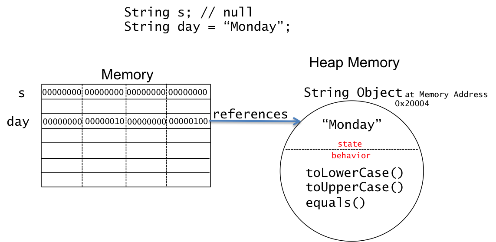

## ```null```

Reference variables that do not reference an object have the value ```null```, which is implemented as 0 in memory.  The number of bytes required for a reference type is determined by the JVM.  A 32-bit JVM allocates 4 bytes and a 64-bit JVM allocates 8 bytes.   The following code demonstrates reference types and ```null```.

```java
String s; // s is null
Person p; // p is null

if (s == null) 
   System.out.println("s is null");
else
   System.out.println(s);

System.out.println(s); // prints null

```

The following figure shows a 32-bit ```null``` reference.




