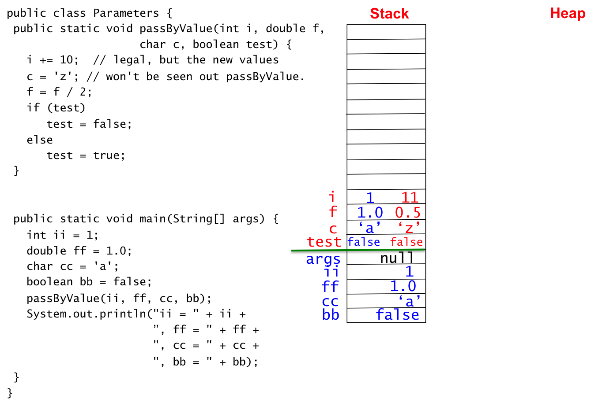
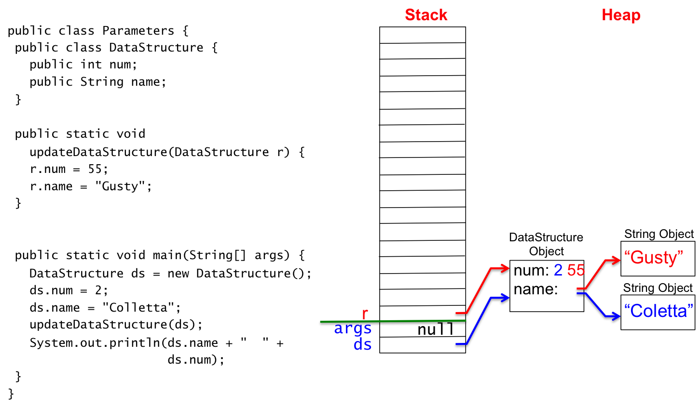
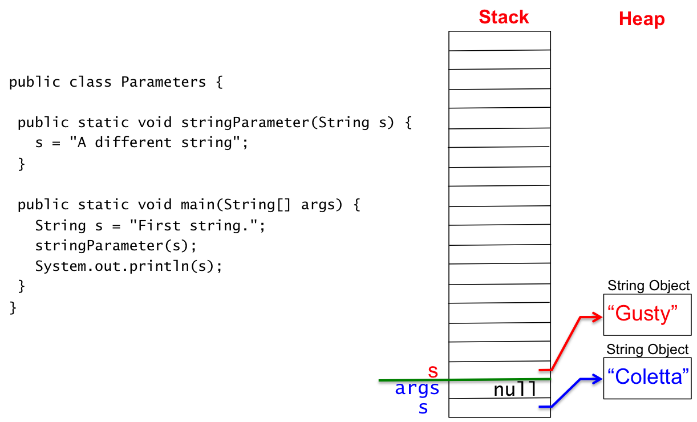

## Acknowledgments

> The sections **Passing Primitive Types**, **Passing Object References**, and **Passing Strings** have been modeled after those same sections from [Java Method Arguments](http://www.cs.toronto.edu/~reid/web/javaparams.html), which is the website http://www.cs.toronto.edu/~reid/web/javaparams.html.  
>
> The code samples have been copied and edited to fit the style of this document. For example, renamed ```tryPrimitives``` to ```passByValue```. 
>
> The descriptions have been augmented and edited to fit the style of this document.

## Introduction

In this section, we study the details of passing parameters.

## Parameters and Arguments

I primarily use the term **parameter**, but I use the terms **parameter** and **argument** interchangeably.  I use **formal** and **actual** as a prefix word - for examples, formal paramter and actual parameter.

Some attempt to differentiate between parameters and arguments.  Some use parameter for formal parameter and argument for actual parameter.  I do not do this.

## Calling Methods and Passing Parameters

We initially studied defining and calling methods in [Methods](/gustycooper.github.io/mydoc_1a_methods).  We have used methods in our programs.  We understand methods defintion and calling as shown in the following figure.


We know basics of defining and calling methods.

1. Define a method
   * Provide a return type
   * Provide a method name
   * Provide modifiers (e.g., ```static```)
   * Provide formal parameters
2. Call a method
   * Call the method passing actual parameters - expressions the evaluate to the type of the corresponding formal parameter.
   * Methods that return values can be used in expressions.
   * Methods of type ```void``` are used as a statement.

The meta languages for method definition and method call are given by the following.

<div class="alert alert-info" role="alert"><i class="fa fa-language fa-lg"></i>
<b>
Meta Language - Method Definition
</b>
<br>
<pre>
&lt;modifiers&gt; &lt;return-type&gt; &lt;method-name&gt; ( &lt;formal-parameter-list&gt; ) {    
    &lt;statement-list&gt;
}
&lt;modifiers&gt; 
   public – method may be called from objects or outside of the class
   static – method exists independent of an object
&lt;method-name&gt;
   any Java identifier
&lt;return-type&gt;
   any Java type or void
   void is for a method that does not return a value
&lt;formal-parameter-list&gt; 
   &lt;type-name&gt; &lt;formal-parameter-name&gt;, ..., &lt;type-name&gt; &lt;formal-parameter-name&gt; 
&lt;type-name&gt;
   any Java type
&lt;formal-parameter-name&gt;
   any Java identifier
&lt;statement-list&gt;
   &lt;statement&gt;; ... &lt;statement&gt;; 
   each statement is terminated with a ;
</pre>
</div>

* The ```<formal-parameter-list>``` is a sequence of variable declarations separated by commas.  
* A ```<formal-parameter>``` is a variable.  
* The type of the actual parameter must match that of the formal parameter.  
* The value of the actual parameter is copied into the formal parameter when the method is called.

A method definition has a block with a sequence of statements.  The method block may contain inner blocks.  The top-level meta language for a method defintion could have been written as follows to emphaise a method block.

<div class="alert alert-info" role="alert"><i class="fa fa-language fa-lg"></i>
<b>
Meta Language - Method Call
</b>
<br>
<pre>
&lt;method-name&gt; ( &lt;actual-parameter-list&gt; )
&lt;method-name&gt;
   any Java identifier that matches the name of a defined method
&lt;actual-parameter-list&gt; 
   &lt;actual-parameter-exp&gt;, ..., &lt;actual-parameter-exp&gt; 
&lt;actual-parameter-exp&gt;
   any Java expression that evaluates to the type of the corresponding actual parameter
</pre>
</div>

* The ```<actual-parameter-list>``` is a list of expressions separated by commas.  
* Each ```<actual-parameter-exp>``` must evaluate to the type of its corresponding formal parameter.

## Formal and Actual Parameters

A formal parameter / argument is a variable defined between the parentheses of a method.  Formal parameters have a type and are defined like regular variables.  When a method has multiple formal parameters, they are separated with a comma.  A method definition does not have to have formal parameters.  The following example method ```average``` has 4 formal parameters: ```a```, ```b```, ```c```, and ```d```.  

```java
  public double average(int a, int b, int c, int d) { ... }
```

The parameters provided in a method call are actual parameters.  Actual parameters are expressions that evaluate to the type of the corresponding formal parameters.  The following is an example method call that has 4 actual parameters: 1, 2, 3, and 4.

```java
 double d = average(1, 2, 3, 4);
```


## Pass by Value and Pass by Reference

Pass by value and pass by reference are two ways to pass parameters to methods.  Pass by value and pass by reference are sumarized in this section.  Details and sample code are provided in subsequent sections. 

* The concept of pass by value is that the called method cannot change the values of the actual parameter.  Pass by value copies the value of the actual parameter into the formal parameter.  The called method manipulates the formal parameter (e.g., use the value and actually change the value of the formal parameter), but the called method cannot change the value of the actual parameter.  
* The concept of pass by reference is the called method can change the values of actual parameters.  Strictly speaking, Java is always pass by value, but that is somewhat misleading because when you pass a reference variable to a method, the address of the object is copied into the formal parameter.   When the called method manipulates the object, it changes the object that is referenced by the actual parameter.  

## Passing Primitive Types

Primitive types are passed by value.

As we have already learned, Java has eight primitive data types: ```byte```, ```char```, ```short```, ```int```, ```long```, ```float```, ```double```, and ```boolean```. When variables of these data types are passed as actual parameters to a method, the values of the actual parameters are copied into the corresponding formal parameters.  The called method can use the formal parameters, including changing their values, but these actions do not change the values of the actual parameters. Consider the following example method ```passByValue```.


```java
public static void passByValue(int i, double f, char c, boolean test) {
   i += 10;    //This is legal, but the new values
   c = 'z';    //won't be seen outside passByValue.
   f = f / 2;
   if (test)
      test = false;
   else 
      test = true;
}
```

If ```passByValue``` is called as follows, the ```println``` prints ```ii = 1, ff = 1.0, cc = a, bb = false```.

```java
public static void main(String[] args) {
   int ii = 1;
   double ff = 1.0;
   char cc = 'a';
   boolean bb = false;
   passByValue(ii, ff, cc, bb);
   System.out.println("ii = " + ii + ", ff = " + ff +
                      ", cc = " + cc + ", bb = " + bb);
}
```

The following figure demonstrates the previous discussion.  Examine the stack that shows actual and formal parameters.  The formal parameters ```i```, ```f```, ```c```, and ```test``` occupy their own space on the stack.  The blue values of the formal paramters indicate their values after they values of the actual parameters are copied into the formal parameters.  The red value of the formal parameters indicate the values just before ```passByValue``` returns.  ```passByValue``` changed the values of its formal parameters, but the values of the actual parameters did not change.



It makes total sense that the values of formal parameters ```ii```, ```ff```, ```cc```, and ```bb``` do not change because you can pass any expression that evaluates to the type of the formal parameters - you cannot change an expression.   The following shows a call to ```passByValue()``` with literals (the simplest expressions), which cannot change.

```java
passByValue(1, 1.0, ‘a’, false);
```

## Passing Object References

You can think of passing a variable that references an object as pass by reference.  Technically, reference variables are pass by value, but the called method can change the object that the actual parameter references.  Within this course, we will consider reference variables passed by reference.

The value of the variable is an object reference, which is the address of the object.  When passing a reference variable, the value is copied to its corresponding formal parameter, which then references the same object as the actual parameter.  The called method can change the contents of the object, but the called method cannot make the actual paramter reference a new object.  This is a subtle point, which becomes more understandable by an example.   Suppose we have defined the following simple class that defines a data structure with two fields (instance variables) ```num``` and ```name```, but does not have instance methods.

```java
public class DataStructure {
  public int num;
  public String name;
}
```

The following is the definition of a method ```updateDataStructure``` that has a formal parameter of type ```DataStructure```.  ```updateDataStructure``` updates the values of the formal parameter fields.

```java
public static void updateDataStructure(DataStructure r) {
   r.num = 55;
   r.name = "Gusty";
}
```

The following ```main``` method declares a variable ```ds``` of type ```DataStructure```, allocates a ```DataStructure``` object to ```ds```, assigns values to the object fields, and calls the method ```updateDataStructure(ds)```.  The value of ```ds``` is copied to the formal paramter ```r```.  At this point, ```ds``` and ```r``` reference the same object - the one created in ```main```.  ```updateDataStructure(ds)``` cannot change the value of ```ds``` such that it reference a differen object.  No matter what ```updateDataStructure``` does, when it returns, ```ds``` still references the same object.  However, the value passed is the address of ```ds```, which means that ```updateDataStructure(ds)``` can change the object ```ds``` references.  In the following code, the ```println``` prints "Gusty 55" because ```updateDataStructure(ds)``` updated the contents of the ```DataStructure ds```.  

```java
public static void main(String[] args) {
   DataStructure ds = new DataStructure();
   ds.num = 2;
   ds.name = "Colletta";
   updateDataStructure(ds);
   System.out.println(ds.name + "  " + ds.num);
}
```

The following figure demonstrates the previous discussion.  Blue indicates the value of ```ds``` just prior to calling ```updateDataStructure```.  Red indicates the value of ```ds``` after calling ```updateDataStructure```.




To better understand that passing objects is technically pass by reference, consider an example method ```createDataStructure```, which is a slight modification to ```updateDataStructure```.  The ```println``` prints "Coletta 2" because ```updateDataStructure(ds)``` assigned the formal parameter ```r``` to a new ```DataStructure``` object.  At this point ```r``` does not reference the same object as the actual parameter ```ds```.  When ```updateDataStructure``` returns, the actual parameter ```ds``` still references the object where the fields contain ```"Coletta"``` and ```2```.

```java
public void createDataStructure(DataStructure r) {
   r = new DataStructure();
   r.num = 111;
   r.name = "President Obama";
}

public static void main(String[] args) {
   DataStructure ds = new DataStructure();
   ds.num = 2;
   ds.name = "Colletta";
   createDataStructure(ds);
   System.out.println(ds.name + "  " + ds.num);
}
   
```

## Returning Objects

To create a method that allocates a new ```DataStructure```, the method must create a ```DataStructure```, manipulate the ```DataStructure```, and return the ```DataStructure```.  In the following code, notice the two variables named ```ds```, one in ```main``` and one in ```createDataStructure```.  These are two different variables.  The ```println``` prints ```Gusty 55```.

```java
public DataStructure createDataStructure(int n, String name) {
   DataStructure ds = new DataStructure();
   ds.num = n;
   ds.name = name;
   return ds;
}

public static void main(String[] args) {
   DataStructure ds = createdDataStructure(55, “Gusty”);
   System.out.println(ds.name + "  " + ds.num);
}
```

## Passing Strings

```String``` types are used repeatedly when programming.  A Java ```String``` is an object, but Java has provided the ability to create ```String``` objects without using the ```new``` operator.  In Java assigning a ```String``` literal to a variable looks exactly like assigning an ```int``` literal to a variable.   

```java
Sting s = "Hello, how are you.";
int i = 1010;
```

Do not be fooled into thinking a ```String``` is a primitve type.  .  A Java ```String``` is a reference type - not a primitive type.   A Java ```String``` is immutable, which means a ```String``` object cannot be changed.  Because a ```String``` is an object you may be tempted to think that a method can change the value of a formal ```String``` parameter.  A ```String``` variable passed as an actual parameter to a method cannot be changed to reference a new ```String``` object.  This is the same rule as described above.  We manipulated the contents of the object the parameter referenced, but we never changed a reference variable actual parameter such that it referenced a new object.  When the following code is executed, the ```println``` prints ```“First string."```.

```java
public static void stringParameter(String s) {
   s = "Gusty";
}

public static void main(String[] args) {
   String s = "Coletta";
   stringParameter(s);
   System.out.println(s);
}
```
 
The following figure provides clarity.  The blue ```s``` and ```String``` object ```"Coletta"``` is that within ```main```.  The red ```s``` and the ```String``` object ```"Gusty"``` is that within ```stringParameter```.



## Swapping Parameters

Recall the Swapping Variables pattern from [Assignment Expressions](/gustycooper.github.io/mydoc_2_assignment_expressions).  

<div class="alert alert-danger" role="alert"><i class="fa fa-delicious fa-lg"></i>
<b>
Programming Pattern
1. Swapping Variables
</b>
<br>
<pre>
int x = 1;
int y = 2;
int t = x; // t is 1
x = y;     // x is 2
y = t;     // y is 1
</pre>
</div>

Since Java passes primitive types by value, you cannot place the Swapping Variables pattern in a method with two formal parameters.  The following ```println``` prints ```1 2``` - not ```2 1```.  The method ```swapInt``` did not swap the variables ```x``` and ```y```.  The method ```swapInt``` did swap the parameters ```a``` and ```b```.

```java
public static void swapInt(int a, int b) {
   int t = a;
   a = b;
   b = t;
}

public static void main(String[] args) {
   int x = 1;
   int y = 2;
   swap(x,y);
   System.out.println(x + " " + y);
}
```

With some good thinking, you can swap the contents of two objects.  The following demonstrates two methods swapping reference variables, ```swapNoSuccess``` and ```swapSuccess```.  The first ```println``` prints ```Colletta 2 Gusty 22```.  The second ```println``` prints ```Gusty 22 Coletta 2```.


```java
public class DataStructure {
  public int num;
  public String name;
}

public static void swapNoSuccess(DataStructure a, DataStructure b) {
   DataStructure t = a;
   a = b;
   b = t;
}

public static void swapSuccess(DataStructure a, DataStructure b) {
   DataStructure t = new DataStructure()
   t.num = a.num;
   t.name = a.name;
   a.num = b.num;
   a.name = b.name;
   b.num = t.num;
   b.name = t.name;
}

public static void main(String[] args) {
   DataStructure ds1 = new DataStructure();
   ds1.num = 2;
   ds1.name = "Colletta";
   DataStructure ds2 = new DataStructure();
   ds2.num = 22;
   ds2.name = "Gusty";
   swapNoSuccess(ds1, ds2)
   System.out.println(ds1.name + "  " + ds1.num + );
                      ds2.name + "  " + ds2.num
   swapSuccess(ds1, ds2)
   System.out.println(ds1.name + "  " + ds1.num + );
                      ds2.name + "  " + ds2.num
}
```

## Return Values

Since Java does not allow you to change the values of actual parameters, you have to write methods that return values. In the simple example below, the method ```power```` has two ```int``` formal parameters, ```a``` and ```b```, and returns ```a``` to the power of ```b```.  when ```main``` calls the ```power```, ```number``` gets assigned the value that ```power``` returns.  Since methods should be designed to be simple and to do one thing, you will often find that returning a single value is sufficient, and that you do not need to change the value of any parameters to the method. Note that this does not help us write a ```swap``` method that wants to return two changed values.  When we study arrays, we will learn that we can swap array elements.

```java
public class Power {
   public static int power(int a, int b) {
      int i;
      int total = 1;
      for(i = 0; i < b; i++)
         total = total * a;
      return total;
   }
   public static void main(String[] args) {
      int number = 2;
      int exponent = 4;
      number = power(number, exponent);
      System.out.println("New value of number is " + number);
   }
}
```


