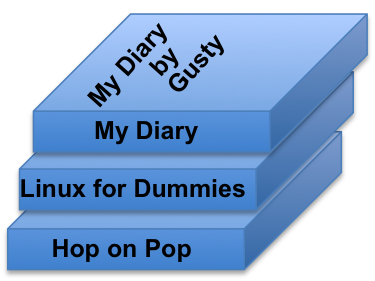
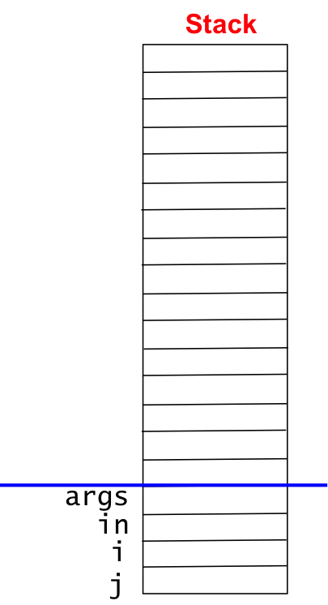
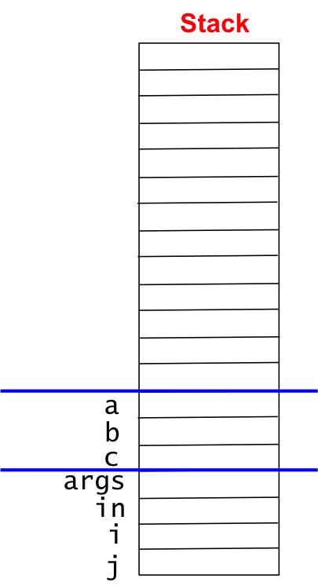
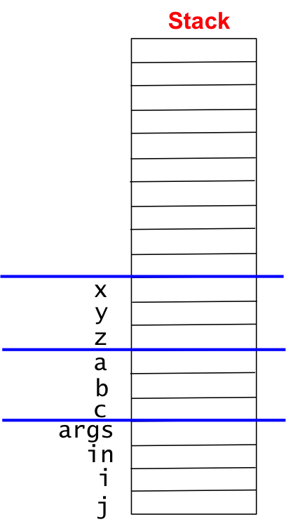
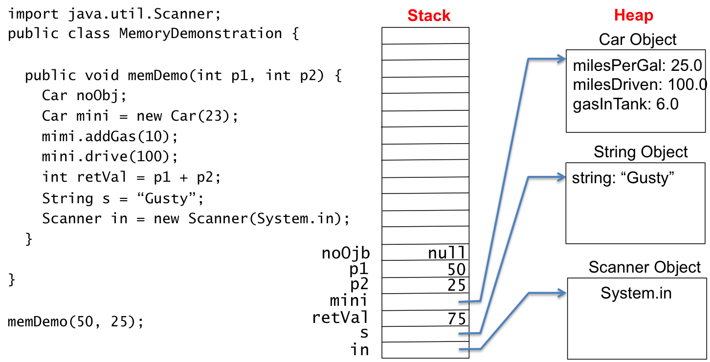

## Stack and Heap

We know the following with regard to computers, information, programs, and memory.

* A computer is a machine that stores and manipulates information under the control of a changeable program.
* A computer stores information in memory.
* Memory is a sequence of bytes.
* A byte is 8-bits of information.
* A bit is a binary digit - either 1 or 0.
* Computer information must be represented as binary in memory.
* Primary types have specific byte allocations - for examples, ```byte``` is one byte, ```char``` is two, ```int``` is 4 and ```double``` is eight.
* Reference types have 4 bytes allocated which contain a reference (or pointer) to the object which is in heap memory.

We have studied figures of primitive types, reference types, and memory where the memory shows objects in heap memory.  The following is one from [Java Strings](/gustycooper.github.io/mydoc_3_strings).


This section describes two types of memory - stack and heap - that are fundamental in computer programming.

## Stacks in Everyday Life

Most people have a stack somewhere in the life.  For example, you probably have a stack of books in your room or office.  The following figure is a stack of my books.  An old *Linux for Dummies* is on the bottom - I have not read it in a while.  On top of my Linux book is one I read to my granddaughter - *Hop of Pop*.  On the top of my stack is *My Diary*.  My stack of books has a top - the last book I put on the stack is on top.  I have to remove the top book before I can get to the next book and so on.  My stack of books has the attribute - last book in is the first book out - which is shortened to last in first out - whic is shortened to LIFO.  A stack is a LIFO.



## Stacks for Method Variables

Stacks are useful in computer programming.  We will study stacks in [Abstract Data Types](/gustycooper.github.io/mydoc_8_ADT).  At this point, we want to understand how method variables are allocated on a stack.  Consider three methods, where ```main``` calls ```methodB```, which calls ```methodC```.  The following code snippet demonstrates this calling sequence.

```java

public static int methodC(int x, int y) {
   int z = x + y;
   return z;
}

public static int methodB(int a, int b) {
   int c = a * methodC(b, 10);
   return c;
}

public static void main(String[] args) {
   Scanner in = new Scanner(System.in);
   System.out.print("Enter a number: ");
   int i = in.nextInt();
   System.out.print("Enter a number: ");
   int j = in.nextInt();
   System.out.print(methodB(i, j));
}
```

The method calls are like stacking books.  ```main``` is on the bottom of the stack.  When ```main``` calls ```methodB```, ```methodB``` is placed on top of ```main```.  Likewize ```methodC``` is placed on top of ```methodB```.  When ```methodC``` returns, it is removed (or popped) from the stack.  When ```methodB``` returns, it is popped from the stack.  Notice the LIFO mechanism at work.  The variables of the called method are what is actually placed on the stack.  The JVM calls ```main``` which starts the stacking of method variables.  We create a sequence of figures to watch the stack grow and shrink.  The method variables include the parameters.  The variables for these three methods are the following.

* ```main```
  * ```args```, ```in```, ```i```, and ```j```
* ```methodB```
  * ```a```, ```b```, and ```c```
* ```methodC```
  * ```x```, ```y```, and ```z```

In the following sequence of three figures, the stack will grow upward.  When the JVM calls ```main```, the stack contains ```main```s variables as follows.



When ```main``` calls ```methodA```, the stack contains ```main```s variables and ```methodA```s variables.  ```methodA```s variables on on the top of the stack.



When ```methodA``` calls ```methodB```, the stack contains ```main```s variables, ```methodA```s variables,  and ```methodB```s variables on on the top of the stack.```methodB```s variables as follows.  



As each method returns, the variables on the stack for that method are popped off the stack.  This popping is the reverse order of the previous three figures.

## Stack, Heap, Memory Allocation, and Garbage Collection

The computers you purchase today have a lot of memory - typically have 4 to 8 gigabytes of memory - a gigabyte is a billion bytes.  Memory is shared among the various programs running on your computer, which probably include a browswer (Chrome, Firefox, Safari, etc), a word processor (MS-Word), a game, and your Java IDE.  When running a Java program, the JVM performs memory management.  Memory management includes 

* Allocating memory for code
* Allocating memory for stack.  A program has a large but finite amount of memory allocated to its stack.  If a program calls too many methods, it may overflow its stack space and get an overflow stack exception.  When we study [Recursion](/gustycooper.github.io/mydoc_9_recursion), we may encounter a recursive method that does not properly terminate, which easily generates a stack overflow.
* Allocating memory for heap.  A program get a large block of memory allocated for its heap.  Initially all bytes in the heap are marked as free, which means they can be used to allcoate objects.  Creating ```String```s and calling a constructors allocate memory for an object in the heap.  When an object is referenced by a variable, the memory occupied by the object is marked as used.  Eventually, an object is not referenced by a variable.  The JVM has a **garbage collector** that periodically examines the heap for objects that are no longer referenced.  The garbage collector returns those bytes to being free so thay can be reused for another object.  The following code snipped demonstrates an object (for ```Person("Gusty",22)```) that is created, but immediately unreferenced.

```java
Person p = new Person("Gusty", 22);
p = new Person("JerriAnne", 21);
```

Memory management is a popular subject in computers science.  You will study memory management in CPSC 405 - Operating Systems.  The following are a few tidbits to whet your appetite.

* You can imagine the memory in the heap can become fragmented with lots of used and free block mingled together.  Sometimes the fragmented free blocks must be coalesced together.  
* You can also imagine multiple memory managers.  The operating system (LINUX, Windows, MACOS) has to manage memory for the various programs running.  JVAM has to manage memory that is allocated to it from the OS.  
* The C programming language forces the programmer to explicitly allocate memory by calling functions such as ```malloc()``` and ```free()```. These functions use operating system services that manage memory.  
* Java allocates memory for objects with the ```new``` operator.  Java does not have a ```free()``` method.  Programmers consume memory and when it is no longer referenced, the garbage collector does the free.

When a Java program executes, 

* the JVM allocates memory for the code and places the code in it.
* allocates memory for the program stack.
* allocates memory for the heap.
* places the ```String[] arg``` on the stack.
* Call the ```main``` method.
* As ```main``` declares variables and calls methods, 
  * the stack grows and shrinks
  * the heap get objects created with the new operator

The following figure demonstrats the stack and heap for the method ```memDemo```.



