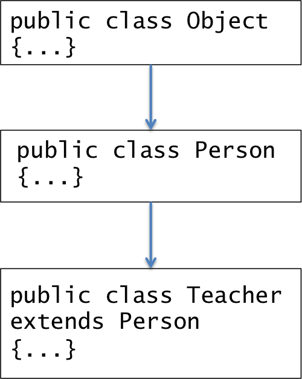

## Subclasses (Eck 5.5.1)

One of the powers of object-oriented programming is the ability to extend an existing class.  You get to use the existing code, which you do not have to re-create, and add new features to it.  In CPSC 220, we create a simple example of subclasses in order for you to appreciate the concept.   In CPSC 240, you study subclasses in depth.  

## Real-world Subclasses

To understand the concept of subclasses, we return to real-world objects.  The world has a lot of persons - approximately 7 billion and growing.  Everyone is a person, but many persons are different.  Some persons are students, teachers, doctors, lawyers, and such.  A teacher has all of the attributes of a regular person plus some teacher specific attributes.  A teacher has a name, age, place of birth like regular persons.  A teacher has a list of courses being taught, classrooms in which the courses are, and the ability to assign grades to students.  

## Software Subclasses

With subclasses, software objects mimick real-world objects ability to have general persons and specific teachers, doctors, lawyers, and such.  Consider the following figure showing a ```Person``` class and a ```Teacher``` class.  


* ```Teacher``` is a **subclass** of ```Person```
* In Java, ```Teacher extends Person```
* ```Person``` is a **superclass** of ```Teacher```
* ```Teacher``` **inherits** all instance variables and methods from ```Person```. 
* ```Teacher``` adds teacher-specific instance variables, constructors, and methods.

## Subclass Example Code - Person and Teacher

The example consists of the following.

* A ```Person``` class that is similar to many we have created.  The ```Person``` class implements the Java ```Comparable``` interface.

  ```java
  public class Person implements Comparable {
     private String firstName;
     private String lastName; 
     private int age;
      
     public Person(String firstName, String lastName, int age) {
        this.firstName = firstName;
        this.lastName = lastName;
        this.age = age;
     }
      
     public String getName() {
        return firstName + " " + lastName;
     }
      
     public void setName(String firstName, String lastName) {
        this.firstName = firstName;
        this.lastName = lastName;
     }
      
     @Override
     public String toString() {
        return this.firstName + " " + this.lastName;
     }
  
     @Override
     public int compareTo(Object o) {
        String compare1 = this.lastName + this.firstName;
        String compare2 = ((Person)o).lastName + ((Person)o).firstName;
        return compare1.compareTo(compare2);
     }
  }
  ```

* A ```TeacherStuff``` interface that consists of one method ```public String assignGrade(double average)```.

  ```java
  public interface TeacherStuff {
     public String assignGrade(double average); 
  }
  ```

* A ```Teacher``` class that is a subclass of ```Person``` and implements the ```TeacherStuf``` interface.  Pay attention to the ```Teacher``` constructor, which calls the ```Person``` constructor via ```super(firstName, lastName, 30)```.  ```super``` is the constructor(s) of the ```Teacher``` superclass, which is ```Person```.  If ```Person``` has multiple constructors, the appropriate one is called based on the actual parameters.  Calling ```super``` must be the first line of a constructor.

  ```java
  public class Teacher extends Person implements TeacherStuff {
     private String courses;
     private String department;
     private final int A = 90;
     private final int B = 80;
     private final int C = 70;
     private final int D = 60;
     
     public Teacher(String firstName, String lastName, String department) {
        super(firstName, lastName, 30);
        courses = "";
        this.department = department;        
     }
     
     public void addCourse(String course) {
        courses += course + " ";
     }
     
     public String getCourses() {
        return courses;
     }
     
     public void setDepartment(String department) {
        this.department = department;
     }
     
     public String getDepartment() {
        return this.department;
     }
     
     public String assignGrade(double average) {
        int aveRounded = (int)Math.round(average);
        if (aveRounded > A)
           return "A";
        else if (aveRounded > B)
           return "B";
        else if (aveRounded > C)
           return "C";
        else if (aveRounded > D)
           return "D";
        else
           return "F";
     }
  }
  ```

* A ```TeacherDemo``` class that uses ```Person``` and ```Teacher```.  ```TeacherDemo``` includes a ```swap``` method that swaps the contents of two ```Person``` objects.  You should notice that you can assign variables of type ```Teacher``` to variables of type ```Person```.  For example, ```Teacher gusty``` can be assigned as ```Person p = gusty;```.  The general rule is the subclasses can be assigned to superclasses.  

  ```java
  public class TeacherDemo {
     public static void swap(Person p, Person q) {
         String pName = p.getName();
         String qName = q.getName();
         int spacePos = pName.indexOf(" ");
         String pFirstName = pName.substring(0, spacePos);
         String pLastName = pName.substring(spacePos, pName.length());
         spacePos = qName.indexOf(" ");
         String qFirstName = qName.substring(0, spacePos);
         String qLastName = qName.substring(spacePos, qName.length());
         p.setName(qFirstName, qLastName);
         q.setName(pFirstName, pLastName);
     }
     public static void main(String[] args) {
         Person jerriAnne = new Person("JerriAnne", "Cooper", 24);
         Teacher gusty = new Teacher("Gusty", "Cooper", "CPSC");
         System.out.println("Printing Person jerriAnne obj: " + jerriAnne);
         System.out.println("Printing Person gusty obj: " + gusty);
         System.out.println("gusty.compareTo(jerriAnne): " + gusty.compareTo(jerriAnne));
         System.out.println("jerriAnne.compareTo(gusty): " + jerriAnne.compareTo(gusty));
         gusty.addCourse("CPSC 220");
         gusty.addCourse("CPSC 110");
         System.out.println("gusty's courses: " + gusty.getCourses());
         Person p = gusty;
         System.out.println("gusty's name via p: " + p.getName());
         System.out.println("gusty's courses via p: " + ((Teacher)p).getCourses());
         System.out.println("gusty's department: " + gusty.getDepartment());
         Person coletta = new Person("Coletta", "Cooper", 1);
         if (gusty.compareTo(coletta) < 0) {
             System.out.println("gusty is less than coletta");
         } else if (gusty.compareTo(coletta) > 0) {
             System.out.println("gusty is greater than coletta");
         } else {
             System.out.println("gusty is equal to coletta");
         }
         System.out.println("coletta compareTo herself: " + coletta.compareTo(coletta));
         swap(jerriAnne, coletta);
         System.out.println("After swapping jerriAnne and colleta: " + jerriAnne + " " + coletta); 
         swap(coletta, (Person)gusty);
         System.out.println("After swapping coletta and gusty: " + coletta + " " + gusty);
         
         System.out.println("Gusty, average 70.6 is grade: " + gusty.assignGrade(70.6));
     }
  }
  ```

## ```Object``` and Class Hierarchy (Eck 5.5.2)

The concepts of superclass, inheritance, and subclass leads to a class hiearchy.  In Java, the class ```Object``` is a superclass of all classes.  ```Object``` is the base class of the class hierarchy.  When we create a ```Person``` it is a subclass of ```Object```.  Our ```Person``` is ```public class Person extends Object```, but Java does not require us to include ```extends Object```.  Java ```extends Object``` for us automatically.  Our ```Person``` inherits ```Object``` attributes, one of which is ```toString```.  In [toString, comparable](/gustycooper.github.io/mydoc_5_toString_comparable), we are overriding the ```toString``` method from the base class ```Object```.  The following figure demonstrates the class hierarchy of ```Object```, ```Person```, and ```Teacher```.



The Java classes provided with Java form a complex class hierarchy, with ```Object``` as its base.  You see the Java class hierarchy at [Java Class Hierarchy](https://docs.oracle.com/javase/8/docs/api/overview-tree.html).


