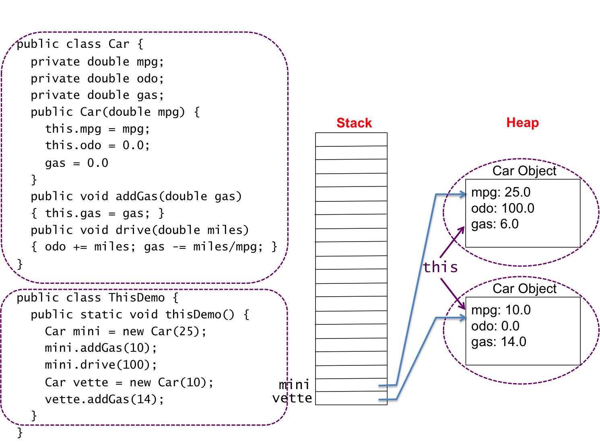

## ```this```

We know that reference types and their constructors are used to declare reference variables and to allocate objects.  We create many ```String``` objects, ```Person``` objects, etc.  Each ```Person``` object has its own instance variable and methods.  So far in our programming when we use instance variables and methods within the class, we simply use their names.  For example, our ```Person``` class looks something like the following.

```java
public class Person {
   String name;
   int age;
   String friends;

   public Person(String n, int a) {
      name = n;
      age = a;
      friends = "";
   }
...
}
```

```this``` is a keyword used within a class that refers to the current object the class is referencing.  The notion is ```this``` is this object.  ```this``` can be used a prefix for instance variables and methods.  For example in the previous example code, the instance variable ```name``` can be referenced as ```this.name```.  Using ```this``` allows you to name your parameters the same as your instance variables - ```this.name``` is the instance variable and ```name``` is the parameter.  The above code is updated to demonstrate.

```java
public class Person {
   String name;
   int age;
   String friends;

   public Person(String name, int age) {
      this.name = name;
      this.age = age;
      this.friends = "";
   }
...
}
```

The following code does not generate a compile error, but it has a devious error that can be hard to debug. The constructor attempts to initialize the instance variables.  Unfortunately, the assignment statements, ```name = name``` and ```age = age```, assign the parameters to themselves.  Thus the instance variables are not initialized. 

```java
public class Person {
   String name;
   int age;
   String friends;

   public Person(String name, int age) {
      name = name;
      age = age;
      friends = "";
   }
...
}
```

## ```this``` Calling Constructors

```this``` can also be used to call constructors, which is handy at times.  Suppose I have a ```Person``` class with two constrctors.  The constructor ```Person()``` calls the constructor ```Person(String name, int age)``` with default values.  The following code demonstrates this concept.

```java
public class Person {
   String name;
   int age;
   String friends;

   public Person() {
      this("Gusty", 22); // call other constructor
   }

   public Person(String name, int age) {
      this.name = name;
      this.age = age;
      friends = "";
   }
...
}
```

## Returning ```this```

Suppose you have an instance method that compares (or something) itself to another object of the same time.  For example, suppose my ```Person``` class has a method that determines the older of two ```Person```s.  ```this Person``` may be older or the parameter ```Person``` may be older.  The following code demonstrates returning ```this```.

```java
public class Person {

// ... missing code

   public Person older(Person p) {
      if (this.age == p.age)
         return null;
      else if (this.age > p.age)
         return this;
      else
         return p;
   }

// ... missing code

}
```

## ```this``` Figure



