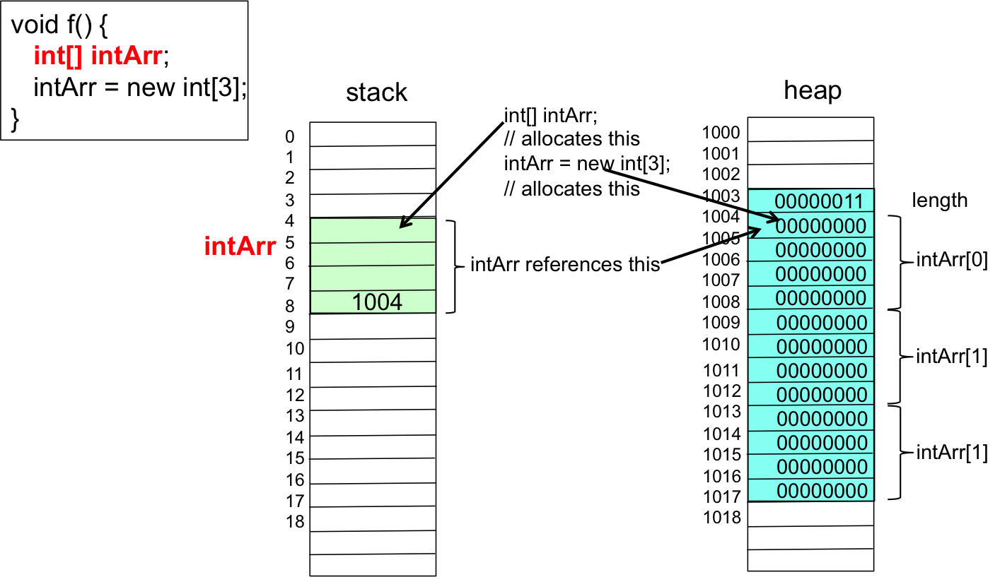

## Arrays Introduction

The following figure provides a visual of an array of ```String```s.  The length of the array is N.  Each ```String``` is in a slot.  The first slot is at index 0.  The last slot is at index N-1.

 

Declaring Java array variables use ```[]``` after the ```<type-name>```, where each element is the same type.  The following are example declaration of array variables.

```java
int[] intArray;
double[] doubleArray;
String[] stringArray;
Person[] personArray;
```

An array variable is a reference variable just like non-primitive type variables - e.g., ```String s;``` and ```Person p;```.  Reference variables reference objects.  Reference variables undergo a two-step sequence for allocating memory.

1. Declare a reference variable, which allocates memory for the variable.
2. Construct an object, which allocate memory for the object.
3. Assign a reference to the object to the reference variable.

You can perform all steps when the variable is declared or you can declare a variable (step 1) and subsequently allcoate (step 2) and assign (step 3) an object to the variable later during control flow.  When you declare reference variables without allocating and assigning an object, the reference variable is ```null```.  The following code snippet demonstrate various ways of declaring reference variables.

```java
Person p = new Person("Gusty", 22);
Person q;                // q is null at this point
boolean b = q == null;   // b is true
q = p;                   // q and p refence the same object
b = q == null;           // b is false
String s;                // s is null
b = s == null;           // b is true
int[] intArray;          // intArray is null
b = intArray == null;    // b is true
intArray = new int[10];  // intArray can hold 10 ints
b = intArray == null;    // b is false
double[] doubleArray = {1.0, 2.0, 3.0}; // doubleArray has 3 doubles
b = doubleArray == null; // b is false
```

## Array Declaration Meta Language

The meta-language for declaring an array is given by the following.

<div class="alert alert-info" role="alert"><i class="fa fa-language fa-lg"></i>
<b>
Meta Language - Array Declarartion Statement
</b>
<br>
<pre>
&lt;type-name&gt;[] &lt;variable-name&gt;;
&lt;type-name&gt;[] &lt;variable-name&gt; = new &lt;type-name&gt;[&lt;array-len&gt;];
&lt;type-name&gt;[] &lt;variable-name&gt; = {&lt;exp&gt;, ... , &lt;exp&gt;};
</pre>
</div>


## Allocating Array Objects

There are two ways to allocate array objects - ```new``` operator and ```{}```.  We have used the ```new``` operator to allocate objects of type ```Scanner```, ```Person```, ```Car```, etc.  Using ```new``` to allocate array objects is similar.

The ```new``` operator can be used when an array is declared or during control flow after the array declaration.  An important aspect number of array elements must be included as part of the ```new``` allocation.  The array elements are initialized to 0 for primitive type arrays and ```null``` for reference type arrays.

```java
double[] da = new double[10];  // declare and allocate together
Person[] pa;                   // declare
// more code here
pa = new Person[25];           // allocate
```

The ```{}``` style allocation can only be used when an array is declared.  The ```{}``` style allocation provides the initial values for the array.
When using ```{}``` style allocations, you are not restricted to literals.  You can populate an array with variables or a combination of literals and variables.  The following populates a ```Person[]``` with variables and a ```new Person```.

```java
int[] ia = {1, 2, 3, 4, 5}; // ia has 5 elements, 1 .. 5
Person p = new Person("Gusty",22);
Person q = new Person("Zac",28);
Person pa = {p, q, new Person("Emily",26)}; 

## Array ```length``` Field

The field ```length``` of an array object provides the number of elements in an array.  Recall that field is the Java term for instance variables.  You access the field ```length``` using the dot notation as you would for fields of any object.  When using ```{}``` style allocation, the number of values between ```{``` and ```}``` becomes the ```length``` of the array. 

```java
int[] intArr = new int[3];
int l = intArr.length;           // l is 3
Person[] pa = new Person[1000];
l = pa.length;                   // l is 1000
double[] da = {1.0,1.1,1.2,1.3}; 
l = da.lenght;                   // l is 4
```

## Accessing Array Elements

Once an array variable references an array object, you access the array elements by placing an index between square brackets.  For example, ```ia[1]``` accesses element 1 of ```int[] ia = {1,2,3}```.  The first element is at index 0.  The last element is at index ```ia.length-1```.  The index can be any expression that evaluates to ```int```.  If the index is not between 0 and ```ia.length-1```, an array index out of bound exception is generated.  The following sample code demonstrates array notation for accessing array elements.  Notice that ```intArray``` has three elements explictly assigned values.  The field ```length``` does not return the number of elements that you have explicitly assigned values.  Consider the following for example, where the ```length``` is 10, which is the total number of elements, not 3, which is the number of elements that have been explicitly assigned values.

```java
int[] intArray = new int[10]; // intArray can hold 10 integers

intArray[0] = 1;
intArray[1] = 10;
intArray[2] = intArray[0] + intArray[1];
int i = intArray[0];       // i is 1
i = intArray[2];           // i is 11
i = intArray[5];           // i is 0
int l = intArray.length;   // l is 10
Person p = new Person("Gusty",22);
Person q = new Person("Zac",28);
Person pa = {p, q, new Person("Emily",26)}; 
System.out.println(pa[0].getName() + " " + pa[0].getAge());
```

## Arrays in Memory

The following figure demonstrates the relationship between declaring an ```int``` array and allocating memory for an array object that holds its elements.  The figure shows that each element of the array is allocated 4 bytes of memory.  The number of bytes allocated for each element depends upon the type of the array.  For example, a ```double[]``` is allocated 8 bytes per element.

 
 
## Arrays and Loops

Often loops are used to process the elements of an array.  Often the Common Loop Patterns from [Loop Patterns](/gustycooper.github.io/mydoc_4_loop_patterns) are used on arrays.  The following sample code finds the average of the elements in an array of doubles.  The sample uses a counting for loop where the loop index counts through the the index values of the array.  Pay attention to the counting ```for``` loop.  

* The initial value of the loop index (```i```) is 0, which is the index of the first element of the array.
* The terminating condition is ```i < numbers.length```, which means the loop index counts 0, 1, ... lengthOfArray-1.
  * If the terminating condition is ```i <= numbers.length```, the ```numbers[i]``` generates an index out of bound exception when ```i``` is ```numbers.length```.

```java
// this loop processes a double[] numbers
double[] numbers = {1,2,3,4,5};
double sum = 0;
for (int i = 0; i < numbers.length; i++) {
    sum += numbers[i];
}
double ave = sum / numbers.length;
```


## Arrays and the ```for-each``` Loop

Looping through all elements of an array is so common in programming, that Java provides a special for loop for it.  The ```for-each``` loop has different syntax and semantics.  Instead of a loop index variable that is incremented for each iteration, a ```for-each``` loop has a variable that contains an element of the array on each iteration.  The first iteration has the first element, the second iteration has the second element, and so on until all loop elements have been used.  Consider the following example,that computes an average of numbers in a ```double[]```.   You read the loop as *For each d in the array numbers*.  On each loop iteration, the variable ```d``` takes on the next element of the array numbers.  Notice this loop is a common looping pattern.

```java
double[] numbers = {1,2,3,4,5};
double sum = 0;
for (double d: numbers) {
    sum += d;
}
double ave = sum / numbers.length;
```

## ```for-each``` Meta Language

The meta-language for a ```for-each``` loop is given by the following.  

<div class="alert alert-info" role="alert"><i class="fa fa-language fa-lg"></i>
<b>
Meta Language - For-Each Loop
</b>
<br>
<pre>
for ( &lt;BaseType&gt; &lt;item&gt; : &lt;itemArray&gt;  )
 	&lt;statement&gt;

for ( &lt;BaseType&gt; &lt;item&gt; : &lt;itemArray&gt;  ) {
	&lt;statements&gt;
}
</pre>
</div>

* ```<BaseType>``` is the same type as ```<itemArray>```.

## Passing Arrays as Parameters

Passing arrays is really no different than passing any other parameters.  The formal and actual arguments have to match.  For example, formal parameter that is an ```int[]``` must have a matching actual paramter that is an ```int[]```.   Since arrays are objects, when a method manipulates the values of a formal parameter that is an array, the values of the actual parameter are changed.  The following code demonstrates passing arrays as parameters.  The method ```largest``` returns the largest value in the formal parameter ```double[] numbers```.  The method ```reverse``` reverses the formal parameter ```int[] numbers```, which also reverses the actual parameter.  The method ```largest``` is called twice.  The second call passes an object that is allocated in the call - ```largest(new double[] {1,2,3,4,5,6}```.

```java
public static double largest(double[] numbers) {
   double retLargest = numbers[0];
   for (i = 1; i < numbers.length(); i++) {
     if (numbers[i] > retLargest) {
       retLargest = numbers[i];
     }
   }
   return retLargest;
}

public static void reverse(int[] numbers) {
   for (int i = 0; i < numbers.length/2; i++) {
      int j = ia.length-1 - i;
      int t = ia[i];
      ia[i] = ia[j];
      ia[j] = t;
   }
}

public static void main(String[] args) {
   double[] nums = {100.0, 3.4, 5.6, 1000101};
   double result = largest(nums);  // result is 1000101
   result = largest(new double[] {1,2,3,4,6}); // result is 6
   int[] ia = {1,2,3,4};
   reverse(ia);  // ia is {4,3,2,1}
}
```

## Arrays - Reallocating

An array object is allocated with a specified number of elements.  If you allocate ```int[] ia = new int[10];```, you can only place 10 ```int``` values in ```ia```. 

Sometimes you may not know exactly how many elements are needed.  For example, you may be are processing user input from the terminal where you 

* repeadedly prompt a user for input.
* store each entered value in an array.

You have a couple of options when using an array for solving this problem.

* You can allocate a large array object and hope the user does not enter more values than you allcoated.  
* You can allocate a typical array, and if they exceed the limit of the initially allocated array, reallocate.  This is a common programming technique that requires counting the elements added to the array.  When the number of elements added is equal to the size of the array, reallocate a new array that is twice the size of the original and copy the original into the new.  The following is an example of this concept.  The example, allocates a new array and uses a counting loop to copy the values from the original array to the new array.

  ```java
  double[] numbers = new double[10];
  int numElements = 0;
  System.out.println("Enter a double or q to quit: ");
  while (in.hasNextDouble()) {
     if (numElements == numbers.length) {
        double[] newNumbers = new double[numbers.length*2];
        for (int i = 0; i < numbers.length; i++) {
           newNumbers[i] = numbers[i];
        }
        numbers = newNumbers;
     }
     numbers[numElements] = in.nextDouble();
     numElements++
     System.out.println("Enter a double or q to quit: ")
  }
  ```

## Java ```Arrays``` Class

The Java [Arrays Class](https://docs.oracle.com/javase/8/docs/api/java/util/Arrays.html) contains many methods for manipulating arrays.  The three listed here are for ```int[]```, but ```Arrays``` has the same methods for all primitive types and ```Object```.  We learned in [Subclasses](/gustycooper.github.io/mydoc_5_subclasses) that ```Object``` is the base class of Java class hierarchy so the ```Arrays``` methods can be used for any referenct type.

* ```static boolean equals(int[] a, int[] a2)``` - Returns true if the two specified arrays of ints are equal to one another.
* ```static void fill(int[] a, int val)``` - Assigns the specified int value to each element of the specified array of ints.
* ```static String toString(int[] a)``` -  Returns a string representation of the contents of the specified array.
  ```java
  int[] ia = {1,2,3};
  String s = Arrays.toString(ia);
  // s is "[1, 2, 3]"
  ```
* ```static int[] copyOf(int[] original, int newLength)``` - Copies the specified array, truncating or padding with zeros (if necessary) so the copy has the specified length.  The ```copyOf``` method can be used to solve the previous problem of reallocating an array.  The following shows the solution.

  ```java
  double[] numbers = new double[10];
  int numElements = 0;
  System.out.println("Enter a double or q to quit: ");
  while (in.hasNextDouble()) {
     if (numElements == numbers.length)
        numbers = Arrays.copyOf(numbers, numbers.length*2);
     numbers[numElements] = in.nextDouble();
     numElements++
     System.out.println("Enter a double or q to quit: ")
  }
  ```
## Multidimensional Arrays


## ```public static void main(String[] args)```

The ```String[] args``` parameter for our ```main``` method is an array of ```String```s.  ```main``` is provided input in ```args```.  Java programs can be executed from a UNIX shell with Java placing user specified parameters in ```args```.  You study UNIX and its shell in CPSC 225.  The following code shows a ```main``` method processing user specified input in ```args```.

```java
public class Main {
   // Modified code from Jeffrey McAteer's Proton Ocular Radiotherapy main()
   public static void main(String[] args) {
      for (int i=0; i<args.length; i++) {
         boolean next = i+1 < args.length;
         // remove first hyphen if double hyphens used (makes --help and -help identical)
         if (args[i].startsWith("--")) 
            args[i] = args[i].substring(1);
           
         switch (args[i]) {
            case "-help":
               System.out.println("Selected -help.");
               break;
            case "-value":
               if (next) {
                  i++;
                  System.out.println("Selected -value: " + args[i]);
               } else
                  System.out.println("Selected -value without a value");
                  break;
             default:
                System.out.println("Selected " + args[i] + ": does not match options.");
                break;
         }
      }
      if (args.length == 0)
         System.out.println("No options.");
   }
}
```

The following shows various invocations of the program ```Main``` from the UNIX shell where ```$``` is the UNIX prompt.

```
$ java Main
No options.
$ java Main -help
Selected -help.
$ java Main --help
Selected -help.
$ java Main -value 100
Selected -value: 100
$ java Main -help -value 10
Selected -help.
Selected -value: 10
$ java Main -help -value
Selected -help.
Selected -value without a value
```

Both BlueJ and Netbeans support passing parameters to ```main```.

* BlueJ 
  * Right click on the class with ```main```.
  * The window with ```Main.main``` shows an input text box with ```{ }```.  This is default and it is an array without element.
  * Change the array in the input text box to contain your parameters.  For example { "one", "two", "three" } passes an array of three strings just like a UNIX command shell.

* Netbeans is more complex that BlueJ
  * Establish arguments to be passed to ```main```
    * Right click on project then select Properties, which creates a Project Properties Dialog box.  
    * Select Run in the Project Properties Dialog box.
    * Type arguments next to "Arguments" in the Project Properties Dialog box.
  * Run the project (not just the file)
    * Run > Run Main Project
    * Do not use Run > Run File (or shift-F6) 

## Arrays in C/C++

As you read Java code from various sources, you may encounter an array declaration as ```int intArray[] = {1,2,3};```.  Java retained this style from C and C++, which place the ```[]``` after the variable - ```int intArray[10];```.

