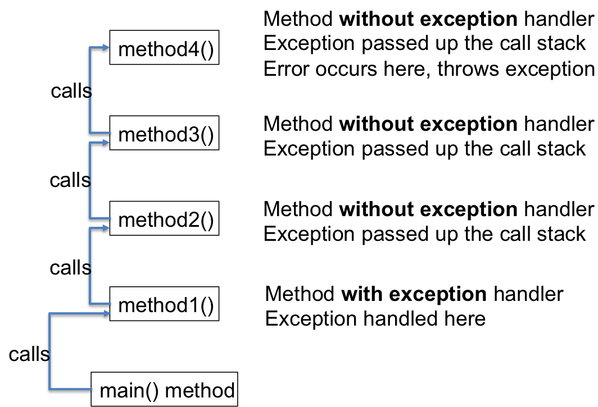

## Exceptions, Try, Catch, Throw

We are solving problems with programs.  The Wirth pattern from [Primitive Types](/gustycooper.github.io/mydoc_1_primitive_types) defines a prgram to be algorithms and data structures.  Exceptions, ```try```, ```catch```, and ```throw``` are part of the Algorithms component.

<div class="alert alert-danger" role="alert"><i class="fa fa-delicious fa-lg"></i>
<b>
Programming Pattern
0. Wirth Pattern
</b>
<br>

</div>


## Exceptions Introducion

Programs have a normal flow of control which is defined by the four forms of control flow - sequential, conditional, loop, and method calls.  An exception is a disruption to the normal flow of control of a program.  Instead of executing the next statement, control is given to another statement.  When a method encounters an error, the method gives an exception to the JVM which searches for a calling method that will process the exception.  Consider the following program that attempts to reverse the contents of a ```String```, but has a bug on line 5 that causes an exception on line 6.  The normal flow of the program is (a) sequentially execute statements 2, 3, and 4 (b) repeatedly execute statements 5 and 6 (c) execute statement 7 (d) exit the program.  The bug on line 5 assigns the loop index to ```s.length()```, which is beyond the characters in ```s```.  When line 6 attempts to ```s.charAt(i)```, Java generates a StringIndexOutOfBoundsException, the normal flow of control is disrupted (i.e., the iteration of the ```for``` stops), and the program terminates.

```java
 1 public class ExceptionDemo {
 2    public static void main(String[] args) {
 3       String s = "12345";
 4       String sReversed = "";
 5       for (int i = s.length(); i >=0; i--)
 6          sReversed += s.charAt(i);
 7       System.out.println(sReversed);
 8    }
 9 }
```

## Unchecked and Checked Exceptions

Java has two types of exceptions.

* **Unchecked Exception** – An unchecked exception is an exception that cannot be anticipated.  An enchecked exception is either programming bugs or hardware failure.
  * Runtime Exception – a runtime exception is a bug in your code.  For example, you may attempt to index a ```String``` or an array with an index that is out of bounds.  The results in an index out of bounds exception.  The remedy for a runtime exception is for you to fix the bugs in your code.
  * Hardware Error – occurs when there is a hardware failure.  For example, the disk may crash in the middle of reading a file.  The remedy for errors is for someone to fix the hardware.  You can also try again and hope the hardware failure goes away.
  * Your program does not need to ```catch``` or ```throw``` an unchecked exception.

* **Checked Exception** – A checked exception is an exception that you can anticipate and you can write code to recover from the exception.  A good example is a trying to open a file that is not there.  You prompt a user to input a filename.  The user enters a filename that is not present.  When you attempt to open the file, you receive a checked exception.  Your program contains code that processes the checked exception and asks the user to enter another file name.
  * Try to open a file that is not there
  * Recover by asking the user for another filename
  * Your program **must** either ```catch``` or ```throw``` a checked exception

The following examples demonstrate a ```try catch``` with checked exceptions because they are easy examples to visualize.  You do not need to ```catch``` checked exceptions.  When Java encounters a checked exception, it terminates your program and generates a method call trace showing the methods called leading to the exception.

## ```try``` and ```catch```

This section contains two sample classes that process Java exceptions.  The first processes one exception.  The second processes multiple exceptions.

### ```IndexOutOfBounds``` Exception

When your program has code that may generate a checked exception, you can place that code in a ```try``` block with corresponding ```catch``` blocks.  Each ```catch``` block  can catch a different exception.  The following code is an updated version of the previous program that includes a ```try-catch``` combination.  All of the code from the previous ```main``` is placed within a ```try``` block on lines 3 through 8.  The corresponding ```catch``` block is on lines 9, 10, and 11.  This ```catch``` catches one exceptoin - ```IndexOutOfBoundsException```.  If some other exception occurs within the ```try``` block, it will not be caught.

```java
 1 public class ExceptionTry {
 2    public static void main(String[] args) {
 3       try {
 4          String s = "12345";
 5          String sReversed = "";
 6          for (int i = s.length(); i >=0; i--)
 7             sReversed += s.charAt(i);
 8          System.out.println(sReversed);
 9       } catch (IndexOutOfBoundsException exceptionCaught) {
10          System.err.println("I caught the sherrif " + exceptionCaught.getMessage());
11       }
12    }
13 }
```

### Multiple Exceptions

The following class catches three exceptions.

* ```StringIndexOutOfBoundsException``` - this is more specific that the previous ```IndexOutOfBoundsException```.  Instead of a plain ```IndexOutOfBoundsException``` that applies to ```String``` and arrays, this time we are only catch ```StringIndexOutOfBoundsException```.  Line 7, ```s.charAt(i)``` generates this exception.

* ```NumberFormatException``` - this exception is generated on line 10, when ```Integer.parseInt``` attempts to convert ```'g'``` to an ```int```.

* ```Exception``` - this is a general exception that catches any exception.  We could eliminate the other two ```catch``` statements and all exceptions would be caught by ```catch (Exception e)```.  In the sample code, this catches the ```ArrayIndexOutOfBoundException``` generated on line 13.   This ```catch``` can be replaced by ```catch (ArrayIndexOutOfBoundException e)```.   The code demonstrated for this is a good pattern to follow for catching exceptions - ```catch (Exception e)``` catches all exceptions.  Onced caught, print the method call stack (```e.printStackTrace()```) trace and exit (```System.exit(1)```).

If you type the code into Netbeans, you will have to make adjustments to ```catch``` all of the exceptions.  

* As currently written, the code catches ```StringIndexOutOfBoundsException```.

* Change line 6 to ```for (int i = s.length()-1; i >= 0; i--)``` to catch the ```NumberFormatException```.

* After changing line 6, comment line 10 so it is not executed in order to catch ```Exception```.  

```java
 1 public class MultipleExceptions {
 2    public static void main(String[] args) {
 3       try {
 4          String s = "12345";
 5          String sReversed = "";
 6          for (int i = s.length(); i >=0; i--)
 7             sReversed += s.charAt(i);
 8          System.out.println(sReversed);
 9          int i = Integer.parseInt("5");
10          i = Integer.parseInt("g");
11          int[] ia = {1,2,3};
12          ia[0]++;
13          ia[4]++;
14       } catch (StringIndexOutOfBoundsException exceptionCaught) {
15          System.err.println("I caught the sherrif " + exceptionCaught.getMessage());
16       } catch (NumberFormatException numberException) {
17          System.err.println("But I did not catch the deputy " + numberException.getMessage());
18       } catch (Exception e) {
19          System.err.println("All you need is love " + e.getMessage());
20          e.printStackTrace();
21          System.exit(1);
22       }
23    }
23 }
```

## Exceptions are Java Classes

Exceptions are a Java Classes. Exceptions have an [Exception Class Hierarchy](https://docs.oracle.com/javase/8/docs/api/java/lang/package-tree.html) with [Exception](https://docs.oracle.com/javase/8/docs/api/java/lang/Exception.html) the base class.  An easy hierarchy to visualize is an ```ArrayIndexOutOfBoundsException``` or a ```StringIndexOutOfBoundsException```.  The following code snippet generates these two exceptions.  You can type the code into the BlueJ Codepad.

```java
String s = "This";
char c = s.charAt(4); // StringIndexOutOfBoundsException
int[] ia = {1,2,3,4}; // ArrayIndexOutOfBoundsException
int i = ia[4];
```

The following figure demonstrates the exception hierarchy for the classes ```NumberFormatException```, ```StringIndexOutOfBoundsException```, and ```ArrayIndexOutOfBoundsException```.  Notice all three trace back to the class ```Exception```.

 

## Searching for an Exception Handler

The exception examples shown thus far involve one method - ```main```.  We can have multiple methods calling each other with the intial calling method containing the ```catch``` statement.  In [Stack and Heap](/gustycooper.github.io/mydoc_5_stack_heap), we learned how methods calls result in allocating space on the stack for the call frame of each method that is called.  If an exception occurs in a method that does not have an exception handler, the JVM searches the call frame to determine if a calling method has an exception handler. The following figure shows searching the call frame for an exception.

 

In the following sample code, exceptions generated in the methods ```reverse``` and ```myParse``` are caught in the calling method - ```main```. 

```java
 1 public class MultipleExceptions {
 2    public static String reverse(String s) {
 3       String sReversed = "";
 4       for (int i = s.length(); i >=0; i--)
 5          sReversed += s.charAt(i);
 6       return sReversed;
 7    }
 8    public static int myParse(String s) {
 9       return Integer.parseInt(s);
10    }
11    public static void main(String[] args) {
12       try {
13          String s = reverse("12345");
14          System.out.println(s);
15          int i = Integer.parseInt("5");
16          i = myParse("g");
17          int[] ia = {1,2,3};
18          ia[0]++;
19          ia[4]++;
20       } catch (StringIndexOutOfBoundsException exceptionCaught) {
21          System.err.println("I caught the sherrif " + exceptionCaught.getMessage());
22       } catch (NumberFormatException numberException) {
23          System.err.println("But I did not catch the deputy " + numberException.getMessage());
24       } catch (Exception e) {
25          System.err.println("All you need is love " + e.getMessage());
26          e.printStackTrace();
27          System.exit(1);
28       }
29    }
30 }
```

## Exception ```throw``` Statement (Defining Your Own)

Java exceptions are generated using a ```throw``` statement.  In [ADTs](/gustycooper.github.io/mydoc_8_ADT) we learn how to create our own Java exception and we will ```throw``` it.  For this section, we pretend our code example is in the ```charAt``` method of the Java ```String``` class.  The method ```charAt``` tests the input parameter to ensure it is within the range of the ```String```.  If it is not, ```charAt``` creates a ```StringIndexOutOfBoundsException``` object with a corresponding message and ```throw```s the exception.

```java
public class String {

   private char[] theString;

   public char charAt(int index) {
      if (index < 0 || index >= theString.length())
         throw new StringIndexOutOfBoundsException("String index out of range: " + index);

   }
}

```/Google Drive/00UMW/1Java/0Class/Netbeans/Stack/src``` - extends ```RunTimeException```

## ```throwing``` Instead  of ```catch```

Java checked exceptions must be either caught with a ```try catch``` or thrown by including a ```throws``` clause on the method definition.  Opening a file for reading generates a checked exception.  The user may have provided an incorrect filename.  You can catch the exception and continue asking the user for a filename until they enter a correct name.  Alternatively, you can ```throw``` the exception.  Java forces you to either ```catch``` or ```throw``` checked exceptions.  Your code will not compile if a ```catch``` or ```throw``` is not present.  The following code sample demonstrates throwing a file not found exception.  We saw ```thows``` in [Sample Code with Loops](/gustycooper.github.io/mydoc_4_loop_sample_code).

```java
public class ThrowSample {
   public static void main(String[] args) throws java.io.FileNotFoundException {
      File inputFile = new File("doubles.txt"); 
      Scanner inDouble = new Scanner(inputFile);
      double largest = inDouble.nextDouble();
      while (inDouble.hasNextDouble()) {
         double input = inDouble.nextDouble();
         if (input > largest) 
            largest = input;
      }
      System.out.println("Largest value: " + largest);
   }
}
```

