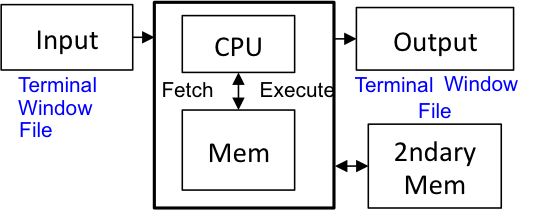

## File I/O

We are solving problems with programs.  The Wirth pattern from [Primitive Types](/gustycooper.github.io/mydoc_1_primitive_types) defines a prgram to be algorithms and data structures.  File I/O is part of the Algorithms component.  Additionally the Wirth pattern shows a computers accepting input and producing output.  Files can be both input and output.

<div class="alert alert-danger" role="alert"><i class="fa fa-delicious fa-lg"></i>
<b>
Programming Pattern
0. Wirth Pattern
</b>
<br>

</div>

## File I/O Introduction

The following figure of a computer shows three types of input/output (I/O).

* Terminal - We have used terminal I/O to interact with users.
* Window - We will use a window to interact with users in [Graphics](/gustycooper.github.io/mydoc_7_graphics).
* File - We study file I/O in this section.

 

Operating systems (e.g., Mac OS, LINUX, MS-Windows) provide a file system for applications to use.  Files are stored on secondary memory.  Information on secondary memory is persistent, which means the information does not disappear when your computer is turned off.  A file system consistes of directories (folders) and files.  A file is a sequence of bytes that must be interpreted by programs.  From the perspective of the file system, there is no difference between a ```.docx``` file, a ```.xlsx``` file, and a ```.java``` file - they are all a sequence of bytes.  MS-Word understands the format of ```.docx``` files and properly displays the correct font, bolding, headings. etc.  All of these document features are attributes stored in the bytes of the file.  A folder is a special file that contains files, including other folders.  You organize the information on your computer by placing the information in a folder structure that you understand.  For example, you may place a ```CPSC220``` folder in your ```MyDocuments``` folder. Within your ```CPSC220``` folder you may place various subfolders for labs, projects, etc., and those too may contain subfolders.

## Text Files

Our ```.java``` files are text files.  Information is stored in text files as Unicode that we studied in [Characters as Information](/gustycooper.github.io/mydoc_1_characters).  We will use text files for our file I/O.  You should use a text editor such as VIM, the editor with Netbeans, or the editor with BlueJ to create any file that your programs read.  Text editors such as Notepad (MS-Windows) or TextEdit (MacOS) often place information (such are bolding) in the file that is not text.

## Java File I/O

Java has many ways to accomplish file I/O.  We will use a ```Scanner``` for file input.  Input is rather simple.  We will use several classes for writing - BufferedWriter, PrintWriter, Files, Path, and Paths.  Output is rather complex.

## File I/O - Checked Exception

Java file I/O generates checked exceptions.  A checked exception must be caught using a ```try catch``` or thrown using a ```throws``` clause.  The following demonstrates how to ```catch``` and ```throws``` a file I/O checked exception.  

```java
public class ThrowSample {
   public static void main(String[] args) throws java.io.FileNotFoundException {
      File inputFile = new File("doubles.txt"); 
      Scanner inDouble = new Scanner(inputFile);
      double largest = inDouble.nextDouble();
      while (inDouble.hasNextDouble()) {
         double input = inDouble.nextDouble();
         if (input > largest) 
            largest = input;
      }
      System.out.println("Largest value: " + largest);
   }
}

public class CatchSample {
   public static void main(String[] args) {
      try {
         File inputFile = new File("doubles.txt"); 
         Scanner inDouble = new Scanner(inputFile);
         double largest = inDouble.nextDouble();
         while (inDouble.hasNextDouble()) {
            double input = inDouble.nextDouble();
            if (input > largest) 
               largest = input;
         }
         System.out.println("Largest value: " + largest);
      } catch (Exception e) {
          e.printStackTrace();
          System.exit(1);
      }
   }
}
```

## File I/O - Person Database

We are creating a text file that serves as a databse of people.  The format of our text file is the following.

* The file contains ```N``` lines of text where ```N%4 == 0```.
* The file has 4 lines of text per database entry.  The 4 lines are
  * Line 1 - Contains either ```Person``` or ```Student```
  * Line 2 - Contains the name of the person.
  * Line 3 - Contains the age of the person.
  * Line 4 - Contains the GPA of the person, if line 1 is ```Student```; otherwise contains 0.

The folloiwng is an example of a database file, ```peopleDB.txt```, that has three students and one person.

```java
Student
Coletta
1
3.9
Person
Zac
28
0
Student
Emily
22
4.0
Student
Homer
3.3
```

The problem has two types, ```Person``` and ```Student```.  ```Student``` is a subclass of ```Person```.  The definitions of ```Person``` and ```Student``` are the following.

```java
public class Person {
    private String name;
    private int age;
    public Person(String name, int age) {
        this.name = name;
        this.age = age;
    }
    @Override
    public String toString() { return name+" " + age; }

    @Override
    public boolean equals(Object p) { 
        return this.name.equals(((Person)p).name) &&
               this.age == ((Person)p).age; 
    }
}

public class Student extends Person {
    public double gpa;
    public Student(String name, int age, double gpa) {
        super(name, age);
        this.gpa = gpa;
    }
}
```

The code for reading our database, displaying its contents, and prompting the user to enter a new record is given by the following.

```java
import java.io.File;
import java.io.FileNotFoundException;
import java.util.ArrayList;
import java.util.Scanner;
import java.io.BufferedWriter;
import java.io.PrintWriter;
import java.io.IOException;
import java.nio.charset.Charset;
import java.nio.file.Files;
import java.nio.file.Path;
import java.nio.file.Paths;
import java.nio.file.StandardOpenOption;

public class PeopleDBGet
{
    /**
     * Fills an ArrayList<Person> with information in a file
     * Each person/student in the file has 4 lines
     * Line 1: Either Person or Student
     * Line 2: name
     * Line 3: age
     * Line 4: gpa (0 for Person
     * @param fileName name of file
     * @return ArrayList<Person> with information from file
     */
    public static ArrayList<Person> personDBRead(String fileName) throws FileNotFoundException {
        ArrayList<Person> pal = new ArrayList<Person>();
        File inputFile = new File(fileName);
        Scanner in = new Scanner(inputFile);
        boolean goon = true;
        while (goon) {
            String line = "";
            if (in.hasNext()) {
                String type = in.nextLine();
                String name = in.nextLine();
                int age = Integer.parseInt(in.nextLine());
                double gpa = Double.parseDouble(in.nextLine());
                if (type.equals("Student"))
                    pal.add(new Student(name, age, gpa));
                else
                    pal.add(new Person(name, age));
            }
            else
                goon = false;
        }
        return pal;
    }
    
    public static void main(String[] args) throws FileNotFoundException {
        String fileName = "people.txt";
        if (args.length != 0)
            fileName = args[0];
                    
        ArrayList<Person> pal = personDBRead(fileName);
        for (Person p : pal) {
            System.out.print(p + " ");
            if (p instanceof Student)
                System.out.println(((Student)p).gpa);
            else
                System.out.println();
        }
        // Add a new person or student to our DB
        Scanner in = new Scanner(System.in);
        System.out.print("Enter Student or Person: ");
        String type = in.nextLine();
        System.out.print("Enter name: ");
        String name = in.nextLine();
        System.out.print("Enter age: ");
        String age = in.nextLine();
        System.out.print("Enter gpa (0 for Person): ");
        String gpa = in.nextLine();
        Path file = Paths.get(fileName);
        Charset charset = Charset.forName("US-ASCII");
        PrintWriter out = null;
        BufferedWriter writer = null;
        try {
            writer = Files.newBufferedWriter(file, charset,
                                             StandardOpenOption.WRITE, 
                                             StandardOpenOption.APPEND,
                                             StandardOpenOption.CREATE);
            out = new PrintWriter(writer, true);  // true indicates to append
            out.println(type);
            out.println(name);
            out.println(age);
            out.println(gpa);
            out.close();
        } catch (IOException x) {
            System.err.format("IOException: %s%n", x);
        }
    }      
}
```

Week13 > instanceOf

Week11 > Que.java

Netbeasn > Stack.java - extends RuntimeException

## Files in Netbeans, BlueJ

State where files must be placed.
