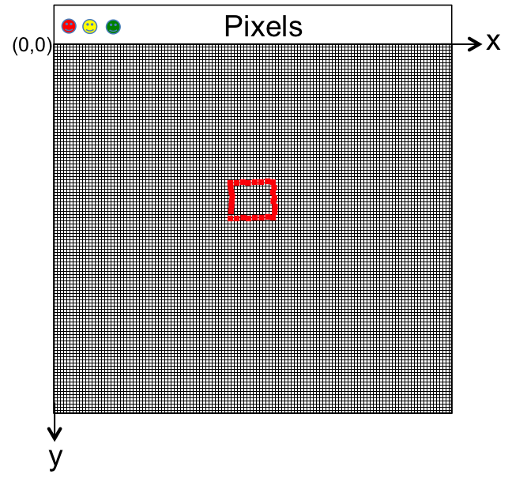
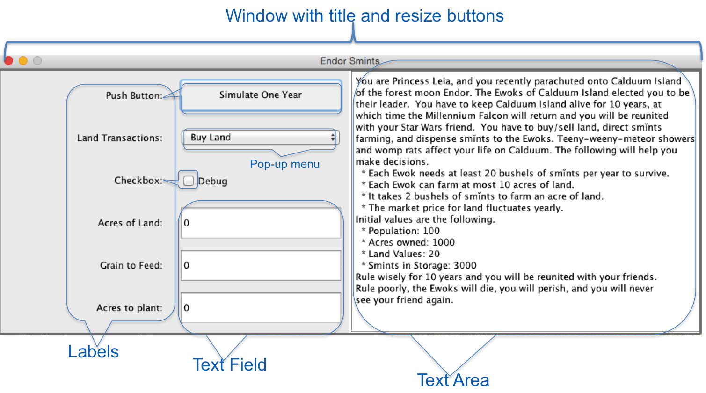
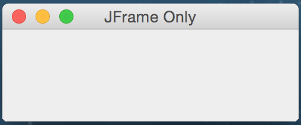
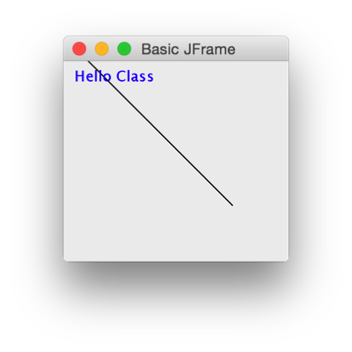
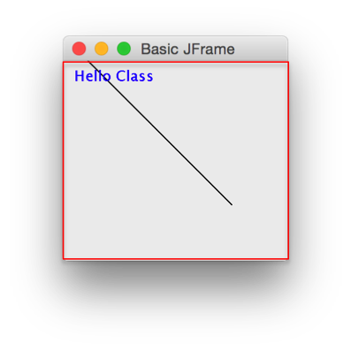
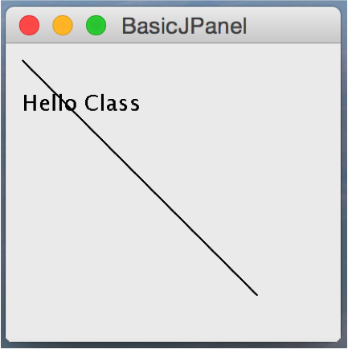
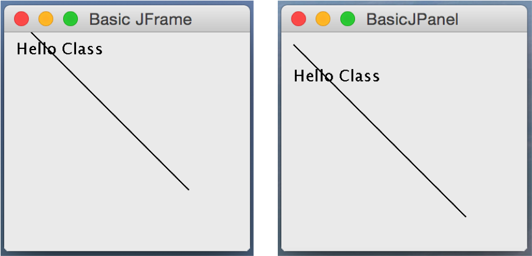
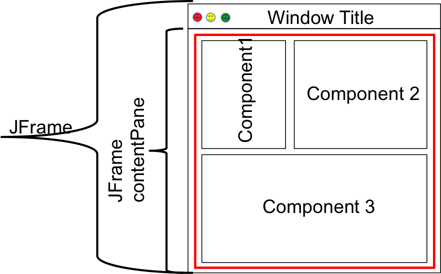

## Introduction

At its lowest level, computer graphics is accomplished by coloring pixels on a display such as a laptop, LCD, and phone.  A pixel is a small square dot on a display.  Modern day displays have lots of pixels that are close together - so close that you often do not even think of them as pixels.  For example, a 4K display has approximately 4000 pixels in the horizontal direction and 2000 pixels in the vertical direction.  Each pixel can be colored one of millions of colors.  The underlying operating system (Windows, IOS, Android, UNIX) controls the entire display, allowing programmers to color pixels in windows.  Pixels in windows are identified using a coordinate system that begins in the upper left hand corner.  The x coordinates count toward the right, and the y coordinates count downward.  The upper left-hand pixel is at coordinate (0,0).  The color of a pixel is specified by its Red, Green, Blue (or RGB) value.  The following figure shows pixels within a window along with a red square drawn by coloring pixels.  Notice how ragged this square looks.  Modern displays have pixels densely packed so one does not notice the raggedness.   The newer 4K and 5K displays are gorgeous.

 

Of course, we do not want to write our graphics programs using only pixels.  We want to manipulate high-level components such a buttons, text fields, labels, and check boxes.  As we move to using components such as buttons and text fields, you should realize that underneath the methods we call is code that manipulates pixels.  The following figure shows a GUI with title, resize buttons, labels, text fields, buttons, checkboxes, and text area.  We will begin with some low-level graphics and eventuall work our way to a GUI with these components.



## JFrame Class

Java has many classes that support GUI development.  The starting point of a GUI application is a window with which to interact.  The Java ```JFrame``` class corresponds to a window.  A ```JFrame``` by itself is not very useful.  You can place a ```JFrame``` window on your display.  It will have a title-bar, open, close, and maximize icons, but that is about it.  A ```JFrame``` has several attributes that you will set.  The following code demonstrates a Java ```main``` that constructs a ```JFrame``` object and manipulates the object with instance methods.  This code is similar to that we have done in constructing ```Person``` objects and manipulating them with instance methods.  The most interesting aspect of the following example is that the ```main``` program finishes executing after the ```window.setVisible(true);``` statement.  The ```JFrame``` object is executing.

```java
import java.awt.*;
import javax.swing.*;
public class JFrameOnly {
    public static void main(String[] args) {
        JFrame window = new JFrame("JFrame Only");
        window.setSize(250,100);  // 250 pixels wide, 100 length
        window.setLocation(100,100); // 100, 100 from upper rhc
        // The following statement will terminate your program 
        // the window is closed
        window.setDefaultCloseOperation(JFrame.EXIT_ON_CLOSE);
        window.setVisible(true);
    }
}
```

The following is a screen shot of the JFrame Only program running.

 


## JFrame and Graphics Classes

The previous section shows a program with a ```JFrame``` without content - it is simply a window.  This section demonstrates code that ```extends``` a ```JFrame``` and overrides the ```paint``` instance method of the ```JFrame``` class to draw some simple shapes.  We studied extending a class in [Subclasses](/gustycooper.github.io/mydoc_5_subclasses).  We studied overriding methods in [toString, comparable](/gustycooper.github.io/mydoc_5_toString_comparable).  Attributes of the ```paint``` method are described as follows.

* You do not create code that calls the ```paint``` method.  The ```paint``` method is called by the JVM whenever a window needs to be redrawn.  Consider your computer desktop that has multiple windows, one of which is your program ```JFrame``` that is currently covered by a browser.  When you move your browser to expose your program ```JFrame```, the ```JFrame``` has to redraw its window.  The operating system and the JVM collaborate to call the ```paint``` method to redraw your window.

  * We will learn another technique that periodically calls the ```paint``` method to create animation in the ```JFrame```.

* The ```paint``` method has one formal parameter of type ```Graphics```.  It signature is ```void paint(Graphics g)```. 

* The ```Graphics``` class is the graphics context of a window.  The low-level methods of the ```Graphics``` class are used by higher level components such as ```JButton``` and ```JTextBox```. 

* The ```Graphics``` class has many low-level graphical drawing methods.  The following are a few examples of these instance methods.

  * ```drawString(String str, int xBaselineLeft, int yBaselineLeft)``` - draws text beginning at pixel coordinant (```xBaselineLeft```, ```yBaselineLeft```).
  * ```drawLine(int x1, int y1, int x2, int y2)``` - draws a line from (```x1```, ```y1```) to (```x2```, ```y2```).
  * ```drawRect(int xTopLeft, int yTopLeft, int width, int height)`` - draws a rectangle of ```width``` and ```height``` where the top left hand corner is at pixel coordinant (```xTopLeft```, ```yTopLeft```).`
  * ```drawOval(int xTopLeft, int yTopLeft, int width, int height)``` - draws an oval of ```width``` and ```height``` where the top left hand corner is at pixel coordinant (```xTopLeft```, ```yTopLeft```).
  * ```drawPolygon(int[] xPoints, int[] yPoints, int numPoint)``` - draws a polygon where the x coordinants are in ```xPoints``` and the y coordinates are in ```yPoints```.
  * ```fillRect(int xTopLeft, int yTopLeft, int width, int height) - draws a filled rectangle of ```width``` and ```height``` where the top left hand corner is at pixel coordinant (```xTopLeft```, ```yTopLeft```).
  * ```fillOval(int xTopLeft, int yTopLeft, int width, int height) - draws an filled oval of ```width``` and ```height``` where the top left hand corner is at pixel coordinant (```xTopLeft```, ```yTopLeft```).
  * ```fillPolygon(int[] xPoints, int[] yPoints, int numPoint) - draws a filled polygon where the x coordinants are in ```xPoints``` and the y coordinates are in ```yPoints```.


* The ```Graphics``` class has an instance method ```setColor``` that establishes the color of the drawing methods.  Until ```setColor``` is called, the default colors is ```Color.Black```.  You can change the drawing color with the following method.

  ```java
  setColor(Color c);
  ```

  * ```Color``` is a Java class that defines basic colors and allows you to define your own colors.  Colors are defined using [RGB](https://en.wikipedia.org/wiki/RGB_color_model) values.  A color is simply a Java object of type [```Color```](https://docs.oracle.com/javase/8/docs/api/java/awt/Color.html).  For example, you can construct a red ```Color``` object by ```Color red = new Color(255,0,0);```.  The ```Color``` class defines the following basic colors as ```static Color``` fields, which can be access as ```Color.RED```, ```Color.GREEN```, etc.  They are defined as follows.

    ```java
    RED       : java.awt.Color[r=255, g=0,   b=0]
    GREEN     : java.awt.Color[r=0,   g=255, b=0]
    BLUE      : java.awt.Color[r=0,   g=0,   b=255]
    YELLOW    : java.awt.Color[r=255, g=255, b=0]
    MAGENTA   : java.awt.Color[r=255, g=0,   b=255]
    CYAN      : java.awt.Color[r=0,   g=255, b=255]
    WHITE     : java.awt.Color[r=255, g=255, b=255]
    BLACK     : java.awt.Color[r=0,   g=0,   b=0]
    GRAY      : java.awt.Color[r=128, g=128, b=128]
    LIGHT_GRAY: java.awt.Color[r=192, g=192, b=192]
    DARK_GRAY : java.awt.Color[r=64,  g=64,  b=64]
    PINK      : java.awt.Color[r=255, g=175, b=175]
    ORANGE    : java.awt.Color[r=255, g=200, b=0]
    ```

  * You can create your own colors using several Color constructors.  The one listed here accepts R, G, B values between 0 and 255.

    ```java
    Color myColor = new Color(123, 101, 45);
    ```
* The ```Graphics``` class has an instance method ```setFont``` that establishes the font for drawing text.  

  ```java
  setFont(Font f); 
  ```

  * ```Font``` is s Java class that defines the basic fonts and allows you to define your own fonts.  Fonts are defined using a a font name, font style, and font point size.  ```Font f = new Font(name, style, size);``` where the parameters are defined as follows.

    * name is type ```String``` and is one of the following.

      * ```"Serif"```
      * ```"SansSerif"```
      * ```"Monospaced"```
      * ```"Dialog"```

    * style is type ```Font``` and is one of the following.

      * ```Font.PLAIN```
      * ```Font.ITALIC```
      * ```Font.BOLD```
      * ```Font.BOLD + Font.ITALIC```

    * ```size``` is an ```int``` from 9 to 36.

    * The following are examples of creating ```Font```s.  The example uses the ```setFont``` method on ```JLabel``` objects.  Many graphical components have a ```setFont``` method. 

      ```java
      Font plainFont = new Font("Serif", Font.PLAIN, 12);
      Font bigBoldFont = new Font("SansSerif", Font.BOLD, 24);
      JLabel label1 = new JLabel("Enter");
      label1.setFont(plainFont);
      JLabel label2 = new JLabel("Stop");
      label2.setFont(bigBoldFont);
      ```

## JFrame Code

The following ```BasicJFrame``` class demonstrates a Java program that extends a ```JFrame```, overrides the ```JFrame paint``` method, and calls the ```Graphics``` ```drawLine``` and ```drawString``` methods to place a line and text in the window.

```java
import java.awt.*;
import javax.swing.*;

public class BasicJFrame extends JFrame {
    public BasicJFrame(String title) {
        super(title); // call JFrame's constructor
    }
    public void paint(Graphics g){
        g.drawLine(10,10,150,150);
        g.drawString("Hello Class",10,40);
    }
    public static void main(String arg[]) {
        BasicJFrame window = new BasicJFrame("Basic JFrame");
        window.setSize(200,200);
        window.setLocation(100,100);
        window.setDefaultCloseOperation(JFrame.EXIT_ON_CLOSE);
        window.setVisible(true);
    }
}
```

The following is a screen shot of the the Basic JFrame program running.

 


## JFrame, Content Pane, and JPanel

A ```JFrame``` has a content pane on which text and shapes are drawn.  In the previous sections, we have drawn text and shapes on the default content pane by overiding the ```paint``` method and calling instance methods of the ```Graphics``` class.  The following figure shows a ```JFrame``` content pane enclosed in a red box.

 

The ```JFrame``` content pane can be changed by calling the ```JFrame``` instance method ```setContentPane```.  Typically, we set the ```JFrame``` content pane to a ```JPanel```.  A ```JPanel``` has a ```paintComponent``` method that is similar to the ```paint``` method of a ```JFrame```.  In the next section we place various componentes in a ```JPanel``` before adding it as the content pane.  In this section the sample code adds content to a ```JPanel``` and then adds the ```JPanel``` to the content pane (via ```setContentPane```) of the ```JFrame```.  The pattern for this code is similar to that in previous section.  We extend ```JPanel``` class and overriding the ```paintComponent(Graphics g)``` method.  The ```paintComponenet``` method (just like the ```JFrame``` ```paint``` method) is called whenever a window needs to be redrawn.  The formal parameter is type ```Graphics``` and has the low-level graphical drawing routines described previously.  The following code demonstrates a Java program that adds text and a line to a ```JPanel``` using ```drawString``` and ```drawLine```.  The ```JPanel``` is added to the ```JFrame``` using the ```setContentPane``` method.    A JPanel has a background color that you can set by calling ```setColor```, which is done in the sample code. 

```java
import java.awt.*;
import javax.swing.*;
public class BasicJPanel extends JPanel {
    // The following constructor is not needed. super() is called for you.
    public BasicJPanel() {
        super(); // call JPanel's constructor
    }
  // Override JPanel's paintComponent() method
  // paintComponent() is called whenever the frame needs to be redrawn */
    public void paintComponent(Graphics g){
        g.drawLine(10,10,150,150); // Draw a line from (10,10) to (150,150)
        g.setColor(Color.BLUE);
        g.drawString("Hello Class",10,40);
    }
    public static void main(String arg[]) {
        JFrame window = new JFrame("BasicJPanel");       
        BasicJPanel panel = new BasicJPanel();
        // A JFrame has a ContentPane, but we overwrite it with ours
        window.setContentPane(panel);
        window.setSize(200,200);
        window.setLocation(100,100);
        window.setDefaultCloseOperation(JFrame.EXIT_ON_CLOSE);
        window.setVisible(true);
    }
}
```

The above sample code uses the ```setContentPane``` method of a ```JFrame``` object as follows.

```java
window.setContentPane(panel);
```

An alternative would have been to get the ```JFrame``` content pane and add the panel to it as follows.

```java
window.getContentPane().add(panel);
```

The following is a screen shot of the the Basic JFrame program running.

 

## JFrame and JPanel Drawing

If you run this ```BasicJPanel``` program and the ```BasicJFrame``` program from the previous sections and compare the windows side-by-side, you will notice the coordinate system for the ```BasicJFrame``` begins at the upper left-hand corner of the window and the coordinate system for the ```BasicJPanel``` begins at the upper left-hand corner of the panel placed within the window.  The following figure shows a ```JFrame``` and a ```JPanel``` so you can see this difference.

 
 
## Graphics Panels

As we write Java graphics, we typically do not add content directly to a ```JFrame```.  Our graphics programs are not be too complicated – just a single window with a few options such a buttons and displays.   Thus we have a ```JFrame```, which will be our primary window.  We add a ```JPanel```(s) to our ```JFrame```.  You should think of your window as consisting of a collections of panels, where each panel contains content.  At this level of thinking a panel is simply a rectangular area on the window.  The following two figures show ```JFrame```s and content.  The red box denotes a ```JPanel```.  The first figure shows a window with three generic components.  The second figure shows a window with two specific components - the text ```"Hello World!"``` and an OK Button.

### First Figure - Three Generic Components

 

### Second Figure - Two Specific Components

 

## Layout Managers

A Java **Layout Manager** determines the placement of components within a panel.  The concept of a layout manager is easy to grasp - it follows an algorithm when adding components (buttons, text fields, labels, panels) to a panel.  However, layout managers are rather complex.  We use a couple of layout managers, but we do not study them in depth.  Java has several layout managers such as the following.

* BorderLayout
* BoxLayout
* CardLayout
* FlowLayout
* GridBagLayout
* GridLayout
* GroupLayout
* SpringLayout

Each layout has its own rules for placing components in a JPanel.  [A Visual Guide to Layout Managers](http://docs.oracle.com/javase/tutorial/uiswing/layout/visual.html) is for those interested

