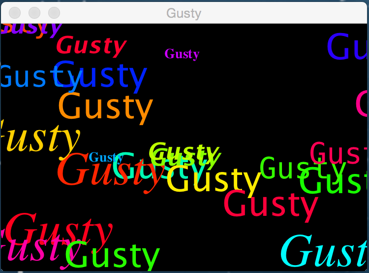
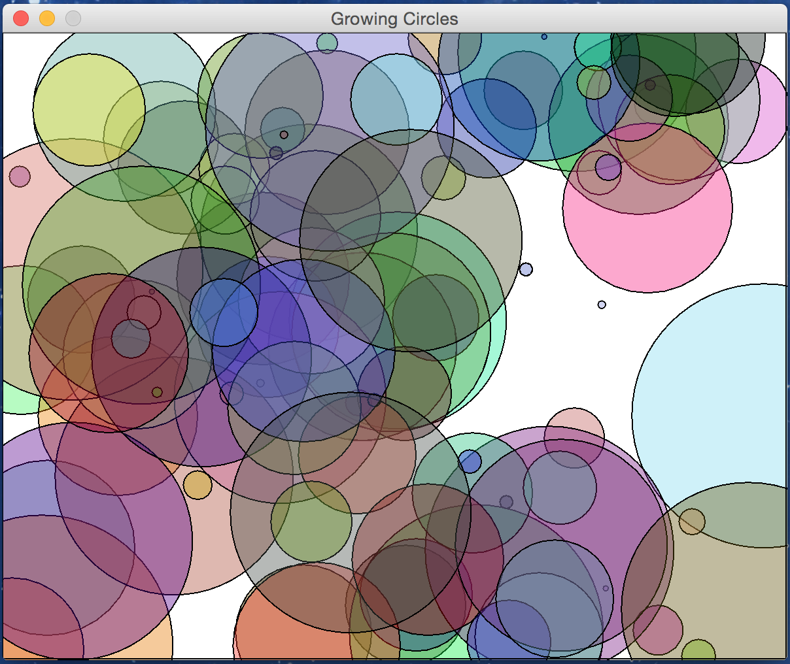
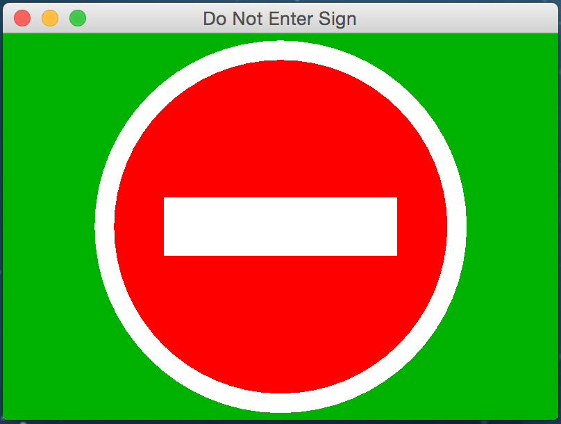

## Sample Graphics Drawing Code

This section provides several sample programs the perform Java graphics drawing.  The samples do not process events.

## Random Strings

[RandomStringsPanel](http://math.hws.edu/javanotes/source/chapter6/RandomStringsPanel.java) is from [Graphics and Painting](http://math.hws.edu/javanotes/c6/s2.html) of David Eck's book.  The following is a screen shot of the Random Strings program running.


 

```java
import java.awt.*;
import javax.swing.JPanel;
import javax.swing.JFrame;

/**
 * This panel displays 25 copies of a message.  
 * - The color and position of each message is selected at random.  
 * - The font * of each message is randomly chosen from among five possible fonts.  
 * - The messages are displayed on a black background.
 * Note:  The style of drawing used here is poor, because every time the paintComponent() 
 * method is called, new random values are used.  Different picture are drawn each time.
 * Resize the window and watch new strings generated
 */
public class RandomStringsPanelWithMain extends JPanel {

    public static void main(String[] args) {
        JFrame window = new JFrame("Gusty");
        RandomStringsPanelWithMain content = new RandomStringsPanelWithMain("Gusty");
        window.setContentPane(content);
        window.setDefaultCloseOperation(JFrame.EXIT_ON_CLOSE);
        window.setLocation(120,70);
        window.setSize(350,250);
        window.setVisible(true);
    }
    
    private String message;
    private Font font1, font2, font3, font4, font5;

    public RandomStringsPanelWithMain() {
        this(null);
    }

    public RandomStringsPanelWithMain(String messageString) {
        message = messageString;
        if (message == null)
            message = "Java!";
        font1 = new Font("Serif", Font.BOLD, 14);
        font2 = new Font("SansSerif", Font.BOLD + Font.ITALIC, 24);
        font3 = new Font("Monospaced", Font.PLAIN, 30);
        font4 = new Font("Dialog", Font.PLAIN, 36);
        font5 = new Font("Serif", Font.ITALIC, 48);
        setBackground(Color.BLACK);
    }

    public void paintComponent(Graphics g) {
        super.paintComponent(g);
        Graphics2D g2 = (Graphics2D)g;
        g2.setRenderingHint( RenderingHints.KEY_ANTIALIASING, RenderingHints.VALUE_ANTIALIAS_ON );

        int width = getWidth();
        int height = getHeight();

        for (int i = 0; i < 25; i++) {
            int fontNum = (int)(5*Math.random()) + 1;
            switch (fontNum) {
            case 1:
                g.setFont(font1); break;
            case 2:
                g.setFont(font2); break;
            case 3:
                g.setFont(font3); break;
            case 4:
                g.setFont(font4); break;
            case 5:
                g.setFont(font5); break;
            }

            float hue = (float)Math.random();
            g.setColor( Color.getHSBColor(hue, 1.0F, 1.0F) );
            int x = -50 + (int)(Math.random()*(width+40));
            int y = (int)(Math.random()*(height+20));
            g.drawString(message,x,y);
        }
    }
}
```

## Growing Circles

[```GrowingCircleAnimation.java```](http://math.hws.edu/eck/cs124/javanotes7/source/chapter5/GrowingCircleAnimation.java) uses [```CircleInfo.java```](http://math.hws.edu/javanotes/source/chapter5/CircleInfo.java).  Both are from [Programming with Objects](http://math.hws.edu/javanotes/c5/s3.html) of David Eck's book.  The following is a screen shot of the Growing Circle Animation program running.

 

```java
import java.awt.Color;
import java.awt.Graphics;

/**
 * A simple class that holds the size, color, and location of a colored disk,
 * with a method for drawing the circle in a graphics context.  The circle
 * is drawn as a filled oval, with a black outline.
 */
public class CircleInfo {
    
    public int radius;    // The radius of the circle.
    public int x,y;       // The location of the center of the circle.
    public Color color;   // The color of the circle.
    
    public CircleInfo( int centerX, int centerY, int rad ) {
        x = centerX;
        y = centerY;
        radius = rad;
        int red =   (int)(255*Math.random());
        int green = (int)(255*Math.random());
        int blue =  (int)(255*Math.random());
        color = new Color(red,green,blue, 100);
    }
    
    public void draw( Graphics g ) {
        g.setColor( color );
        g.fillOval( x - radius, y - radius, 2*radius, 2*radius );
        g.setColor( Color.BLACK );
        g.drawOval( x - radius, y - radius, 2*radius, 2*radius );
    }
}
```

```java
import java.awt.*;
import java.awt.event.*;
import javax.swing.*;

/**
 * This program shows an animation where 100 semi-transparent disks of
 * various sizes grow continually, disappearing before they get too big.
 * When a disk disappears, it is replaced by a new disk at another location.
 */
public class GrowingCircleAnimation extends JPanel implements ActionListener {
    
    private CircleInfo[] circleData; // holds the data for all 100 circles
    
    /**
     *  Draw one frame of the animation.  If there is no disk data (which is
     *  true for the first frame), 100 disks with random locations, colors,
     *  and radii are created.  In each frame, all the disks grow by
     *  one pixel per frame.  Disks sometimes disappear at random, or when
     *  their radius reaches 100.  when a disk disappears, a new disk appears
     *  with radius 1 and with a random location and color
     */
    private void drawFrame(Graphics g, int frameNumber, int width, int height) {
        if (circleData == null) {  // create the array, if it doesn't exist
            circleData = new CircleInfo[100];
            for (int i = 0; i < circleData.length; i++) {
                circleData[i] = new CircleInfo( 
                                        (int)(width*Math.random()),
                                        (int)(height*Math.random()),
                                        (int)(100*Math.random()) );
            }
        }
        for (int i = 0; i < circleData.length; i++) {  // draw the filled circles
            circleData[i].radius++;
            circleData[i].draw(g);
            if (Math.random() < 0.01 || circleData[i].radius > 100) {
                    // replace circle number i with a new circle
                circleData[i] = new CircleInfo( 
                                        (int)(width*Math.random()),
                                        (int)(height*Math.random()),
                                        1 );
            }
        }
        g.setColor(Color.BLACK);
        g.drawRect(0,0,width-1,height-1);  // Draw a frame (for the screenshot).
    }
    
    //------ Implementation details: DO NOT EXPECT TO UNDERSTAND THIS ------
    
    
    public static void main(String[] args) {
        JFrame window = new JFrame("Falling Circles");
        GrowingCircleAnimation drawingArea = new GrowingCircleAnimation();
        drawingArea.setBackground(Color.WHITE);
        window.setContentPane(drawingArea);
        drawingArea.setPreferredSize(new Dimension(600,480));
        window.pack();
        window.setLocation(100,50);
        window.setDefaultCloseOperation(JFrame.EXIT_ON_CLOSE);
        window.setResizable(false);
        // The Swing Timer frameTimer establishes the actionPerformed() method
        // so that it runs periodically -- in this case every 20 ms
        Timer frameTimer = new Timer(20,drawingArea);
        window.setVisible(true);
        frameTimer.start();
    } // end main

    private int frameNum;
    
    // actionPerformed() calls repaint() which registers an asynchronous request
    // to the AWT that our component needs to repainted.
    // AWT will call our paintComponent() methods, which calls the above drawFrame()
    //
    // The end result is that we paintComponent() at a 20ms rate.
    public void actionPerformed(ActionEvent evt) {
        frameNum++;
        repaint();
    }
    
    protected void paintComponent(Graphics g) {
        super.paintComponent(g);
        drawFrame(g, frameNum, getWidth(), getHeight());
    }

}
```

## Do Not Enter

The Do Not Enter program is from [Loyola Marymont University, Los Angeles](http://cs.lmu.edu).  I remember watching Loyola Marymont in the NCAA basketball tournament in 1990.  They were coached by [Paul Westhead](https://en.wikipedia.org/wiki/Paul_Westhead), who played at an extraordniarily fast pace, taking shots within 10 seconds of obtaining possession.  Their two star players were [Bo Kimble](https://en.wikipedia.org/wiki/Bo_Kimble) and [Hank Gathers](https://en.wikipedia.org/wiki/Hank_Gathers).  Hank died during the West Coast Conference Basketball tournament.

[Basic Java Graphics from Loyola Marymon University](http://cs.lmu.edu/~ray/notes/javagraphics/).

The following is a screen shot of the Do Not Enter Program running.

 

```java
// Example from cs.lmu.edu

import java.awt.BorderLayout;
import java.awt.Color;
import java.awt.Graphics;
import java.awt.Point;

import javax.swing.JFrame;
import javax.swing.JPanel;

/**
 * A panel maintaining a picture of a do not enter sign.
 */
 public class DoNotEnterSign extends JPanel {

    /**
     * Called by the runtime system whenever the panel needs painting.
     * TODO: This code has too many literals sprinkled about.
     */
    public void paintComponent(Graphics g) {
        super.paintComponent(g);

        Point center = new Point(getWidth() / 2, getHeight() / 2);
        int radius = Math.min(getWidth() / 2, getHeight() / 2) - 5;
        int innerRadius = (int)(radius * 0.9);

        g.setColor(Color.WHITE);
        g.fillOval(center.x - radius, center.y - radius,
                   radius * 2, radius * 2);
        g.setColor(Color.RED);
        g.fillOval(center.x - innerRadius, center.y - innerRadius,
                   innerRadius * 2, innerRadius * 2);
        g.setColor(Color.WHITE);
        int barWidth = (int)(innerRadius * 1.4);
        int barHeight = (int)(innerRadius * 0.35);
        g.fillRect(center.x - barWidth/2, center.y - barHeight/2,
                   barWidth, barHeight);
    }

    /**
     * A tester method that embeds the panel in a frame so you can "run"
     * it as an application.  Because we have nothing better to do, we
     * show off a bit of color manipulation.
     */
    public static void main(String[] args) {
        JFrame frame = new JFrame("A simple graphics program");
        frame.setSize(400, 300);
        frame.setDefaultCloseOperation(JFrame.EXIT_ON_CLOSE);
        JPanel panel = new DoNotEnterSign();
        panel.setBackground(Color.GREEN.darker());
        frame.getContentPane().add(panel, BorderLayout.CENTER);
        frame.setVisible(true);
    }
}
```

