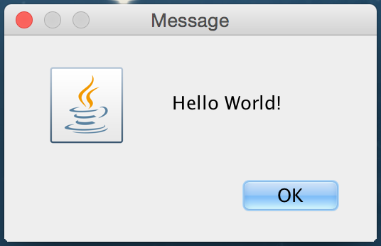

## Introduction

Input in a GUI program is processed with an **Event Handler**, which is code that is executed when an event occurs.  An event can be one of the following.

* A mouse click.
* A mouse press down.
* A mouse press release.
* A key click.

A GUI program can have several buttons, popup menus, and text areas all of which can generate an input.  For example in MS-Word, you can type text in your file (key clicks), you can search for a string (Control-F, followed by typing text, followed by clicking on Search), you can select a specific heading (Selecting a popup menu), and you can print (Selecting File > Print and using the Print Panel).  The corresponding GUI program has an event handler that is called when each corresponding event occurs.

## Hello World Example

This section develops the Hello World examples from [The Basic GUI Application](http://math.hws.edu/javanotes/c6/s1.html) of David Eck's book.

This section shows two figures and corresponding code.  The first figure is a screen shot of the code running.  The second figure shows an ```ActionEvent``` object flowing from the OK button to the event handler.  The figures and code show a ```JFrame``` with is content pane (red border in figure) set to a ```JPanel```.  The ```JPanel``` contains two components.

* ```JButton``` that is labeled ```OK```.
  * The ```JButton``` has an ```ActionListener``` added to it.  
    * The ```ActionListener``` is called when the ```JButton``` is selected.
    * An ```ActionListener``` is an object.
  * We create a class ```ButtonHandler``` that implements the ```ActionListener``` interface.
    * The ```ActionListener``` interface has one method, ```actionPerformed```.
    * The code for our implementation of the ```actionPerformed``` method is simply to exit the progrm.
  * When a user clicks on OK, an ```ActionEvent``` object is passed as a parameter to the ```actionPerformed``` method of our ```ButtonHandler```.
* ```HelowWorldDisplay``` which is our class that extends a ```JPanel``` and overrides the ```paintComponent``` method in order to ```drawString``` ```Hello World!```.
* The ```JButton``` and ```HelloWorldDisplay``` are added to the ```JPanel``` using ```BorderLayout```, with ```Hello World!``` in the ```CENTER``` and the ```JButton``` in the ```SOUTH```.

### Hello World GUI Screen Shot


### Hello World Event Flow


### Hello World Code

```java
import java.awt.*;
import java.awt.event.*;
import javax.swing.*;

public class HelloWorldGUI2 {

    private static class HelloWorldDisplay extends JPanel {
        public void paintComponent(Graphics g) {
            super.paintComponent(g);
            g.drawString( "Hello World!", 20, 30 );
        }
    }

    private static class ButtonHandler implements ActionListener {
        public void actionPerformed(ActionEvent e) {
            System.exit(0);
        }
    }

    public static void main(String[] args) {

        HelloWorldDisplay displayPanel = new HelloWorldDisplay();
        JButton okButton = new JButton("OK");
        ButtonHandler listener = new ButtonHandler();
        okButton.addActionListener(listener);

        JPanel content = new JPanel();
        content.setLayout(new BorderLayout());
        content.add(displayPanel, BorderLayout.CENTER);
        content.add(okButton, BorderLayout.SOUTH);

        JFrame window = new JFrame("GUI Test");
        window.setContentPane(content);
        window.setSize(250,100);
        window.setLocation(100,100);
        window.setVisible(true);

    }

}
```

## Annonymous Class - ButtonHandler

If you study sample graphics code from the Internet, you will see annonymous classes.

In the previous we created a ```ButtonHandler``` class that implemented the ```ActionListener``` interface.  ```ActionListener``` is an interface and you cannot apply the ```new``` operator as

```java
ActionListener actListener = new ActionListener();
```

However, you can define an anonymous class (a class without a name) that implements an ActionListener interface.  When doing this, the anonymous class defines the method(s) of the interface (e.g., public void actionPerformed() which allows the interface to seem to be a class in which the ```new``` operator is applied.  The following code creates an anonymous class that implements an ```ActionListener``` interface, constructs an object, and assigns it to a variable.  The resulting object is used as an action listener on the OK button.

```java
JButton okButton = new JButton("OK");
ActionListener listener = new ActionListener(){
      public void actionPerformed(...)   {System.exit(0);}
};
okButton.addActionListener(listener);
```

## Abstract Classes

Graphics programming often use abstract classes.  An abstract class is somewhat like a class and an interface combined

* Interface likeness: You define methods that must be implemented
* Interface likeness: You cannot create objects from them as they are defined  
* Class likeness: You can create an object if you provide the real code for an abstract method
* Class likeness: You can extend them

The following code demonstrates an abstract class ```GraphicObject``` that has one real method (```moveTo```) and two abstract methods (```draw``` and ```resize```).  When the class ```Circle``` extends ```GraphicObject```, ```Circle``` has to provide the code for ```draw``` and ```resize```, but reuses the ```moveTo``` code from the superclass.
```java
abstract class GraphicObject {
    int x, y;
    ...
    void moveTo(int newX, int newY) {
        ...
    }
    abstract void draw();
    abstract void resize();
}
class Circle extends GraphicObject {
    void draw() {
        ...
    }
    void resize() {
        ...
    }
}
```

## AbstractAction

```java.swing.AbstractAction``` is an abstract class that has the ```actionPerformed``` method.  The sample ```Capitalizer``` code in [Graphics Events Code](/gustycooper.github.io/mydoc_7_graphics_events_code) uses the ```AbstractAction``` class.  The following code snippet demonstrates creating an anonymous ```AbstractAction``` object that implements the ```actionPerformed``` method

```java
new AbstractAction("To Lower Case") {
    public void actionPerformed(ActionEvent e) {
        area.setText(area.getText().toLowerCase());
    }
}
```

You can actually do several actions in one big swoop

```java
JPanel buttonPanel = new JPanel();

buttonPanel.add(new JButton(new AbstractAction("To Lower Case") {
            public void actionPerformed(ActionEvent e) {
                area.setText(area.getText().toLowerCase());
            }
        }));
```

## Hello World JOptionPane Example

When a user makes an invalid selection on a GUI program, you often pop-up a dialog box that forces the user to acknowledge the error before returning to your program.  The Java ```JOptionPane``` class is used for these pop-up dialog boxes.  This section shows a ```JOptionPane``` Hello World example screen shot and code.

### JOptionPane Screen Shot



### JOptionPane Code

```java
import javax.swing.JOptionPane;

/**
 * Displays a dialog box with "Hello World."  
 * The program terminates when the user selects OK
 */
public class HelloWorldGUI1 {
    public static void main(String[] args) {
        JOptionPane.showMessageDialog( null, "Hello World!" );
    }

}
```

### JOptionPane with a JFrame

The ```JOptionPane``` is designed to show messages that must be acknowledged and then return to the main window.  Suppose you have a GUI with a ```JTextField``` in which a user must type a number.  You can use a ```JOptionPane``` for an error message.  This section shows a screen shot and some code snippets to demonstrate how you would use a ```JOptionPane```.  The screen shot shows several input text fields.  The code snippet demonstrates processing the Acres of Land input text field.  The user has to enter a number in the Acres of Land input text field and then select Simulate One Year.  The ```similateYearButtonActionPerformed``` method processes the button clicked event.  The text is the ```acresOfLandTextField``` is parsed to an integer.  If it is not an integer, an exception occurs and an ```JOptionPane``` is used to inform the user.

```
public class EndorUI extends JFrame {
   private JTextField acresOfLandTextField;

   public void optionPane(String s) {
      JOptionPane.showMessageDialog(rootPane, s, "Error", JOptionPane.ERROR_MESSAGE);
   }

   private void initComponents() {
      // just one of many components
      acresOfLandTextField = new javax.swing.JTextField();
   }

   private void similateYearButtonActionPerformed(ActionEvent evt) {

      try {
         acres = Integer.parseInt(acresOfLandTextField.getText());
      }
      catch (Exception e) {
         optionPane("Illegal value for Acres of Land");
         goodData = false;
      }
   }
}
```

