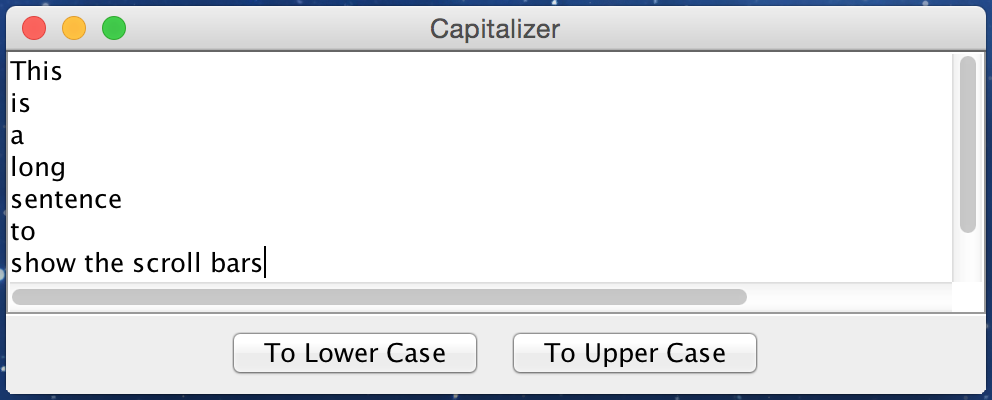
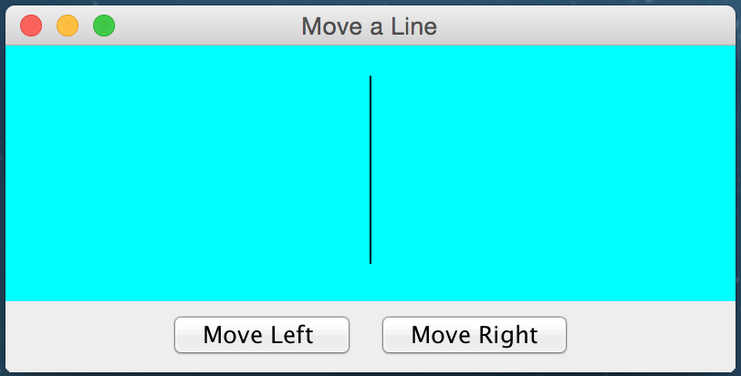
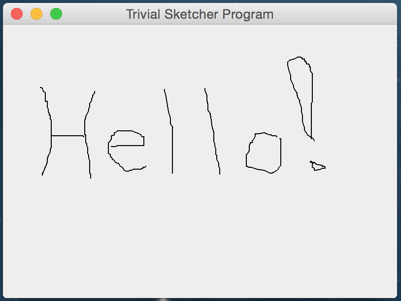
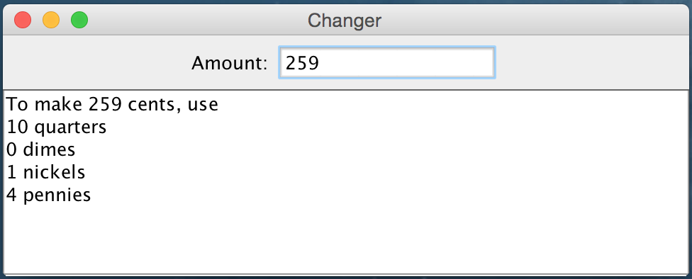
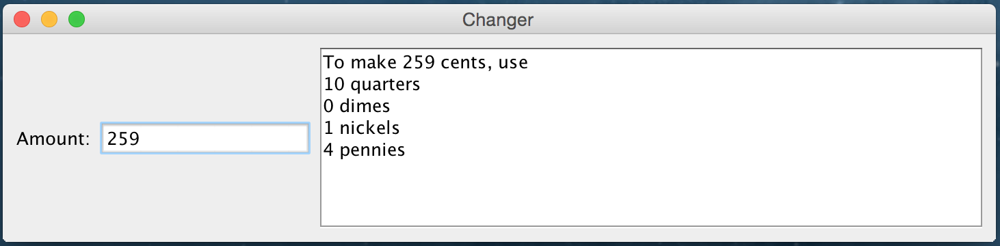

## Sample Graphics Code with Events

This section provides several sample programs the perform Java graphics drawing and processing events.

The Capitalizer, Move A Line, Trivial Sketcher, and Changer programs are from [Basic Java Graphics](http://cs.lmu.edu/~ray/notes/javagraphics/) from [Loyola Marymont University, Los Angeles](http://cs.lmu.edu).  

I remember watching Loyola Marymont in the NCAA basketball tournament in 1990.  They were coached by [Paul Westhead](https://en.wikipedia.org/wiki/Paul_Westhead), who played at an extraordniarily fast pace, taking shots within 10 seconds of obtaining possession.  Their two star players were [Bo Kimble](https://en.wikipedia.org/wiki/Bo_Kimble) and [Hank Gathers](https://en.wikipedia.org/wiki/Hank_Gathers).  Hank died during the West Coast Conference Basketball tournament.

## Capitalizer Program

The Capitalizer program is from [Basic Java Graphics](http://cs.lmu.edu/~ray/notes/javagraphics/) from [Loyola Marymont University, Los Angeles](http://cs.lmu.edu).  The following is a screen shot of the Capitalizer Program running.

 

```java
// Example copied from cs.lmu.edu and modified

import java.awt.BorderLayout;
import java.awt.event.ActionEvent;

import javax.swing.AbstractAction;
import javax.swing.JButton;
import javax.swing.JFrame;
import javax.swing.JPanel;
import javax.swing.JScrollPane;
import javax.swing.JTextArea;

/**
 * A trivial GUI application for capitalizing strings.
 * You get to type in strings into a textarea and press
 * buttons to make the string all lowercase or all uppercase.
 */
@SuppressWarnings("serial")
public class Capitalizer {

     public static void main(String[] args) {
        String initialText = "\u00bfHablas espa\u00f1ol o ingl\u00e9s?";
        final JTextArea area = new JTextArea(initialText, 8, 50);

        JPanel buttonPanel = new JPanel();
        /* The following two statements add buttons with actions to our buttonPanel.
         * The statements are rather tricky.  They accomplishes the following
         * 1. Add a JButton to the buttonPanel
         * 2. Add an actionPerformed() ActionListener method to the Jbutton
         *
         * AbstractAction is an abstract class that has the actionPerformed() method
         * The new AbstractAction(){ } creates an anonymous class with a real actionPerformed() method.
         * The new JButton() attaches the action to the button created
         * The buttonPanel.add() adds the JButton to the buttonPanel.
         */
        buttonPanel.add(new JButton(new AbstractAction("To Lower Case") {
            public void actionPerformed(ActionEvent e) {
                area.setText(area.getText().toLowerCase());
            }
        }));
        buttonPanel.add(new JButton(new AbstractAction("To Upper Case") {
            public void actionPerformed(ActionEvent e) {
                area.setText(area.getText().toUpperCase());
            }
        }));

        JFrame window = new JFrame("Capitalizer");
        window.setDefaultCloseOperation(JFrame.EXIT_ON_CLOSE);
        // The next two statements add panels to the window's ContentPane
        window.getContentPane().add(new JScrollPane(area), BorderLayout.CENTER);
        window.getContentPane().add(buttonPanel, BorderLayout.SOUTH);
        window.pack();
        window.setVisible(true);
    }
}
```

## Move A Line Program

The Move A Line program is from [Basic Java Graphics](http://cs.lmu.edu/~ray/notes/javagraphics/) from [Loyola Marymont University, Los Angeles](http://cs.lmu.edu).  The following is a screen shot of the Move A Line Program running.

 

```java
// Example copied from cs.lmu.edu and modified

import java.awt.*;
import java.awt.event.*;
import javax.swing.*;
/**
 * Custom Graphics Example: Using key/button to move a line left or right.
 */
@SuppressWarnings("serial")
public class CGMoveALine extends JFrame {
   // Name-constants for the various dimensions
   public static final int CANVAS_WIDTH = 400;
   public static final int CANVAS_HEIGHT = 140;
   public static final Color LINE_COLOR = Color.BLACK;
   public static final Color CANVAS_BACKGROUND = Color.CYAN;
 
   // The line from (x1, y1) to (x2, y2), initially position at the center
   private int x1 = CANVAS_WIDTH / 2;
   private int y1 = CANVAS_HEIGHT / 8;
   private int x2 = x1;
   private int y2 = CANVAS_HEIGHT / 8 * 7;
 
   private DrawCanvas canvas; // the custom drawing canvas (extends JPanel)
 
   /** Constructor to set up the GUI */
   public CGMoveALine() {
      // Set up a panel for the buttons
      JPanel btnPanel = new JPanel(new FlowLayout());
      JButton btnLeft = new JButton("Move Left ");
      btnPanel.add(btnLeft);
      btnLeft.addActionListener(new ActionListener() {
         public void actionPerformed(ActionEvent e) {
            x1 -= 10;
            x2 -= 10;
            canvas.repaint();
            requestFocus(); // change the focus to JFrame to receive KeyEvent
         }
      });
      JButton btnRight = new JButton("Move Right");
      btnPanel.add(btnRight);
      btnRight.addActionListener(new ActionListener() {
         public void actionPerformed(ActionEvent e) {
            x1 += 10;
            x2 += 10;
            canvas.repaint();
            requestFocus(); // change the focus to JFrame to receive KeyEvent
         }
      });
 
      // Set up a custom drawing JPanel
      canvas = new DrawCanvas();
      canvas.setPreferredSize(new Dimension(CANVAS_WIDTH, CANVAS_HEIGHT));
 
      // Add both panels to this JFrame
      Container cp = getContentPane();
      cp.setLayout(new BorderLayout());
      cp.add(canvas, BorderLayout.CENTER);
      cp.add(btnPanel, BorderLayout.SOUTH);
 
      // "this" JFrame fires KeyEvent
      addKeyListener(new KeyAdapter() {
         @Override
         public void keyPressed(KeyEvent evt) {
            switch(evt.getKeyCode()) {
               case KeyEvent.VK_LEFT:
                  x1 -= 10;
                  x2 -= 10;
                  repaint();
                  break;
               case KeyEvent.VK_RIGHT:
                  x1 += 10;
                  x2 += 10;
                  repaint();
                  break;
            }
         }
      });
 
      setDefaultCloseOperation(JFrame.EXIT_ON_CLOSE); // Handle the CLOSE button
      setTitle("Move a Line");
      pack();           // pack all the components in the JFrame
      setVisible(true); // show it
      requestFocus();   // set the focus to JFrame to receive KeyEvent
   }
 
   /**
    * DrawCanvas (inner class) is a JPanel used for custom drawing
    */
   class DrawCanvas extends JPanel {
      @Override
      public void paintComponent(Graphics g) {
         super.paintComponent(g);
         setBackground(CANVAS_BACKGROUND);
         g.setColor(LINE_COLOR);
         g.drawLine(x1, y1, x2, y2); // draw the line
      }
   }
 
   /** The entry main() method */
   public static void main(String[] args) {
      // Run GUI codes on the Event-Dispatcher Thread for thread safety
      SwingUtilities.invokeLater(new Runnable() {
         @Override
         public void run() {
            new CGMoveALine(); // Let the constructor do the job
         }
      });
   }
}
```

## Trivial Sketcher Program

The Trivial Sketcher program is from [Basic Java Graphics](http://cs.lmu.edu/~ray/notes/javagraphics/) from [Loyola Marymont University, Los Angeles](http://cs.lmu.edu).  The following is a screen shot of the Trivial Sketcher Program running.

 


```java
// Example from cs.lmu.edu

import java.awt.BorderLayout;
import java.awt.Graphics;
import java.awt.Point;
import java.awt.event.MouseAdapter;
import java.awt.event.MouseEvent;
import java.awt.event.MouseMotionAdapter;

import javax.swing.JFrame;
import javax.swing.JPanel;

/**
 * This is an extremely scaled-down sketching canvas; with it you
 * can only scribble thin black lines.  For simplicity the window
 * contents are never refreshed when they are uncovered.
 */
public class TrivialSketcher extends JPanel {

    /**
     * Keeps track of the last point to draw the next line from.
     */
    private Point lastPoint;

    /**
     * Constructs a panel, registering listeners for the mouse.
     */
    public TrivialSketcher() {
        // When the mouse button goes down, set the current point
        // to the location at which the mouse was pressed.
        addMouseListener(new MouseAdapter() {
            public void mousePressed(MouseEvent e) {
                lastPoint = new Point(e.getX(), e.getY());
            }
        });

        // When the mouse is dragged, draw a line from the old point
        // to the new point and update the value of lastPoint to hold
        // the new current point.
        addMouseMotionListener(new MouseMotionAdapter() {
            public void mouseDragged(MouseEvent e) {
                Graphics g = getGraphics();
                g.drawLine(lastPoint.x, lastPoint.y, e.getX(), e.getY());
                lastPoint = new Point(e.getX(), e.getY());
                g.dispose();
            }
        });
    }

    /**
     * A tester method that embeds the panel in a frame so you can
     * run it as an application.
     */
    public static void main(String[] args) {
        JFrame frame = new JFrame("Trivial Sketcher Program");
        frame.getContentPane().add(new TrivialSketcher(), BorderLayout.CENTER);
        frame.setDefaultCloseOperation(JFrame.EXIT_ON_CLOSE);
        frame.setSize(400, 300);
        frame.setVisible(true);
    }
}
```

## Changer Program

The Changer program is from [Basic Java Graphics](http://cs.lmu.edu/~ray/notes/javagraphics/) from [Loyola Marymont University, Los Angeles](http://cs.lmu.edu).  The following is a screen shot of the Changer Program running.

 

```java
// Example from cs.lmu.edu

import java.awt.BorderLayout;
import java.awt.Color;

import javax.swing.JFrame;
import javax.swing.JLabel;
import javax.swing.JPanel;
import javax.swing.JScrollPane;
import javax.swing.JTextArea;
import javax.swing.JTextField;
import javax.swing.event.DocumentEvent;
import javax.swing.event.DocumentListener;
import javax.swing.text.Document;

/**
 * A silly little application that lets you type in an amount of
 * cents in a textfield and see a report of how to make that amount
 * with the fewest number of pennies, dimes, nickels and quarters.
 */
public class Changer extends JFrame {
    private JTextField amountField = new JTextField(12);
    private Document amountText = amountField.getDocument();
    private JTextArea report = new JTextArea(8, 40);

    /**
     * Constructs a Changer, laying out the frame and registering
     * listeners
     */
    public Changer() {

        // Lay out the components in the window.
        JPanel topPanel = new JPanel();
        topPanel.add(new JLabel("Amount:"));
        topPanel.add(amountField);
        getContentPane().add(topPanel, BorderLayout.NORTH);
        getContentPane().add(new JScrollPane(report), BorderLayout.CENTER);

        // Set some properties of the frame and its components
        setBackground(Color.LIGHT_GRAY);
        report.setEditable(false);

        /*
         * A DocumentListener is an interface that has three methods
         * 1. changeUpdate - something in document was changed
         * 2. insertUpdate - something in document was inserted
         * 3. removeUpdate - something in document was removed
         * The following statement creates an unnamed DocumentListener object
         * by implementing the three methods of the interface.
         * The DocumentListener object is added to the document of the JTextField
         * This ensures the text changes as the user types in the JTextField
         */
        amountText.addDocumentListener(new DocumentListener() {
            public void changedUpdate(DocumentEvent e) {
                updateReport();
            }
            public void insertUpdate(DocumentEvent e) {
                updateReport();
            }
            public void removeUpdate(DocumentEvent e) {
                updateReport();
            }
        });
    }

    /**
     * Writes the correct amount of coins in the report window.
     */
    void updateReport() {
        try {
            int amount = Integer.parseInt(
                    amountText.getText(0, amountText.getLength()));
            report.setText("To make " + amount + " cents, use\n");
            report.append(amount / 25 + " quarters\n");
            amount %= 25;
            report.append(amount / 10 + " dimes\n");
            amount %= 10;
            report.append(amount / 5 + " nickels\n");
            amount %= 5;
            report.append(amount + " pennies\n");
        } catch (NumberFormatException e) {
            report.setText("Not an integer or out of range");
        } catch (Exception e) {
            report.setText(e.toString());
        }
    }

    /**
     * Runs a changer as an application.
     */
    public static void main(String[] args) {
        JFrame frame = new Changer();
        frame.setTitle("Changer");
        frame.pack();
        frame.setDefaultCloseOperation(JFrame.EXIT_ON_CLOSE);
        frame.setVisible(true);
    }
}
```

## Changer JPanel Program

I edited the Changer program to use JPanel (instead of JFrame) in the Changer JPanel Program.  The Changer JPanel program uses the ```BorderLayout```.  You should compare the layout of Changer JPanel with Changer JPanel2 (next section), which uses a ```FlowLayout```.  The Changer  program is from [Basic Java Graphics](http://cs.lmu.edu/~ray/notes/javagraphics/) from [Loyola Marymont University, Los Angeles](http://cs.lmu.edu).    The following is a screen shot of the Changer JPanel Program running.

 


```java
// Example from cs.lmu.edu

import java.awt.BorderLayout;
import java.awt.Color;

import javax.swing.JFrame;
import javax.swing.JLabel;
import javax.swing.JPanel;
import javax.swing.JScrollPane;
import javax.swing.JTextArea;
import javax.swing.JTextField;
import javax.swing.event.DocumentEvent;
import javax.swing.event.DocumentListener;
import javax.swing.text.Document;

/**
 * A silly little application that lets you type in an amount of
 * cents in a textfield and see a report of how to make that amount
 * with the fewest number of pennies, dimes, nickels and quarters.
 */
public class ChangerJPanel extends JPanel {
    private JTextField amountField = new JTextField(12);
    private Document amountText = amountField.getDocument();
    private JTextArea report = new JTextArea(8, 40);

    /**
     * Constructs a Changer, laying out the frame and registering
     * listeners
     */
    public ChangerJPanel(JFrame frame) {

        // Lay out the components in the window.
        JPanel topPanel = new JPanel();
        topPanel.add(new JLabel("Amount:"));
        topPanel.add(amountField);
        frame.getContentPane().add(topPanel, BorderLayout.NORTH);
        frame.getContentPane().add(new JScrollPane(report), BorderLayout.CENTER);

        // Set some properties of the frame and its components
        frame.setBackground(Color.LIGHT_GRAY);
        report.setEditable(false);

        /*
         * A DocumentListener is an interface that has three methods
         * 1. changeUpdate - something in document was changed
         * 2. insertUpdate - something in document was inserted
         * 3. removeUpdate - something in document was removed
         * The following statement creates an unnamed DocumentListener object
         * by implementing the three methods of the interface.
         * The DocumentListener object is added to the document of the JTextField
         * This ensures the text changes as the user types in the JTextField
         */
        amountText.addDocumentListener(new DocumentListener() {
            public void changedUpdate(DocumentEvent e) {
                updateReport();
            }
            public void insertUpdate(DocumentEvent e) {
                updateReport();
            }
            public void removeUpdate(DocumentEvent e) {
                updateReport();
            }
        });
    }

    /**
     * Writes the correct amount of coins in the report window.
     */
    void updateReport() {
        try {
            int amount = Integer.parseInt(amountText.getText(0, amountText.getLength()));
            report.setText("To make " + amount + " cents, use\n");
            report.append(amount / 25 + " quarters\n");
            amount %= 25;
            report.append(amount / 10 + " dimes\n");
            amount %= 10;
            report.append(amount / 5 + " nickels\n");
            amount %= 5;
            report.append(amount + " pennies\n");
        } catch (NumberFormatException e) {
            report.setText("Not an integer or out of range");
        } catch (Exception e) {
            report.setText(e.toString());
        }
    }

    /**
     * Runs a changer as an application.
     */
    public static void main(String[] args) {
        JFrame frame = new JFrame();
        ChangerJPanel cjp = new ChangerJPanel(frame);
        frame.setTitle("Changer");
        frame.pack();
        frame.setDefaultCloseOperation(JFrame.EXIT_ON_CLOSE);
        frame.setVisible(true);
    }
}
```

## Changer JPanel2 Program

I edited the Changer program to use JPanel (instead of JFrame) in the Changer JPanel2 Program.  The Changer JPanel2 program uses the ```FlowLayout```.  You should compare the layout of Changer JPanel2 with Changer JPanel (previous section), which uses a ```BorderLayout```.  The Changer program is from [Basic Java Graphics](http://cs.lmu.edu/~ray/notes/javagraphics/) from [Loyola Marymont University, Los Angeles](http://cs.lmu.edu).  

 


```java
// Example from cs.lmu.edu

import java.awt.BorderLayout;
import java.awt.Color;
import java.awt.FlowLayout;

import javax.swing.JFrame;
import javax.swing.JLabel;
import javax.swing.JPanel;
import javax.swing.JScrollPane;
import javax.swing.JTextArea;
import javax.swing.JTextField;
import javax.swing.event.DocumentEvent;
import javax.swing.event.DocumentListener;
import javax.swing.text.Document;

/**
 * A silly little application that lets you type in an amount of
 * cents in a textfield and see a report of how to make that amount
 * with the fewest number of pennies, dimes, nickels and quarters.
 */
public class ChangerJPanel2 extends JPanel {
    private JTextField amountField = new JTextField(12);
    private Document amountText = amountField.getDocument();
    private JTextArea report = new JTextArea(8, 40);
    private FlowLayout flowLayout = new FlowLayout();

    /**
     * Constructs a Changer, laying out the frame and registering
     * listeners
     */
    public ChangerJPanel2() {

        // Lay out the components in the window.
        JPanel topPanel = new JPanel();
        topPanel.setLayout(flowLayout);
        topPanel.add(new JLabel("Amount:"));
        topPanel.add(amountField);
        topPanel.add(new JScrollPane(report));
        report.setEditable(false);
        this.add(topPanel);

        /*
         * A DocumentListener is an interface that has three methods
         * 1. changeUpdate - something in document was changed
         * 2. insertUpdate - something in document was inserted
         * 3. removeUpdate - something in document was removed
         * The following statement creates an unnamed DocumentListener object
         * by implementing the three methods of the interface.
         * The DocumentListener object is added to the document of the JTextField
         * This ensures the text changes as the user types in the JTextField
         */
        amountText.addDocumentListener(new DocumentListener() {
            public void changedUpdate(DocumentEvent e) {
                updateReport();
            }
            public void insertUpdate(DocumentEvent e) {
                updateReport();
            }
            public void removeUpdate(DocumentEvent e) {
                updateReport();
            }
        });
    }

    /**
     * Writes the correct amount of coins in the report window.
     */
    void updateReport() {
        try {
            int amount = Integer.parseInt(amountText.getText(0, amountText.getLength()));
            report.setText("To make " + amount + " cents, use\n");
            report.append(amount / 25 + " quarters\n");
            amount %= 25;
            report.append(amount / 10 + " dimes\n");
            amount %= 10;
            report.append(amount / 5 + " nickels\n");
            amount %= 5;
            report.append(amount + " pennies\n");
        } catch (NumberFormatException e) {
            report.setText("Not an integer or out of range");
        } catch (Exception e) {
            report.setText(e.toString());
        }
    }

    /**
     * Runs a changer as an application.
     */
    public static void main(String[] args) {
        JFrame frame = new JFrame();
        ChangerJPanel2 panel = new ChangerJPanel2();
        frame.setContentPane(panel);
        frame.setTitle("Changer");
        frame.pack();
        frame.setDefaultCloseOperation(JFrame.EXIT_ON_CLOSE);
        frame.setBackground(Color.LIGHT_GRAY);
        frame.setVisible(true);
    }
}
```
