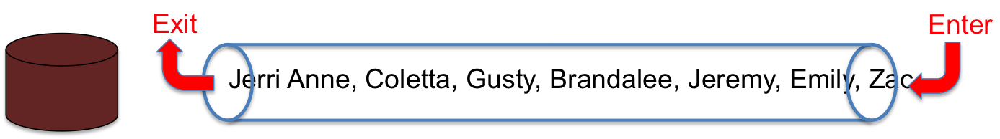
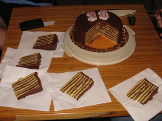
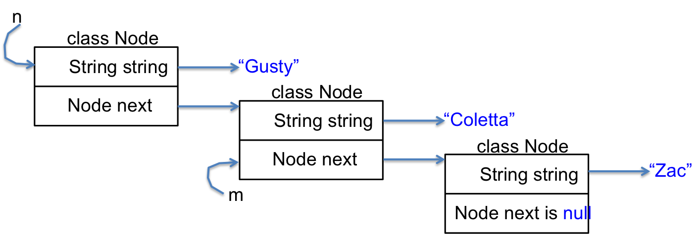
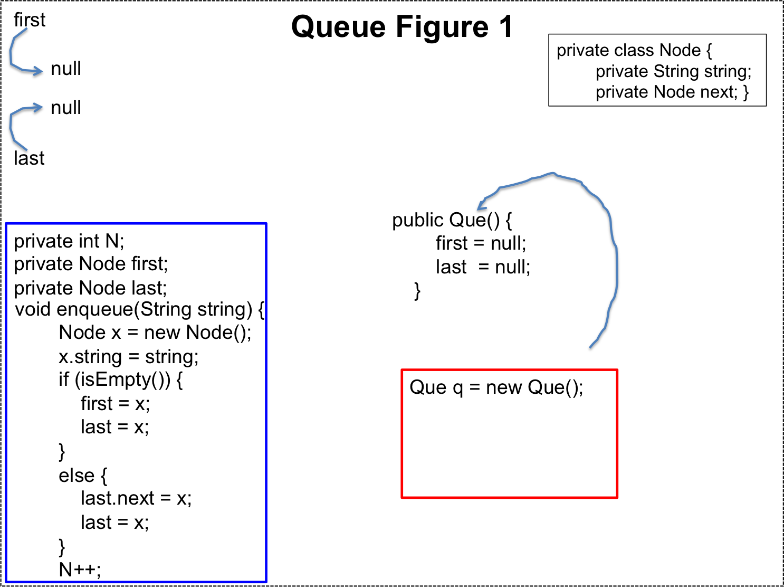
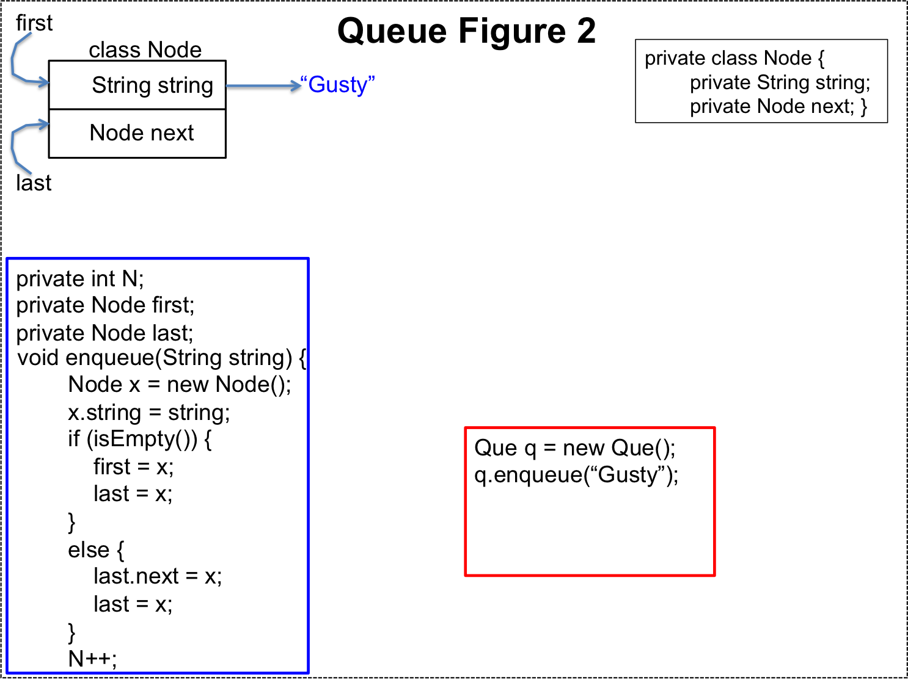
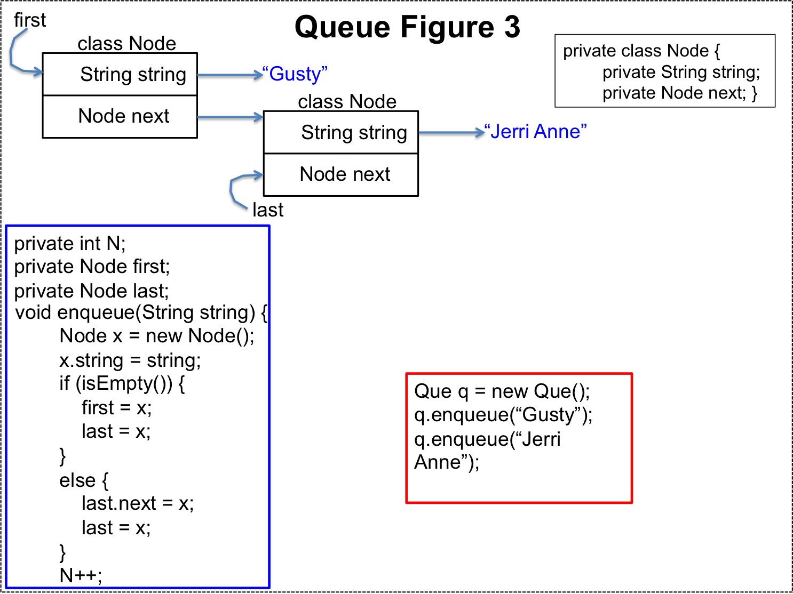
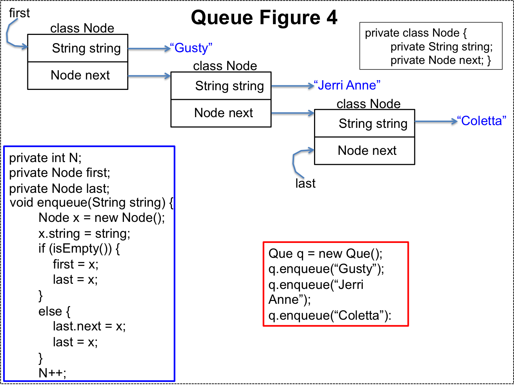
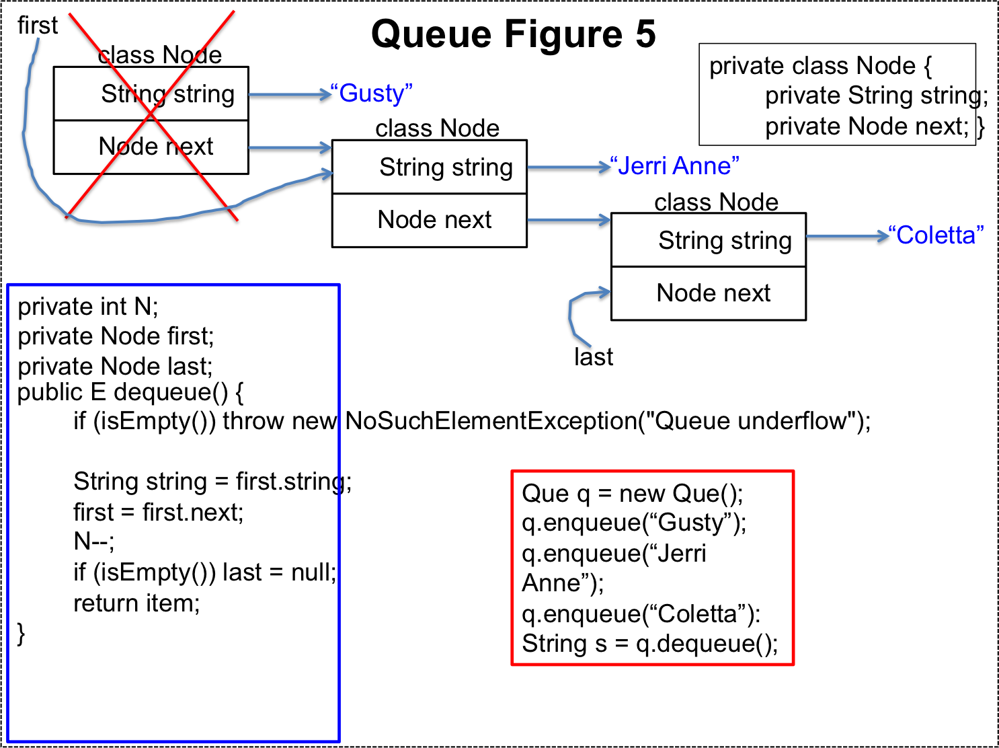

## ADTs and the Wirth Pattern

Abstract Data Types (ADTs) are the Data Structures component of the Programs = Algorithms + Data Structions formula.

<div class="alert alert-danger" role="alert"><i class="fa fa-delicious fa-lg"></i>
<b>
Programming Pattern
0. Wirth Pattern
</b>
<br>

</div>

## Abstract Data Types

We began our study of data types in [Primitive Types](/gustycooper.github.io/mydoc_1_primitive_types).  At that time we first learned that a data type is a set of values and set of operations.  Primitive type ```boolean``` is our simplest example.  The set of values is ```{ true, false }``` and the set of operations is ```{ &&, ||, ! }```.  We expanded our study of data types in [Simple Objects](/gustycooper.github.io/mydoc_3_simple_objects).  We learned how to define our own data types - reference types.  We associated the instance variables with the set of values and the instance methods with the set of operations.  We continued our study of data types in [Classes, Objects, ...](/gustycooper.github.io/mydoc_5_classes_objects).  All of these are examples of Abstract Data Types, with primitive types provided by Java and reference types provided by programmers.  

An abstract data type allows us to view a data type in terms of values and operations.  We do not care how the ADT is implemented as long as we can declare variables and manipulate them with instance methods.  

We have defined ```Person```, ```Car```, ```PowerBall```, ```Twitter```, ```MyMath```, ```Student```, and ```Dog```.  We do not care how someone implements the ```Person``` type as long as we can construct ```Person``` objects and call ```addFriend```, ```getFriends```, ```getName```, etc.

Since we have been using ADTs, the purpose of this module is to re-emphasize the concept and study two classing ADTs - queue and stack.  We develop a queue ADT in this module.  We develop a stack ADT in [Stack lab](/gustycooper.github.io/labs_lab08_01).  We do this implementation using ```interface```s, a regular class, and a generic class.  The generic class is an advanced topic for those who are interested.  You will not be tested on creating generic classes.

In addition to implementing a queue and a stack, we solve several problems with them.

## Queue Introduction

Jerri Anne has just finished baking a 7 layer cake.  The Cooper’s love Jerri Anne’s 7 layer cake, but they have to wait in line to get their piece.  They rush to get in line, pushing and shoving, but eventually a line forms, which is shown in the following figure.

 

The line formed waiting for cake is a **queue**.  The attribute of a queue is that the first one in is the first one out, which is shorted to first in first out, which is shortened to **FIFO**.  In the previous figure you see tube into which people enter from the right and exit to the left.  Once someone enters the tube, they cannot skip around someone who is already in the tube.  We see that Jerri Anne is the first one in tube and because of this she is the first one to get cake.  Jerri Anne is at the **head** of the queue.  Jerri Anne is followed by Coletta, Gusty, Brandalee, Jeremy, Emily, and Zac, which is the order of serving cake.  In our family, Jerri Anne bakes a 7-layer cake for birthdays, and the person who has a birthday is the head of the queue.  The following is a nice photo of one of Jerri Anne's 7 Layer Cakes.  They are most delicious.

 


The following describes operations for the 7-layer cake queue.

* **getInLine** – a person gets in the cake line.  When this happens the line gets longer.
* **firstPersonIsServed** – a person is served a piece of cake.  When that happens, the person gets out of line and the line gets shorter.
* **whoIsAtTheFrontOfTheLine** – this asks a question.  The answer determines the size of the slice of cake.  For example, when Gusty is at the front of the line, the cake slicer knows to slice a large hunk.  The line stays the same for this operation.
* **howManyInLine** - this asks a question.  The answer determines how to slice the cake.  If the cake is getting small, and the number is line 10, the slicer knows to slice small.
* **isAnyBodyInLine** - this asks a question.  When the line is empty, the cake slicer takes a break.

We will define a ```QueueInterface``` interface that has methods for a queue of ```String```.  similar to the operations listed for 7-layer cake waiting.  These method names are classic names for queue operations.

* **enqueue** - adds a ```String``` to the tail of the queue.  The queue gets longer.
* **dequeue** - removes a ```String``` from the head of the queue.  The queue gets shorter.
* **peek** - get the ```String``` from the head of the queue, but leave the ```String``` on the queue.  The queue stays the same length and the head remains the same.
* **size** - return the number of elements in the queue.
* **isEmpty** - return ```true``` if the queue is empty; otherwise ```false```.

Java defines a [```Queue``` interface](https://docs.oracle.com/javase/tutorial/collections/interfaces/queue.html) that has methods equivalent to these, but with different names.  The Java ```Queue``` interface is a bit tricky to understand because it is defined for a generic type, which allows you to declare a queue of ```String```, a queue of ```Person```, etc.  We discuss this in section Queue of Generic Type.  For now, observe the names of the methods in the interface.

* **add** - adds an element to the tail of the queue.  The queue gets longer.
* **remove** - removes an element from the head of the queue.  The queue gets shorter.
* **peek** - get the head element from the queue, but leave the head element on the queue.  The queue stays the same length and the head remains the same.
* **size** - return the number of elements in the queue.
* **isEmpty** - return ```true``` if the queue is empty; otherwise ```false```.

## ```QueInterface``` of Java String

Recall that a Java ```interface``` defines method signagures without code.  Any class that ```implements``` an ```interface``` must provide the definitions (with code) of all method signatures in the ```interface```.  We studied ```interface``` in [Interface](/gustycooper.github.io/mydoc_5_interface).  In [Student Type Lab](/gustycooper.github.io/labs_lab05_04) we defined a ```BannerInterface``` that was implemented by ```Student```.

Our ```QueInterface``` defines the method signatures for the methods described above.

```java
public interface QueInterface {
    public void enqueue(String s);  // places s at end of queue
    public String dequeue();        // removes and returns head of que 
    public String peek();           // returns head of queue
    public boolean isEmpty();       // true if queue is empty
    public int size();              // returns num of elements in que    
}
```

## Example Use of ```QueueInterface```

This section demonstrates sample code that uses the ```QueInterface```.  At this point we define a ```public class Que``` as follows.

```java
public class Que implements QueInterface { ... }
```

Notice we do not show any code implementing the interface at this time.  The beauty of an ADT is that we do not care about the implementation.  We only care that the implementation satisfies the definition.  The following code snippet uses ```Que```.

```java
Que q = new Que();  // q is a queue of Strings
q.enqueue(“Gusty”);
q.enqueue(“Coletta”);            // Gusty, Coletta
System.out.println(q.size());    // prints 2
System.out.println(q.dequeue()); // prints Gusty
System.out.println(q.size());    // prints 1, Coletta is in front
```

## Queue Solving Hot Potato

You can use ```Que``` to solve your problems. You do not care how Que implements the QueInterface.

The game of hot potato is played with a group of people in a circle.  The potato begins with one person in the group, who passes it to the person to their left, who passes it to the person to their left.  Before the game starts, everyone agrees the potato will be passed N times - in this example, the potato is passed 5 times.  Whoever has the potato after the 5<sup>th</sup> pass is out of the game.  The passing begins anew with the person after the one eliminated.  In the followin figure, the potato begins with the pitch-fork man, is passed to the person to the left (this is a pass one), who passes it to the person to the left (this is pass 2), who passes it to the next person (this is pass 3), who passes it to the next person (this is pass 4), who passes it to the next person (this is pass 5).  After 5 passes, the potato is with the man holding the rectangle.  This person is out of the game.  The next round begins with the lady holding her hands in a gesture.  This continues until only one person iremains who is the winner.  The following two figures show the game as it begins and the game after the first 5 passes.

### Hot Potato Figure 1

The pitch fork gentleman has the hot potato.  After 5 passes, the man holding the rectangle has the potato.  He is out.

 

### Hot Potato Figure 2

After the man holding the rectangle is removed from the game.  The game begins again.  The lady holding her hands in a gester now has the hot potato.

 
 
The Hot Potato game can be solved with a queue.  

* Passing the potato is accomplished by enqueuing a deque.  That is you remove the first person and place them back in the queue at the tail.
* After passing the potato the selected number of times, you dequeue the person.  That is you remove them from the game.
* You repeat the previous two steps until only one person remains, who is the game winner.

The following code demonstrates solving the Hot Potato game with ```Que```.

```java
public class HotPotato {
   public static String hotPotato(String[] players, int num, boolean display) {
      Que q = new Que();
      for (String player : players)
         q.enqueue(player);
      while (q.size() > 1) {
         for (int i = 0; i < num; i++)
            q.enqueue(q.dequeue());
         String out = q.dequeue();
         if (display)
            System.out.println(out + " is out.");
      }
      return q.dequeue();
    }

   public static void main(String[] args) {
      String[] strings = {"Gusty", "Jerri Anne", "Emily", "Jeremy", "Brandalee",
                          "Coletta", "Zachary"};
      System.out.println("\nHot Potato Game with pass count of 5");
      System.out.println(hotPotato(strings, 5, true) + " wins!");
   }
}
```
 
## Queue Implementation with Recursive Data Structure

This section presents code for the class ```Que``` that ```implements``` the ```QueInterface```.  The ```Que``` code uses a class ```Node``` that is a recursive data structure, which means the class ```Node``` declares an instance variable of type ```Node```.  Class ```Node``` references itself, which is recursive.  Class ```Node``` does not contain methods, which we studied in [Class without Methods](/gustycooper.github.io/mydoc_05_class_without_methods).  Class ```Node``` and some example code is provided as follows.  You can use BlueJ to define a class Node and then type the code in the BlueJ codepad.  You should study the code and the following figure to get comfortable with this concept.

```java
public class Node {
   public String string;
   public Node next;
}

Node n = new Node();
n.string = "Gusty";
Node m = new Node();
m.string = "Coletta";
n.next = m;
m.next = new Node();
m.next.string = "Zac";
// for loop prints Gusty Coletta Zac
for (Node i = n; i != null; i = i.next)
   System.out.println(i.string);
```

The following figure shows the variables ```n```, ```m```, and the 3 ```Node``` objects created in the above code.

 

Our ```Que``` uses a ```Node``` along with two variables - ```first``` and ```last```.  The methods ```dequeue``` and ```enqueue``` use ```first``` and ```last``` as follows.   A sequence of figures are presented to help clarify this processing.

* ```first``` - references the first (or head) ```Node``` in the queue.  The ```dequeue``` method does the following.
  * returns ```first.string```
  * ```first = first.next;```
* ```last``` - references the last (or tail) ```Node``` in the queue.  The ```enqueue``` method does the following.
  * ```Node node = new Node();```
  * ```node.string = String parameter of enque;```
  * ```last.next = node;```
  * ```last = node;```

Our ```Que``` class throws a ```NoSuchElementException```, which is defined in the ```java.util``` package.  We studied exceptions in [Exceptions, Try](/gustycooper.github.io/mydoc_6a_exceptions_try) and we studied packages in [Packages](/gustycooper.github.io/mydoc_8_packages).

Our implementation of the ```Que``` class is given as follows.

```java

import java.util.NoSuchElementException;

public class Que implements QueInterface {
    private int size;   // number of elements in queue
    private Node first; // beginning of queue
    private Node last;  // end of queue
    
    private class Node {
        private String string;
        private Node next;
    }
    
    public Que() {
        first = null;
        last = null;
        size = 0;
    }
    
    public boolean isEmpty() { return first == null; }
    
    public int size() { return size; }
    
    public void enqueue(String string) {
        Node node = new Node();
        node.string = string;
        if (isEmpty())
            first = node;
        else
            last.next = node;
        last = node;
        size++;
    }
    
    public String dequeue() {
        if (isEmpty()) throw new NoSuchElementException("Queue underflow");
        String retString = first.string;
        first = first.next;
        size--;
        if (isEmpty()) last = null;
        return retString;
    }
    
    public String peek() {
        if (isEmpty()) throw new NoSuchElementException("Queue underflow");
        return first.string;
    }
    
    @Override
    public String toString() {
        String retString = "";
        for (Node n = first; n != null; n = n.next)
            retString += n.string + " ";
        return retString;
    }
}
```


We will create a sequence of figures that demonstrate using our ```Que``` type.  The figures demonstrate declaring a variable of type ```Que```, allocating an object to the variable, using the object to enqueue three ```String```s, and then dequeuing one ```String```.  The figures show the user code in a red box, the ```Que``` code in a blue box, and a figure showing ```Node``` objects being allocated, and the assignment of those nodes to the ```first``` and ```last``` private instance variables.

### Que Figure 1

* Queue Figure 1 shows the ```Que``` ADT after declaring a variable of type ```Que``` and allocating a ```Que``` object.

 

### Que Figure 2

* Queue Figure 2 shows the ```Que``` ADT after enqueing the ```"Gusty"``` on the ```Que```.

 

### Que Figure 3

* Queue Figure 3 shows the ```Que``` ADT after enqueing the ```"Jerri Anne"``` on the ```Que```.

 

### Que Figure 4

* Queue Figure 4 shows the ```Que``` ADT after enqueing the ```"Coletta"``` on the ```Que```.

 

### Que Figure 5

* Queue Figure 5 shows the ```Que``` ADT after dequeing the first element on the ```Que```.

 

## Queue of Generic Type

This optional section is for those interested.  We defined a ```Que``` that allows us to ```enqueue``` and ```dequeue``` objects of type ```String```.  With [ArrayLists](/gustycooper.github.io/mydoc_06_arraylists) we declare ArrayLists of an arbitrary reference type.  In this section we show how to define a ```QueGeneric``` class that allows you to declare ```Que``` with any reference type.  The following shows example code using ```QueGeneric```.  The notation will be just like ArrayLists.

```java
String[] players = {"Gusty", "Jerri Anne", "Emily", "Jeremy", "Brandalee",
                    "Coletta", "Zachary"};
QueGeneric<String> q = new QueGeneric<String>();
for (String player : players)
   q.enqueue(player);

Person p = new Person("Gusty",22);
QueGeneric<Person> qq = new QueueGeneric<Person>();
qq.enqueue(p);
Person pp = qq.dequeue();
```

The code to implement ```QueGenericInterface``` and ```QueGeneric``` is almost identical to ```QueInterface``` and ```Que```.  You will notice the ```<Ele>``` notation.  When we declare a ```QueGeneric<String>``` the ```String``` replaces ```Ele```.  This can be likened to passing an actual parameter (```String```) to a formal parameter (```Ele```).

```java
public interface QueGenericInterface<Ele> {
   public void enqueue(Ele ele);  // places s at end of queue
   public Ele dequeue();        // removes and returns head of queue 
   public Ele peek();           // returns head of queue
   public boolean isEmpty();       // true if queue is empty
   public int size();              // returns num of elements in que    
}
```

```java
import java.util.NoSuchElementException;

public class QueGeneric<Ele> implements QueGenericInterface<Ele> {
   private int size;   // number of elements in queue
   private Node first; // beginning of queue
   private Node last;  // end of queue
    
   private class Node {
      private Ele ele;
      private Node next;
   }
    
   public QueGeneric() {
      first = null;
      last = null;
      size = 0;
   }
    
   public boolean isEmpty() { return first == null; }
    
   public int size() { return size; }
    
   public void enqueue(Ele ele) {
      Node node = new Node();
      node.ele = ele;
      if (isEmpty())
         first = node;
      else
         last.next = node;
      last = node;
      size++;
   }
    
   public Ele dequeue() {
      if (isEmpty()) throw new NoSuchElementException("Queue underflow");
      Ele retEle = first.ele;
      first = first.next;
      size--;
      if (isEmpty()) last = null;
      return retEle;
   }
    
   public Ele peek() {
      if (isEmpty()) throw new NoSuchElementException("Queue underflow");
      return first.ele;
   }  
}
```

```java

import java.util.HashMap;
import java.util.Map;
import java.util.Scanner;

public class QueGenericTester {
   public static String hotPotato(String[] players, int num, boolean display) {
      QueGeneric<String> q = new QueGeneric<String>();
      for (String player : players)
         q.enqueue(player);
      while (q.size() > 1) {
         for (int i = 0; i < num; i++)
            q.enqueue(q.dequeue());
         String out = q.dequeue();
         if (display)
            System.out.println(out + " is out.");
      }
      return q.dequeue();
   }

   
   public static QueGeneric<String> getInLine(String[] family) {
      QueGeneric<String> retQue = new QueGeneric<String>();
      for (String familyMember : family)
         retQue.enqueue(familyMember);
      return retQue;
   }
   public static void main(String[] args) {
      String[] coopers = {"Jerri Anne", "Coletta", "Gusty", "Brandalee", "Jeremy", "Emily",  
                          "Zachary"};
      
      QueGeneric<String> q = getInLine(coopers);
      
      System.out.println("Num of Coopers in line " + q.size());
      System.out.println("Order of getting 7-layer cake.");
      while (!q.isEmpty())
          System.out.print(q.dequeue() + " ");
      System.out.println();
      try {
      System.out.println(q.peek());
      }
      catch (Exception e) {
         System.out.println(e.getMessage());
      }
      
      Scanner in = new Scanner(System.in);
      String person;
      do {
         System.out.print("Who wants cake? Enter your name: ");
         person = in.nextLine();
         if (!person.equals("Q"))
            q.enqueue(person);
      } while (!person.equals("Q"));
      System.out.println("Those wanting cake.");
      while (!q.isEmpty())
         System.out.print(q.dequeue() + " ");

      System.out.print("Who wants cake? Enter your name: ");
      while (!(person = in.nextLine()).equals("Q")) {
         q.enqueue(person);
         System.out.print("Who wants cake? Enter your name: ");
      }
      System.out.println("Those wanting cake.");
      while (!q.isEmpty())
         System.out.print(q.dequeue() + " ");
      System.out.println("\nHot Potato Game with pass count of 7");
      System.out.println(hotPotato(coopers, 7, true) + " wins!");
      
      System.out.println("\nHot Potato Game with pass count of 5");
      System.out.println(hotPotato(coopers, 5, true) + " wins!");
      
      System.out.println("\nHot Potato Game with pass count of 2");
      System.out.println(hotPotato(coopers, 2, true) + " wins!");
      
      Map<String,Integer> gamesWon = new HashMap<String, Integer>();
      for (String s : coopers)
         gamesWon.put(s, 0);
      
      System.out.println("\nLets play 100 games of hot potato with pass counts from 1 to 100.");
      System.out.println("We will keep track of the winners and see how many each player wins.");
      for (int i = 1; i < 101; i++) {
         String winner = hotPotato(coopers, i, false);
         gamesWon.put(winner, gamesWon.get(winner)+1);
      }
      
//    for (String s : gamesWon.keySet())
//       System.out.println(gamesWon.get(s));
       
      System.out.printf("%-12s %s\n", "Player", "Games won");
      for (Map.Entry<String,Integer> m : gamesWon.entrySet())
         System.out.printf("%-12s %7d\n", m.getKey(), m.getValue());
   }   
}
```

