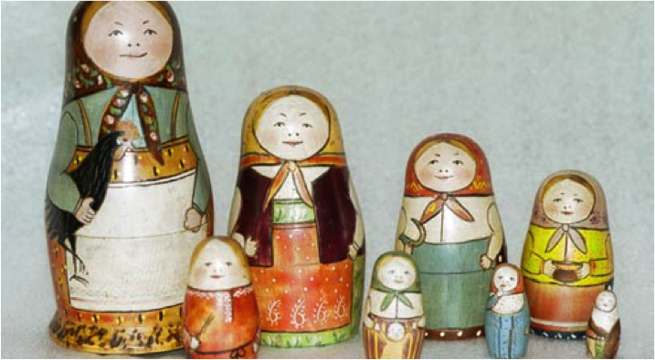
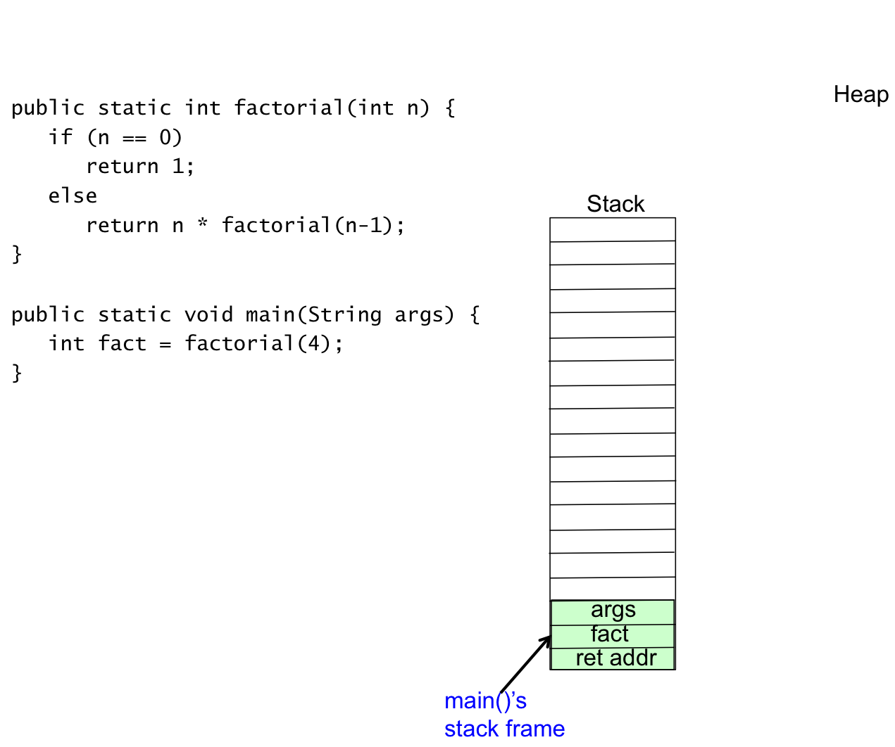
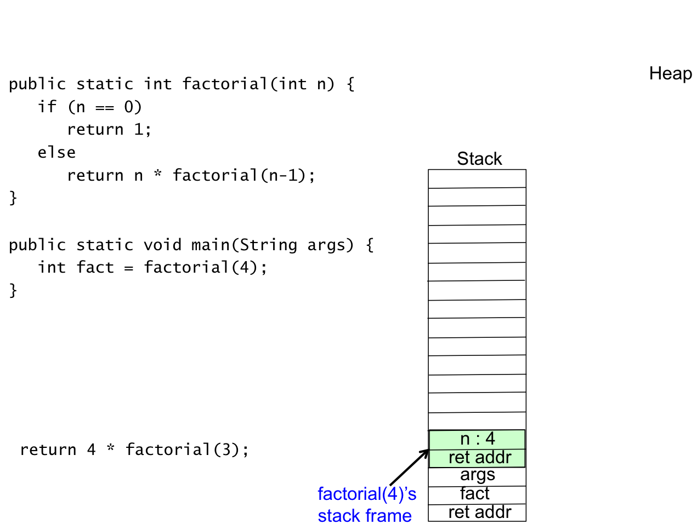
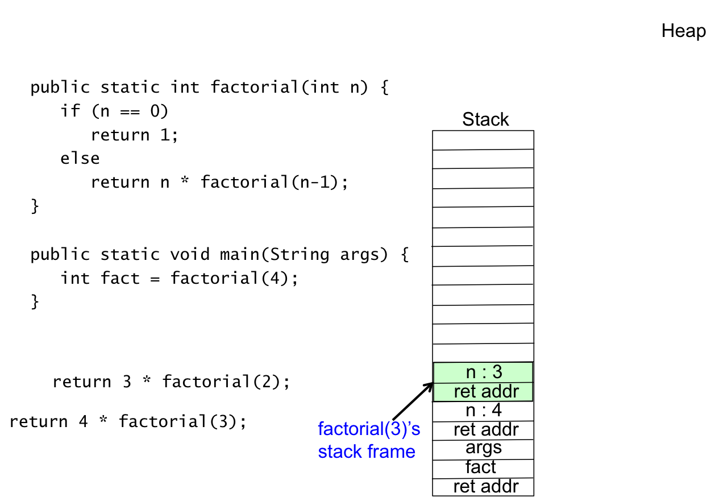
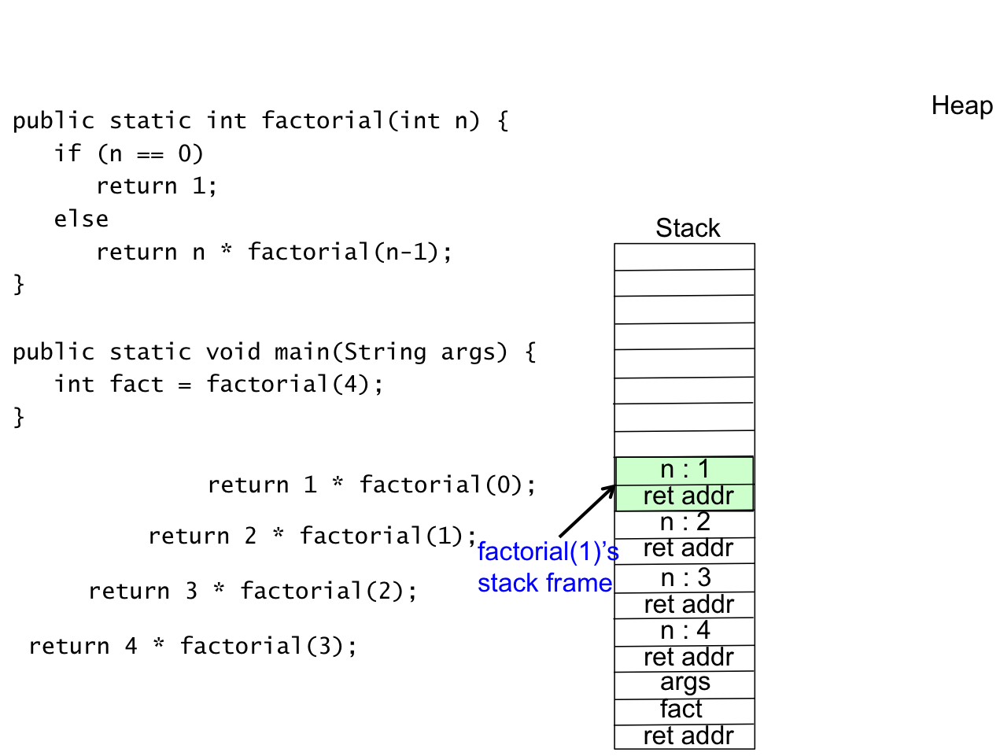
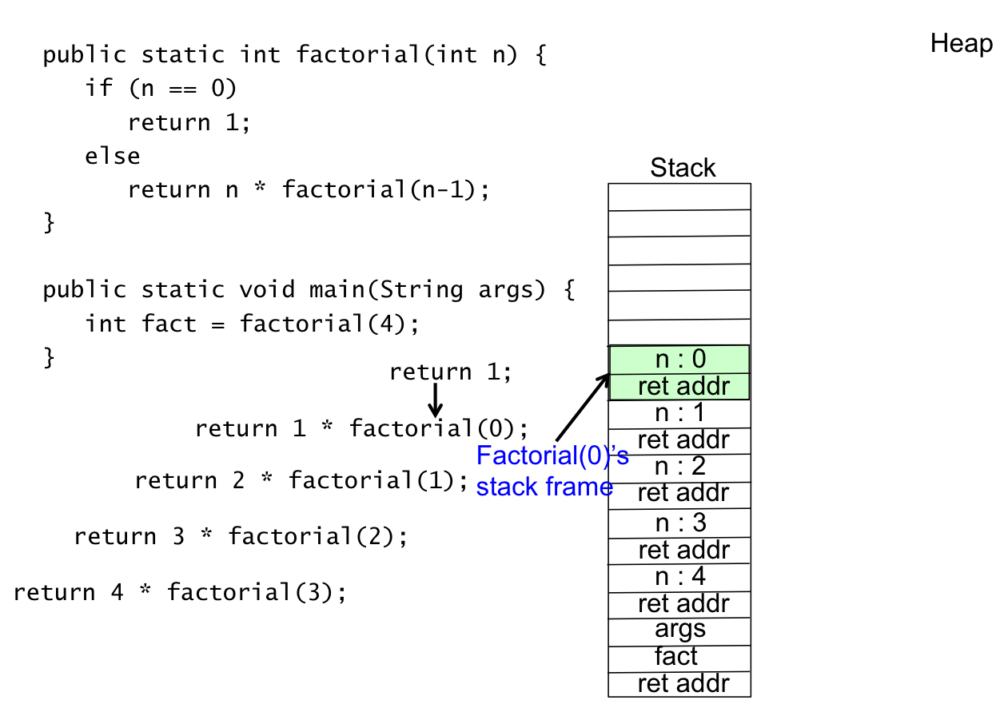
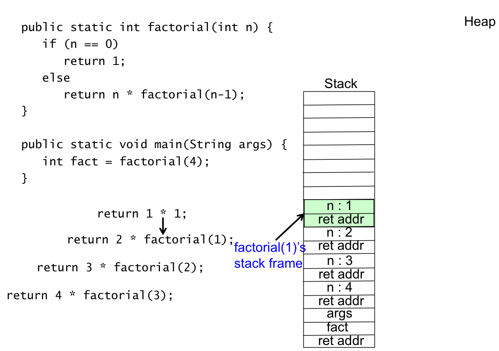
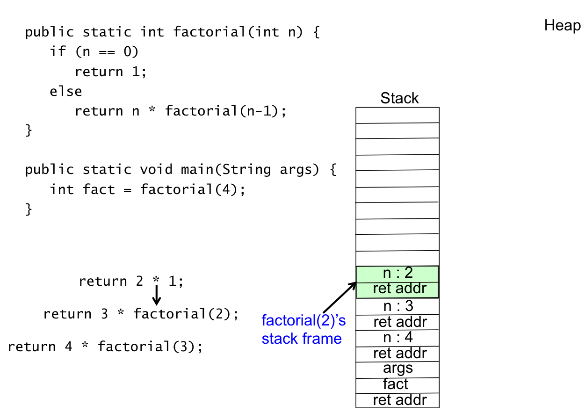
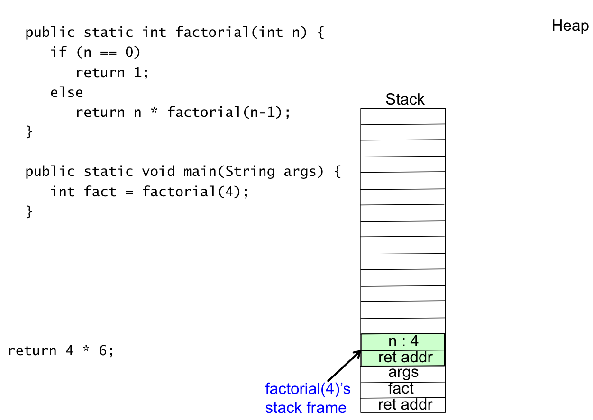
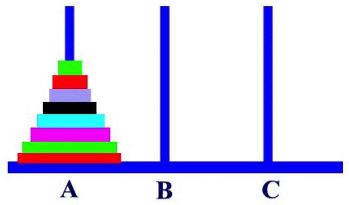

## Recursion

**Recursion** is when a method calls itself.  A recursive solution is one that uses a recursive method.  Any algorithm of consequence involves some repetitive computations.  The repetition can be iteration in the form of loops or recursion in the form of methods calling themselves.  For some problems a recursive solution is simpler and easier to understand.  


We begin our study of recursion by considering a matriarchal society.  In this society, ladies get pension of they are descendants of Sally.  The following figure depicts the society.

 

Examining the figure, we know that Mary Fay and Rose get pensions, but Shawnee and Emily do not get a pension.  The following **recursive** algorithm determines who gets a pension.

```java
boolean getsPension(String lady) {
 if (lady.equals(“Sally”))
   return true;
 else if (lady.equals(“”))
   return false;	
 else	
  return getsPension(motherOf(lady));
}
```

The Matriarchal Society problem is an example problem where a recursive solution is simpler and easier to understand than an iterative solution.  

A recursive solution as two parts

* Base case solution
  * This part allows the algorithm to terminate
  * The ```getsPension``` method base case is ```lady.equals(“Sally”)``` and ```lady.equals(“”)```
* Recursive case solution for all other cases
  * Keep reducing the problem until you get to the base case, which causes the recursive solution to terminate
  * The ```getsPension``` method recursive case is ```return getsPension(motherOf(lady));```

## Russian Matryoshka Doll

This section describes a somewhat silly recursive algorithm - Matryoshka Dolls.  You may be familiar with [Russian Matryoshka Dolls](https://en.wikipedia.org/wiki/Matryoshka_doll).  They are the dolls within dolls as shown by the following Wikipedia figure.

 

The following is a recursive algorithm that paints mustaches on Matryoshka Dolls.

```java
paintMustache(Matryoshka Doll)
   if there is one figure in nest of dolls 
      paint a Mustache on the face
   else
      paint a Mustache on the outer doll
      paintMustache(Matryoshka Doll after removing outer doll)
```

## Factorial Recursive

The factorial of a non-negative integer ```n``` is the product of all positive integers less than or equal to ```n```.  The notation of n-factorial is ```n!```.  The value of 5! is shown by the following.

```java
5! = 5 * 4  * 3  * 2  * 1 which is 120
```

Factorial has a natural recursive defintion.

* Base Case: factorial(0) is 1
* Recursive Case: factorial(n) is n * factorial(n-1)

The recursive Java method ```factorial``` is given by the following.

```java
public static int factorial(int n) {
   if (n == 0)
      return 1;                   // base case
   else
      return n * factorial(n-1);  // recursive case
}
```

The following sequence of figures shows the recursive calls incurred for ```factorial(4)```, which is ```4*3*2*1```.  The program begins in ```main```, which calls ```factorial``` with the statement ```int fact = factorial(4);```.  The ```factorial``` method executes the recursive case (i.e., calls itself) whenever the formal parameter is not 0.  This means ```factorial(4)``` calls ```factorial(3)```, which calls ```factorial(2)```, which calls ```factorial(1)```, which calls ```factorial(0)```.  The method ```factorial``` has been called 5 times - once by ```main``` and 4 times by itself.  Each of these calls results is a method call frame on the stack.  Finally, the call ```factorial(0)``` executes the recursive base case, which causes the recursion to terminate.  The ```factorial(0)``` call returns ```1``` to ```factorial(1)```, which returns ```1 * 1``` to ```factorial(2)```, which returns ```1 * 2``` to ```factorial(3)```, which returns ```3 * 2``` to ```factorial(4)```, which returns ```4 * 6``` to ```main```.  ```main``` assigns ```24``` to the variable ```fact```, which is ```4!```.

### Factorial - ```main``` Stack Frame

This figure shows ```main``` stack frame before the ```factorial(4)``` call.

 

### Factorial - ```factorial(4)``` Stack Frame`

This figure shows the stack frame with ```main``` and the ```factorial(4)``` call.

 

### Factorial - ```factorial(3)``` Stack Frame

This figure shows the stack frame with ```main```, the ```factorial(4)``` call, and the first recursive call ```factorial(4)``` calls ```factorial(3)```.

 

### Factorial - ```factorial(2)``` Stack Frame

This figure shows the stack frame with ```main```, the ```factorial(4)``` call, the ```factorial(3)``` call, and the ```factorial(2)``` call.  There are two more recursive calls.

 

### Factorial - ```factorial(1)``` Stack Frame

This figure shows the stack frame with ```main```, the ```factorial(4)``` call, the ```factorial(3)``` call, the ```factorial(2)``` call, and the ```factorial(1)``` call.  There is one more recursive call.

 

### Factorial - ```factorial(0)``` Stack Frame

This figure shows the stack frame with ```main```, the ```factorial(4)``` call, the ```factorial(3)``` call, the ```factorial(2)``` call, the ```factorial(1)``` call, and the ```factorial(0)``` call.  The ```factorial(0)``` call executed the base case so it is the last recursive call.  The stack frame now begins to unwind.

 

### Factorial - ```factorial(1)``` Stack Frame

We have now returned from ```factorial(0)``` to ```factorial(1)```.  This figure shows the stack frame with ```main```, the ```factorial(4)``` call, the ```factorial(3)``` call, the ```factorial(2)``` call, and the ```factorial(1)``` call.  The stack frame is the same as earlier, but now we are unwinding the recursive calls.

 

### Factorial - ```factorial(2)``` Stack Frame

We have now returned from ```factorial(1)``` to ```factorial(2)```.  This figure shows the stack frame with ```main```, the ```factorial(4)``` call, the ```factorial(3)``` call, and the ```factorial(2)``` call.  The stack frame is the same as earlier, but now we are unwinding the recursive calls.

 

### Factorial - ```factorial(3)``` Stack Frame

We have now returned from ```factorial(2)``` to ```factorial(3)```.  This figure shows the stack frame with ```main```, the ```factorial(4)``` call, and the ```factorial(3)``` call.  The stack frame is the same as earlier, but now we are unwinding the recursive calls.

 

### Factorial - ```factorial(4)``` Stack Frame

We have now returned from ```factorial(3)``` to ```factorial(4)```.  This figure shows the stack frame with ```main``` and the ```factorial(4)``` call.  The stack frame is the same as earlier, but now we are unwinding the recursive calls.

 

### Factorial - ```main``` Stack Frame

We have now returned from ```factorial(4)``` to ```main```.  This figure shows the stack frame with ```main```.  The stack frame is the same as earlier, but now we have completed unwinding the recursive calls.  We have computed 4!.

 

## Recursion - Stack Overflow

A call ```factorial(100000)``` would either overflow the stack or overflow ```int```.  Stack Overflow exceptions will occur when you have incorrectly implemented the base case such that recursion never stops.

## General Recursive Algorithm

```java
Step 1:
If the problem can be solved for the current value of n
   Solve It
else
Step 2:
   Recursively apply the algorithm to one or  more problems involving smaller values of n
   Combine the solutions to the smaller problems to get the solution to the bigger
```

Step 1: Base Case – Easily solved
Step 3: Recursive Case

## Finding a Recursive Solution

1. You have to recognize the base case
   * Something that is easy to solve for a small value of n
2. You have to devise a strategy to split the problem into smaller versions of itself
3. Each recursive case must make progress toward the base case
4. You have to be able to combine the solutions to the smaller problems in such a way that each larger problem is solved correctly

## Recursive ```stringLength```

The recursive ```stringLength``` method looks a lot like ```factorial```.  The design shown in pseudo code is the following.

```java
Base Case
if the string is empty
   the length is 0
else
Recursive Case
   the length is 1 plus the length of the string excluding the first character
```

The method defintion is given as follows.

```java
public static int stringLength(String s) {
   if (s == null || s.equals(“”))
      return 0;
   else
      return 1 + stringLength(s.substring(1));
}
```

## Recursion vs. Iteratition

The following figure shows the recursive ```factorial``` and an iterative ```factorial```.

 

## Towers of Hanoi

The Towers of Hanoi is a classic recursive algorithm.  It is problem that seems to be hard to solve, but the recursive solution is eloquant and beautiful.  Consider the following figure that shows three pegs labeled A, B, and C.  Peg A has disks stacked with the largest on the bottom and the smallest on the top.

 

To play the Towers of Hanoi game, you must move the discs from peg A to peg B by moving one disc at a time.  A larger disc can never sit atop a smaller disc.  Peg C can be used as a holding area.

INCLUDE MORE INFO HERE. - Algorithm, Code, and sequence of photos showing a solution

## Recursion in a Maze

INCLUD INFO HERE

## Ecludid's Algorithm

INCLUDE INFO HERE

## Recursive Fibonacci

INCLUDE INFO HERE


