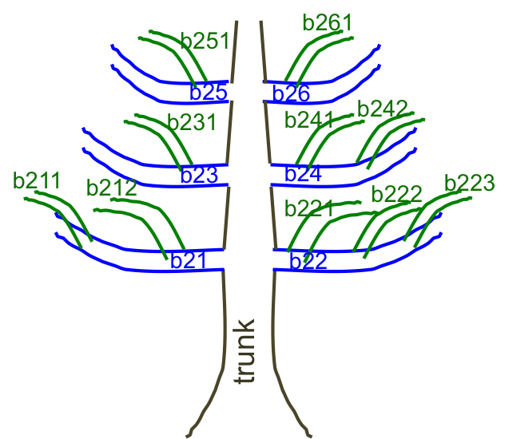
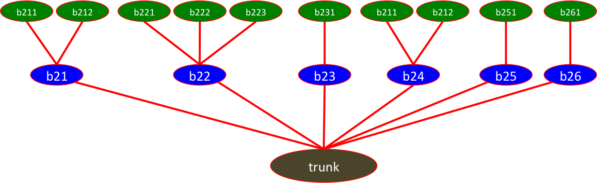
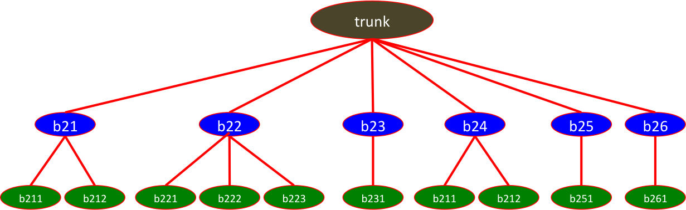
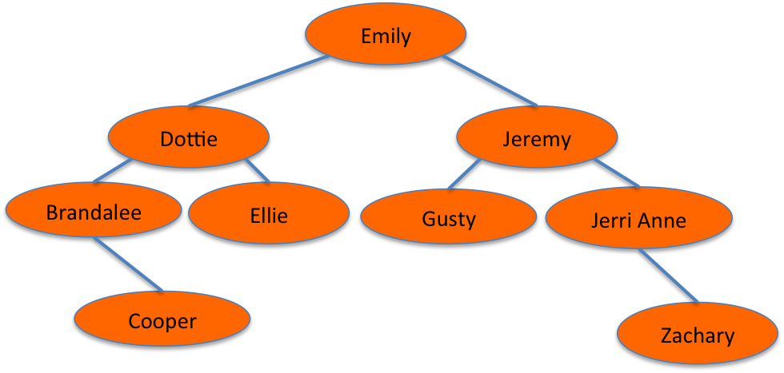
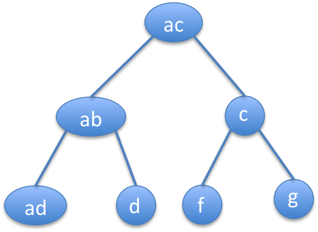
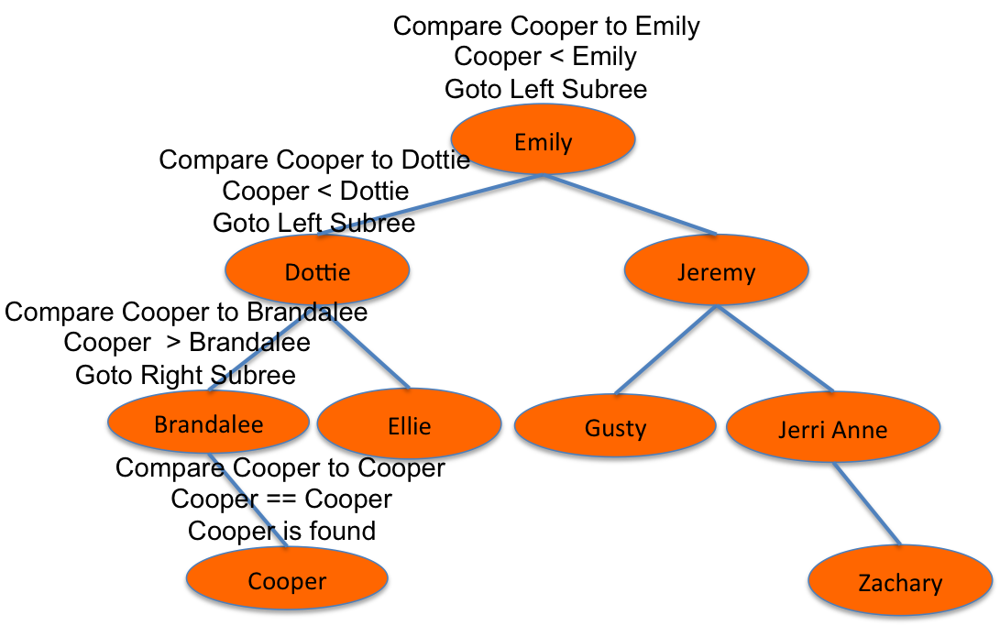
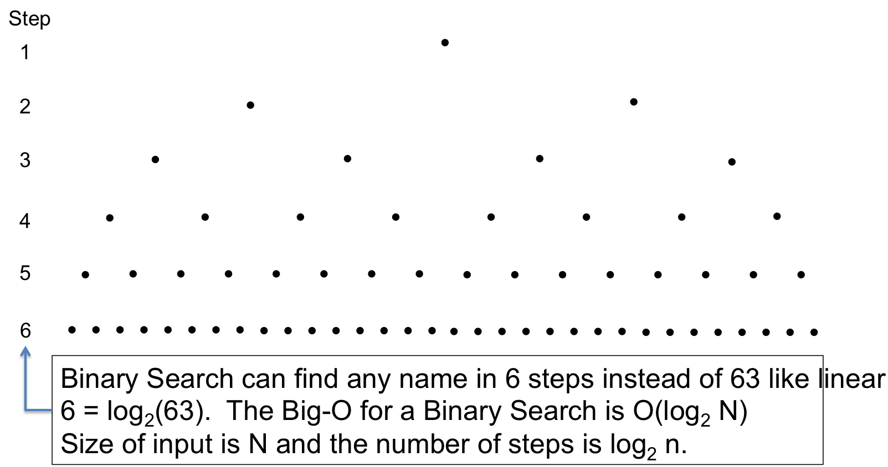
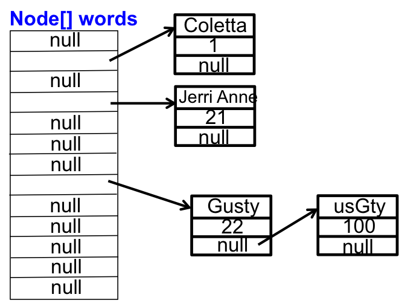

## Searching

We will study two search algorithms – linear and binary.  A search requires something to search for and something in which to search for it.  I could be searching for my favorite pair of sneakers.  Sometimes, I search for them in my home.  Sometimes, I search for them in my car.  In a program searching examines elements of some collection (like an array or ```ArrayList``` for a particular element.  The linear search is one that we have already studied, and its speed is rather pedestrian.  The binary search is amazingly fast.

Additionally, we will examine hash tables and the Java ```Map``` interface and the ```HashMap``` type, which is a key-value data structure.  Key-value data structures are an optimized algorith to search for values associated with a key.

## Searching and the Wirth Pattern

Searching is mostly the algorithm component of the Wirth pattern; however, the algorithm has to search a collection of information, which is the data structure component.

Java packages deal with grouping information together so they do not apply to the Wirth pattern.

<div class="alert alert-danger" role="alert"><i class="fa fa-delicious fa-lg"></i>
<b>
Programming Pattern
0. Wirth Pattern
</b>
<br>

</div>

## Linear Search

The linear search has a search element that is a particular type (i.e., ```double```, ```Person```, ```String```) and a collection of element of the same type (i.e., ```double[]```, ```ArrayList<Person>```, ```String[]```).  The collection is a sequential collection, which gives rise to the linear search.

* A linear search examines the first element of the collection to see if it is the search item.
* If the first item is the search item, the item has been found; otherwise, the linear search exaamines the second element of the collection.
* This continues until the item is found or the collection is exhausted.

The following method ```findValue``` performs a linear search of a ```double[]``` for a specifc ```double```.  ```findValue``` returns the index that contains ```searchItem```; otherwise ```findvalue``` returns -1.

```java
public static int findValue(double[] searchArray, double searchItem) {
   for (int i = 0; i < searchArray.length; i++)
      if (searchArray[i] == searchItem)
         return i;
   return -1;
}
```

The following method ```findLargest``` is a linear search of an ```ArrayList<douible>``` for the largest element.  ```findLargets``` returns the index of the largest value in the ```ArrayList```.

```java
public static int findLargest(ArrayList<Double> da) {
   double largest = da.get(0); // assume first element is largest
   int retVal = -1;
   for (double d : da)
      if (d > largest) {
         largest = d;
         retVal = i;
      }
   return retVal;      
}
``` 

## Linear Search and Big O

We consider the Big O of a linear search to be its worst case.  The worst case for ```findValue``` is when the sought after value is in the last element of the ```double[]```.  The worst case for ```findLargest``` is when the largest element is in the last element of the ```ArrayList<Double>```.  In both of these cases, if the length of the input is N, the number of steps (i.e., the number of iterations of the loop) is N.  Thus the Big O of linear search is N - O(N).

We can consider Big O from several perspectives.

### Linear Search and Worst Case Big O

The worst case of finding a value in a collection of N is N, Big O Worst Case is O(N).


### Linear Search and Average Case Big O

The average of finding a value in a collection of N is N/2.  Big O Average Case is O(N/2).

### Linear Search and Best Case Big O

The best case of finding a value in a collection of N is 1, Big O Best Case is O(1)

## Trees - Introduction

We begin our discussion of binary search by examining a binary search tree.  In the biological world a tree is an organism with a trunk, which has branches, each of which has branches, and so on.  In the software world, we create trees to store information, where the trunk contains a piece of information.  The trunk has primary branches each of which contains information, the primary branches have secondary branches each of which contains information, the secondary branches have terciary branches each of which contains information, and so on.  In an arbitray tree the trunk can have 20 primary branches.  Primary branch 1 can have 10 secondary branches, primary branch 2 can have 3 secondary branches, and so on.  

In computer science tree terminology, the trunk is root node and all other branches are nodes (i.e., each secondary branch is a node, each terciary branch is a node)

Two figures are shown to demonstrate trees.  The first figure looks like a tree without leaves.  The second figure shows labeled nodes.  Both figures have the same information.  They have a trunk that has 6 secondary branches labeled **b21**, **b22**, ..., **b26**.  The primary branch **b21** has 2 secondary branches labed **b211** and **b212**, the primary branch **b22** has 3 secondary branches labed **b221**, **b222**, and **b223**, the primary branch **b23** has 1 secondary branch labeled **b231**, the primary branch **b24** has 2 secondary branched labeled **b241** and **b242**, the primary branch **b25** has one secondary branch labeled **b251**, and the primary branch **b26** has one secondary branch labeled **b261**.

 

 

## Trees - Computer Science

Most of the time, computer scientists draw trees growing downward, which places the root node at the top of the tree.  The previous tree is redrawn in a downward dog facing pattern, which is the way we do it in computer science.  Note the downward facing dog nomenclature is a Gustyism and not normal computer science terminology.

 

## Trees within Trees

Trees contain subtrees.  For example, all of the nodes beginning at **b22** form a **subtree** of the **trunk** node.  As we will see, subtrees allow some natural recursion within trees.

## Binary Tree

 A **binary tree** is a special tree where the trunk can have 1 or 2 secondary branches, each secondary branch can have 1 or 2 terciary branches, and so on.  In computer science terminology, the root node that has (1 or) 2 subnodes, each of which has (1 or) 2 subnodes, each of which has (1 or) 2 subnodes, and so on.   

## Binary Search Tree

A **binary search tree** is a binary tree organized such that every node is greater than all nodes of its left subtree and less than all nodes of its right subtree.  The following is an example of a binary search tree.  The root node contains ```Emily```.  The left subtree of ```Emily``` has a root node that contains ```Dottie```.  The right subtree of ```Emily``` has a root node that contains ```Jeremy```

 

Do not be fooled by binary trees that appear to be binary search trees.  The entire subtree has to be less than (or greater than) the root node.  Sometimes, you examine the root node of the subtree and forget to examine the entire subtree.  The following binary tree is not a binary search tree because the left subtree of ```ac``` contains ```d``` with is greater than ```ac```.

 

## Searching in a Binary Search Tree

The following figure annotates searching for ```Cooper``` in a binary search tree, which is found in 4 steps.

1. Compare ```Cooper``` to the root node.  Since ```Cooper``` is less than ```Emily```, go to the left subree.
2. Compare ```Cooper``` to ```Dottie```.  Since ```Cooper``` is less than ```Dottie```, go to the left subtee.
3. Compare ```Cooper``` to ```Brandalee```.  Since ```Cooper``` is greater than ```Brandalee```, go to the right subtree.
4. Compare ```Cooper``` to ```Cooper```.  Since ```Cooper``` is equal to ```Cooper```, we have found ```Cooper```.

 

## Where is Gusty? - Pseudo Code for Binary Search

The nodes of the previous tree are arranged alphebetically as follows.  You can easily envision these names stored in a ```String[] names = {"Brandalee", ...}```  The different colored names denote the middles of sub-arrays and are referenced in the pseudo code.  Emily is in the middle of the array, and Emily is the root node of the tree.  Dottie is in the middle of the first half of the array, and Dottie is the root node of the left subtree.  Jeremy is in the middle of the second half of the array, Jeremy is the root node of the right subtree.

* 0 Brandalee
* 1 Cooper
* 2 Dottie
* 3 Ellie
* 4 <font color="blue">Emily</font>
* 5 <font color="green">Gusty</font>
* 6 <font color="red">Jeremy</font>
* 7 Jerri Anne
* 8 Zachary

The **Where is Gusty** pseudo code is given by the following.  This code shows nested ifs - just enough to demonstrate finding ```Gusty```.  The pseudo code keeps spliting the array in half based upon comparing ```Gusty``` to the middle element.

```java
If Gusty is in the <font color="blue">middle</font> then
   found
Else if Gusty is greater than the <font color="blue">middle</font> look in the second half
   If Gusty is in the middle of this half then
      found
   Else if Gusty is greater than the <font color="red">middle</font> look in the 2nd half of this half
        ...
   Else look in the 1st half of this half
      If Gusty is in the middle of this half then
           found
Else look in the first half
    ...
```

## Binary Search Recursive Method

The binary search discussion describes binary searching in terms of 

* Progressively examining subtrees
* Progressively splitting an array into halves

Both of these techniques lend themselves to an eloquent recursive algorithm.  The following alorithm is a binary search in a ```String[]``` for a particular string.  The ```String[]``` must be in alphabetical order.  The algorithm uses the [```compareTo```](/gustycooper.github.io/mydoc_5_subclasses) method of the ```Comparable interface```.  The algorithm returns the index of the found item or -1 if the item is not in the ```String[]```.

```java
private static int binarySearchString(String[] sa, String ele, 
                                      int first, int last) {
   if (first > last)
      return -1;
   else {
      int middle = (first + last) / 2;
      int compares = ele.compareTo(sa[middle]); // string method
      if (compares == 0)
         return middle;
      else if (compares < 0)  // look in the first half
         return binarySearchString(sa, ele, first, middle-1);
      else                    // look in the second half
         return binarySearchString(sa, ele, middle+1, last);
   }
}

public static int binarySearchString(String[] sa, String ele) {
  return binarySearchString(sa, ele, 0, sa.length-1);
}
int pos = binarySearchString(coopers, “Gusty”);
```

## Binary Search and Big O

In the binary searching of the example tree with 9 elements, we found ```"Cooper"``` in 4 steps and ```"Gusty"``` in 3 steps.  Every element in our example tree of 9 elements can be found in 4 steps or fewer.  The example tree could be expanded to hold 15 elements and you can still find each element in 4 steps or fewer.  

When a binary tree created to hold 63 items, the number of steps to find an item is 6.

 

You have to understand the logarithm function to understand the Big O of binary search.  The log<sub>10</sub> of a number is the power of 10 that creates the number.  For examples, 

* log<sub>10</sub>(100) is 2 because 10<sup>2</sup> is 100.
* lob<sub>10</sub>(10_000_000) is 7 because 10<sup>7</sup> is 10_000_000.
* lob<sub>10</sub>(67) is 1.8260748027008262 because 10<sup>1.8260748027008262</sup> is 67.

We can create a log function for binary.  The log<sub>2</sub> of a number is the power of 2 that creates the number.  For examples, 

* log<sub>2</sub>(4) is 2 because 2<sup>2</sup> is 4.
* lob<sub>2</sub>(128) is 7 because 2<sup>7</sup> is 128.
* lob<sub>2</sub>(67) is 6.066089190457772 because 2<sup>6.066089190457772</sup> is 67.

We have two binary tree examples of different size inputs - one for input size 15 which has 4 max steps and another for input size 63 which has 6 max steps.  The following table expands these examples and derives Big O for binary search.  

Input Size | Max Steps | Size/Step      | Big O 
---------- | --------- | -------------- | -----
     7     |     3     |  2<sup>3</sup> | log<sub>2</sub> 8
    15     |     4     |  2<sup>4</sup> | log<sub>2</sub> 16
    31     |     5     |  2<sup>5</sup> | log<sub>2</sub> 32
    63     |     6     |  2<sup>6</sup> | log<sub>2</sub> 64
     N     | log<sub>2</sub> N | 2<sup>N</sup> | log<sub>2</sub> N

The Big O of binary search of an input of size N is O(log<sub>2</sub>N).

You have to ponder examples with large input sizes in order to fully appreciate the speed of a Big O algorithm that has a value of O(log<sub>2</sub> N).  The number of steps grows slowly by the log<sub>2</sub> of the input size.  Suppose you want to search for a name in an array of 4294967296 names.  That is over 4 billion names.  The maximum number of steps in a binary search is 32.  That is 32 steps to find a name in over 4 billion names.  In a linear search, you may have to take 4 billion steps.  Of course the input array has to be [sorted](/gustycooper.github.io/mydoc_9_sorting), which takes steps to accomplish.

## Java Binary Search

The Java [Arrays Class](https://docs.oracle.com/javase/8/docs/api/java/util/Arrays.html) in the ```java.util``` package provides ```binarySearch``` methods that accept various array types.  These methods are similar to the one developed in the earlier section.  If the input array is not sorted, the results are undefined.

```java
public class BinarySearchDemo {
   import java.util.Arrays;

   public static main(String[] args) {
      String[] sa = {"Abe", "Betty", "Cooper", "Dottie", "Emily", "Zachary", "Zeus"};
      System.out.println(Arrays.binarySearch(sa, "Zachary"));
   }
}
```

## Hash Searching

In [Abstract Data Types](/gustycooper.github.io/mydoc_8_ADT) we implemented a queue ADT with a recursive data structure.  We will use a recursive data structure to implement a hash table to demonstrate another searching technique.  Recall that a recursive data structure references itself.

PICTURE Recursive Data Structure HERE

A hash algorithm generates a number within a specific range (e.g., 0 to 59) for an input parameter.  Our example generates a number for an input ```String```, where the number is 0, 1, 2, ..., 12.  The idea is to use the generated number as an index into an array that can store a value for the ```String```.  In our example, the ```String``` is a person's name and the value is the person's age.  

The following is an example hash method for names and a few sample calls to show the resulting hash value.

```java
public class HashExample {
   final static int HASHTABLESIZE = 13;
   public static int hashValue(String s) {
      int hashCode = 0;
      for (char c : s.toCharArray())
          hashCode = hashCode + c;
      hashCode %= HASHTABLESIZE;
      return hashCode;
   }

   public static void main(String[] args) {
      int hv = hashValue("Gusty");  // hv is 7
      hv = hashValue("Emily");      // hv is 5
      hv = hashValue("utsGy");      // hv is 7
      hv = hashValue("Jerri Anne"); // hv is 3
      hv = hashValue("Coletta");    // hv is 1
   }
}
```

We create a **hash table** in the form of a  ```Node[]``` with the recursive data structure ```Node``` that looks as follows.

```java
public class Node {
   String name;
   int age;
   Node next;
}

static Node words [] = new Node[HASHTABLESIZE];

```

We couple this ```Node[]``` with the ```hashValue``` method to insert names and ages into the array as shown be the following figure.

 

You should notice that multiple ```String```s can generate the same index (i.e., hash value) of the ```Node[]```.  A **collision** occurs when two ```String```s hash to the same index.  When a collision occurs, the recursive data structure is used add the collided ```String```s in a linked list.  A good hash table has an array with a length that minimizes the number of collisions.  We do not study how to minimize the number of collisions.

To search for information in a hash table, the process is reversed.  First compute the hash value of the name and then see if the name in in the linked list of ```Node```s.  If the name is found, return the age; otherwise, return -10_000_000.

Putting all of this together results in the following code.

```java
public class Hash {
   static class Node {
      String name;
      int age;
      Node next;
   }
   final static int HASHTABLESIZE = 13;
   static Node names [] = new Node[HASHTABLESIZE];
   
   public static int hashValue(String s) {
      int hashCode = 0;
      for (char c : s.toCharArray())
         hashCode = hashCode + c;
      hashCode %= HASHTABLESIZE;
      return hashCode;
   }

   public static void insert(String s, int age) {
      Node node = new Node();
      node.name = s;
      node.age = age;
      int hashCode = hashValue(s);
      Node insertPoint = names[hashCode];
      if (names[hashCode] == null)
         names[hashCode] = node;
      else {
         Node lookAt = names[hashCode];
         Node addTo;
         do {
            addTo = lookAt;
            lookAt = lookAt.next;
         } while (lookAt != null && !lookAt.name.equals(s));
         if (lookAt == null)
            addTo.next = node;
      }
          
   }
   
   public static int getValue(String s) {
      int hashCode = hashValue(s);
      if (names[hashCode] == null)
         return -1_000_000;
      else {
         Node node = names[hashCode];
         while (node != null && !node.name.equals(s))
            node = node.next;
         if (node == null)
            return -1_000_000;
         else
            return node.age;
      }
   }

   public static void main(String[] args) {
      insert("Gusty",22);
      insert("Jerri Anne", 21);
      insert("Coletta", 1);
      insert("usGty",100);
      insert("ustGy",111);
      System.out.println("Gusty value: " + getValue("Gusty"));
      System.out.println("usGty value: " + getValue("usGty"));
      System.out.println("ustGy value: " + getValue("ustGy"));
      System.out.println("Gtsyu value: " + getValue("Gtsyu"));
      System.out.println("NOTHERE value: " + getValue("NOTHERE"));
      for (int i = 0; i < names.length; i++)
         if (names[i] != null) {
            for (Node n = names[i]; n != null; n = n.next)
                System.out.println("Index: " + i + " Name: " + n.name + " Age: " + n.age);
         }
      String s = "Gusty";
      System.out.println("Compare our hashValue(\"Gusty\") with String.hashCode(\"Gusty\").");
      System.out.println("String.hashCode: " + s.hashCode() + " %13: " + (s.hashCode()%13));
      System.out.println("Our hashValue:   " + hashValue(s) + " %13: " + (hashValue(s)%13));
   }
}
```

## Key-Value Data Structures

A hash table is a **key-value** data structure.  In the example described above, the key is the ```String``` name and the value is the ```int``` age.  You insert a value using a key, and you retrieve a value using a key.

## Java Map

The ```java.util``` package provides a ```Map``` interface and a ```HashMap``` class that can be used together as a key-value data structure.  Both of these are generic types that accept two input types.  The first type is the type of the key and the second type is the type of the value.  In our example of a name (i.e., ```String```) key and age (i.e., ```int```) value, you declare and manipulate a ```Map``` as follows.

```java
Map<String, Integer> m = new HashMap<String, Integer>();

m.put("Gusty", 22);
m.put(“Jerri Anne”,21);  
m.put(“Coletta”,1);
int val = m.get(“Gusty”);  // val is 22
val = m.getDefault(“Jeremy”,29);  // val is 29, Jeremy not in m
m.put(“Emily”,m.getOrDefault(“Emily”,25)+1); // Emily is 25
m.put(“Coletta”,m.getOrDefault(“Coletta”,25)+1; // Coletta is 2
```

You may recall our solution of the hot potato problem that used ```Map``` to count the games won.  The following code snippet hightlights the algorithm.

```java
// Keeping track of Hot Potato Games Won
Map<String,Integer> gamesWon = new HashMap<String, Integer>();
for (int i = 1; i < 101; i++) {
    String winner = hotPotato(strings, i, false);
    gamesWon.put(winner, gamesWon.getOrDefault(winner,0)+1);
}
System.out.printf("%-12s %s\n", "Player", "Games won");
for (Map.Entry<String,Integer> m : gamesWon.entrySet())
    System.out.printf("%-12s %7d\n", m.getKey(), m.getValue());
```

