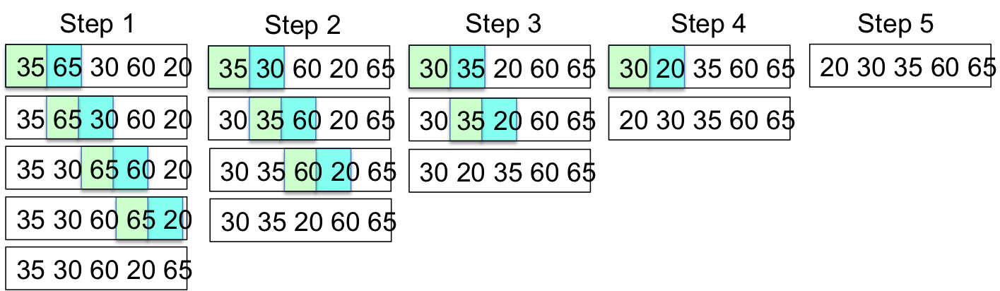
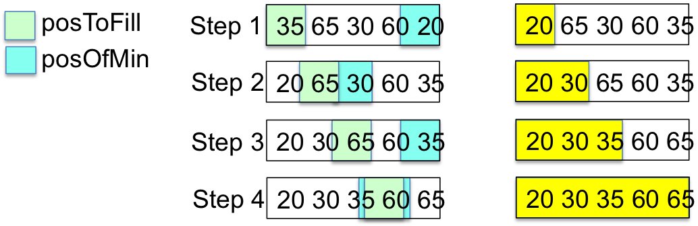

## Sorting

Sorting rearranges a sequential collection such as an array or ```ArrayList``` until the elements are in ascending or descending order.  To order elements they must be comparable.  For examples, 

* [Numeric types](/gustycooper.github.io/mydoc_1_primitive_types) can be compared with the [relational operators](/gustycooper.github.io/mydoc_2_relational_boolean_expressions). 

  ```java
  double x = 1.0, y = 2.0;
  if (x < y) {
     double t = x;
     x = y;
     y = t;
  }
  ```

* [Reference types](/gustycooper.github.io/mydoc_3_simple_objects) can be compared if the type implements the [```comparable```](/gustycooper.github.io/mydoc_5_toString_comparable) interface.  We know the Java ```String``` type implements ```comparable```, and we learned how to implement ```comparable``` for our own types like ```Person```.

  ``` 
  String e = "Emily", g = "Gusty";
  if (e.compareTo(g) < 0) {
     String t = e;
     e = g;
     g = e;
  }
  ```

Rearranging array/```ArrayList``` elements is accomplished by swapping their contents.  In [Assignment Expressions](/gustycooper.github.io/mydoc_2_assignment_expressions), we studied the pattern of swapping the contents of two variables .  The following updates the Swapping Variables pattern to be Swapping Array Elements.  The example swaps elements 0 and 1 of an ```int[]```.

<div class="alert alert-danger" role="alert"><i class="fa fa-delicious fa-lg"></i>
<b>
Programming Pattern
1. Swapping Array Elements
</b>
<br>
<pre>
int[] ia = {10, 5, 20, 100};
int t = ia[0]; // t is 10
ia[0] = ia[1]; // ia[0] is 5
ia[1] = t;     // ia[1] is 10
</pre>
</div>

We examine three sorting algorithms – **bubble**, **insertion**, and **selection**.  We discuss sorting into ascending order.  The alogorithms can be easliy modifed to sort into descending order.

## Sorting and the Wirth Pattern

Sorting is mostly the algorithm component of the Wirth pattern; however, the algorithm has to sort a collection of information, which is the data structure component.

<div class="alert alert-danger" role="alert"><i class="fa fa-delicious fa-lg"></i>
<b>
Programming Pattern
0. Wirth Pattern
</b>
<br>

</div>

## Sorting Animation

The following are links to various sorting web sites.

* [Visualization of Sorting](https://www.cs.usfca.edu/~galles/visualization/ComparisonSort.html) - This site allows you to select various sorting algorithm and watch an animation of the sort.  This site helps you to understand sorting.
* [Dancing Sorting](https://www.youtube.com/user/AlgoRythmics) - This site allows you to watch people dancing various sorting algorithms.  This site is both entertaining and helpful.
* [President Obama on Sorting](https://www.youtube.com/watch?v=k4RRi_ntQc8) - This site shows President Obama and his knowledge of the bubble sort.
* [Cowgirl Sorting](https://www.youtube.com/watch?v=B6BzDrQFRpk&feature=fvst) - This site shows cow girls sorting cows into ascending order.


## Bubble Sort Introduction

Bubble sort successively examines pairs of elements in an array/```ArrayList```.  Bubble sort begins with the first pair of elements, repetitively comparing adjacent pairs and swapping if necessary to move the larger to the higher index.  If all pairs have been examined without a swap, the array is sorted and the algorithm stops; otherwise go back to the first pair of elements and repeat.  The following sample ```int[]``` is used to demonstrate bubble sort into ascending order.

```java
int[] ia = { 35, 65, 30, 60, 20 }
```

* **Step 1**.  Beginning with the first pair of numbers (```ia[0]``` is 35 and ```ia[1]``` is 65) examine successive pairs of elements, and swap if necessary so that the larger has moved to the higher index value.  We swap three pairs of numbers so we must perform Step 2.  At the end of Step 1, the largest element (60) in the array is in position ```ia[4]```

  * Examine ```ia[0]```, which is 35, and ```ia[1]```, which is 65.  We do not swap ```ia[0]``` and ```ia[1]``` because they are in ascending order. 
  * Examine ```ia[1]```, which is 65, and ```ia[2]```, which is 30.  We swap ```ia[1]``` and ```ia[2]``` moving the larger (65) to the higher index (2).
  * Examine ```ia[2]```, which is 65, and ```ia[3]```, which is 60.  We swap ```ia[2]``` and ```ia[3]``` moving the larger (65) to the higher index (3).
  * Examine ```ia[3]```, which is 65, and ```ia[4]```, which is 20.  We swap ```ia[3]``` and ```ia[4]``` moving the larger (65) to the higher index (4).

* **Step 2**.  Beginning with the first pair of numbers (```ia[0]``` is 35 and ```ia[1]``` is 30) examine successive pairs of elements, and swap if necessary so that the larger has moved to the higher index value.  Since we know that ```ia[4]``` contains the largest element, we do not compare ```ia[3]``` and ```ia[4]```.  We swap two pairs of numbers so we must perform Step 3.  At the end of Step 2, the second largest element (60) in the array is in position ```ia[3]```

  * Examine ```ia[0]```, which is 35, and ```ia[1]```, which is 30.  We swap ```ia[0]``` and ```ia[1]``` moving the larger (35) to the higher index (1).
  * Examine ```ia[1]```, which is 35, and ```ia[2]```, which is 60.  We do not swap ```ia[1]``` and ```ia[2]``` because they are in ascending order. 
  * Examine ```ia[2]```, which is 60, and ```ia[3]```, which is 20.  We swap ```ia[2]``` and ```ia[3]``` moving the larger (60) to the higher index (3).

* **Step 3**.  Beginning with the first pair of numbers (```ia[0]``` is 30 and ```ia[1]``` is 35) examine successive pairs of elements, and swap if necessary so that the larger has moved to the higher index value.  Since we know that ```ia[4]``` contains the largest element and ```ia[3]``` contains the second largest element,  we do not compare ```ia[2]``` and ```ia[3]```.  We swap one pair of numbers so we must perform Step 4.  At the end of Step 3, the third largest element (35) in the array is in position ```ia[2]```

  * Examine ```ia[0]```, which is 30, and ```ia[1]```, which is 35.  We do not swap ```ia[0]``` and ```ia[1]``` because they are in ascending order. 
  * Examine ```ia[1]```, which is 35, and ```ia[2]```, which is 20.  We swap ```ia[1]``` and ```ia[2]``` moving the larger (35) to the higher index (2).

* **Step 4**.  Beginning with the first pair of numbers (```ia[0]``` is 30 and ```ia[1]``` is 20) examine successive pairs of elements, and swap if necessary so that the larger has moved to the higher index value.  Since we know that ```ia[4]``` contains the largest element and ```ia[3]``` contains the second largest element, and ```ia[2]``` contains the third largest element, we do not compare ```ia[1]``` and ```ia[3]```.  We swap one pair of numbers so we must perform Step 5.  At the end of Step 4, the fourth largest element (30) in the array is in position ```ia[1]```.  In fact, the entire array is sorted; however, the algorithm does not know the array is sorted until it has finished an iteration in which no pair is swapped.

  * Examine ```ia[0]```, which is 30, and ```ia[1]```, which is 20.  We swap ```ia[0]``` and ```ia[1]``` moving the larger (30) to the higher index (1).

* **Step 5**.  Beginning with the first pair of numbers (```ia[0]``` is 20 and ```ia[1]``` is 30) examine successive pairs of elements, and swap if necessary so that the larger has moved to the higher index value.  This step does not perform any swaps, so the bubble sort algorithm terminates.  Since we know that ```ia[4]``` contains the largest element and ```ia[3]``` contains the second largest element, and ```ia[2]``` contains the third largest element, and ```ia[1]``` contains the fourth largest numbers, we do not compare ```ia[0]``` and ```ia[1]```.  


The following figure shows the five steps described above.

 

## Bubble Sort Code

The bubble sort algorithm is two loops, one nested within the other.  The outer loop corresponds the five steps in the previous section.  The inner loop examine successive pairs of the array, performing the swap if necessary.  The following code contains some optimizations.  The outer loop counts down, beginning with a value that is one less than the array length.   The inner loop counts from 0 up to one less than the loop index of the outer loop.  This allows the inner loop to not compare elements at the end of the array that have already been sorted.  For example, after the first iteration of the outer loop, the largest element of the array is in the last element of the array, which does not requiring comparing in the second iteration of the outer loop.  The following code demonstrates a bubble sort of an integer array.  

```java
public static void bubbleSortIntArray(int[] ia) {
    for (int i = ia.length-1; i >= 0; i--) {
        for (int j = 0; j <= i-1; j++) {
            if (ia[j] > ia[j+1]) {
                // swap ia[j] and ia[j+1]
                int t = ia[j];
                ia[j] = ia[j+1];
                ia[j+1] = t;
            }
        }
    }
}
```

## Bubble Sort Optimization

The ```bubbleSortIntArray``` code in the previous section iterates on loops that are already sorted or partially sorted, often never performing a sway.   If our inner loop does not perform a swap, the array ```ia``` is in order.  We can optimize ```bubbleSortIntArray``` to ```break``` out of the outer loop if the inner loop does not perform a sway.   The code for this is as follows.

```java
public static void bubbleSortIntArray(int[] ia) {
   for (int i = ia.length-1; i >= 0; i--) {
      boolean swapped = false;
      for (int j = 0; j <= i-1; j++) {
         if (ia[j] > ia[j+1]) {
            // swap a[j] and a[j+1]
            int t = a[j];
            a[j] = a[j+1];
            a[j+1] = t;
            swapped = true;
         }
      }
      if (!swapped) {
         break;
      }
   }
}
```

## Bubble Sort and Big O

From [Big O](/gustycooper.github.io/mydoc_9_big_o) we know that the Big O of an algorithm with two loops, with one nested inside the other, is O(N<sup>2</sup>).  A bubble sort fits this pattern so its Big O is O(N<sup>2</sup>).


The optimization in the previous section is clever, but the optimization did not improve Big O.  The optimized algorithm is faster on arrays that are already sorted or partially sorted, but on unsorted arrays our algorithm the algorithm is still O(N<sup>2</sup>).

## Selection Sort

Selection sort finds the smallest element and puts it in the correct position.  On the first iteration selection sort examines elements of an array to find the smallest element and put it in the position 0 of the array.  At the end of this iteration, you have the smallest element in the first position of your array.  Notice you did not swap adjacent elements as you did in the bubble sort.  Of course you have to perform compares to locate the smallest, but you remember the position that has the smallest and at the end of the iteration, you swap the element in that position with the first element.  The algorithm to find the smallest element in an array is one we first studied in [Loop Patterns](/gustycooper.github.io/mydoc_4_loop_patterns) and then expanded to arrays/```ArrayList```s in [Loop Patterns Lab](/gustycooper.github.io/labs_lab06_01).  Repeat this for the second position, third position, and so forth.  The following sample ```int[]``` is used to demonstrate selection sort into ascending order.

```java
int[] ia = { 35, 65, 30, 60, 20 };
```

* **Step 1**.  Mark index 0 as the position to put the smallest - this is the position to fill.  Assume the element at index position 0 (```ia[0]``` is 35) is the smallest and examine the remainder of the array for the smallest - this is the position of the smallest.  At the end of Step 1, the smallest element (20) in the array is in position ```ia[0]```.

  * Examine ```ia[1]```, which is 65, and is not smaller than 35.
  * Examine ```ia[2]```, which is 30, and is smaller than 35.  Remember that position 2 is the current position of the smallest.
  * Examine ```ia[3]```, which is 60, and is not smaller than 35.
  * Examine ```ia[4]```, which is 20, and is smaller than 30.  Remember that position 4 is the current position of the smallest.
  * We have found the smallest element at position 4.  Swap ia[4] with ia[0], which put the smallest element in position 0.
  * After Step 1, ```ia``` is ```{ 20, 65, 30, 60, 35 }```.

* **Step 2**.  Mark index 1 as the position to put the second smallest - this is the position to fill.  Assume the element at index position 1 (```ia[1]``` is 65) is the smallest and examine the remainder of the array for the smallest - this is the position of the smallest.  At the end of Step 2, the second smallest element (30) in the array is in position ```ia[1]```.

  * Examine ```ia[2]```, which is 30, and is smaller than 65.  Remember that position 2 is the current position of the smallest.
  * Examine ```ia[3]```, which is 60, and is not smaller than 30.
  * Examine ```ia[4]```, which is 35, and is not smaller than 30.
  * We have found the smallest element at position 2.  Swap ia[2] with ia[1], which put the second smallest element in position 1.
  * After Step 2, ```ia``` is ```{ 20, 30, 65, 60, 35 }```.

* **Step 3**.  Mark index 2 as the position to put the third smallest - this is the position to fill.  Assume the element at index position 2 (```ia[2]``` is 65) is the smallest and examine the remainder of the array for the smallest - this is the position of the smallest.  At the end of Step 3, the third smallest element (35) in the array is in position ```ia[2]```.

  * Examine ```ia[3]```, which is 60, and is smaller than 65.  Remember that position 3 is the current position of the smallest.
  * Examine ```ia[4]```, which is 30, and is smaller than 60.  Remember that position 4 is the current position of the smallest.
  * We have found the smallest element at position 4.  Swap ia[4] with ia[2], which put the third smallest element in position 2.
  * After Step 3, ```ia``` is ```{ 20, 30, 35, 60, 65 }```.

* **Step 4**.  Mark index 3 as the position to put the fourth smallest - this is the position to fill.  Assume the element at index position 3 (```ia[3]``` is 60) is the smallest and examine the remainder of the array for the smallest - this is the position of the smallest.  At the end of Step 4, the fourth smallest element (60) in the array is in position ```ia[3]```.  Since the array has five elements, the array is sorted at the end of Step 4.

  * Examine ```ia[4]```, which is 65, and is not smaller than 60.
  * After Step 4, ```ia``` is ```{ 20, 30, 35, 60, 65 }```.

The following figure shows the four steps described above.

 

## Selection Sort Code

The selection sort algorithm is two loops, one nested within the other.  The outer loop corresponds the four steps in the previous section.  The inner loop searches for the smallest element in the array, beginning at position 0 the first time it is executed, position 1 the second, and so forth.  After the inner loop has found the smallest element, the outer loop swaps the smallest with the correct index position.  The following code demonstrates a selection sort of an ```int[]```.

```java
public static void selectionSort(int[] ia) {
   for (int posToFill = 0; posToFill < ia.length-1; posToFill++) {
      int posOfMin = posToFill;
      for (int curPos = posToFill+1; curPos < ia.length; curPos++)
         if (ia[curPos] < ia[posOfMin])
            posOfMin = curPos;
      int temp = ia[posToFill];
      ia[posToFill] = ia[posOfMin];
      ia[posOfMin] = temp;           
   }
}
```

## Selection Sort and Big O

From [Big O](/gustycooper.github.io/mydoc_9_big_o) we know that the Big O of an algorithm with two loops, with one nested inside the other, is O(N<sup>2</sup>).  A selection sort fits this pattern so its Big O is O(N<sup>2</sup>).

## Merging Two Sorted Arrays

The algorithm to merge two arrays that are already sorted in a central tenet of the merge sort.  The algorithm is not difficult to understand.  You have to visualize two sorted arrays, where one is on the left and the other is on the right.  The following figure shows two sorted arrays that are merged into one sorted array.

 

The code to merge two sorted ```int[]``` is provided as follows.

```java
public static void merge(int[] outputIa, int[] leftIa, int[] rightIa) {
   int leftI = 0; int rightI = 0; int outI = 0;
   while (leftI < leftIa.length && rightI < rightIa.length)
      if (leftIa[leftI] < rightIa[rightI])
         outputIa[outI++] = leftIa[leftI++];
      else
         outputIa[outI++] = rightIa[rightI++];
   while (leftI < leftIa.length)
      outputIa[outI++] = leftIa[leftI++];
   while (rightI < rightIa.length)
      outputIa[outI++] = rightIa[rightI++];
}
```

## Merging Two Sorted Arrays and Big O

The ```merge``` method in the previous section has three loops, but they are not nested.  Let A be the size of ```leftIa``` and B be the size of ```rightIa```.  Let N be the sum of A and B.  The sum of steps in all three loops is N, which means the Big O of ```merge``` is O(N).

## Merge Sort

The merge sort is a recursive algorithm.  The idea is to split the array into halves (a left half and a right half) and perform a merge sort on each half.  The algorithm is almost magical.  You should watch a merge sort at [Visualization of Sorting](https://www.cs.usfca.edu/~galles/visualization/ComparisonSort.html) or [Dancing Sorting](https://www.youtube.com/user/AlgoRythmics).  The code for a merge sort uses the ```merge``` method provided in the previous section.

```java
public static void mergeSort(int[] ia) {
   if (ia.length > 1) {
      int halfSize = ia.length / 2;
      int[] leftIa = new int[halfSize];
      int[] rightIa = new int[ia.length-halfSize];
      System.arraycopy(ia, 0, leftIa, 0, halfSize);
      System.arraycopy(ia,halfSize,rightIa,0,ia.length-halfSize);
      mergeSort(leftIa);
      mergeSort(rightIa);
      merge(ia, leftIa, rightIa);
   }
}
```

## Merge Sort and Big O

The Big O of merge sort is the product of the Big O of ```merge``` and ```mergeSort```.  We know the Big O of ```merge``` is O(N).  From a Big O perspective, ```mergeSort``` is the same as binary search, which is O(log<sub>2</sub>N).  Thus the Big O of ```mergeSort``` is O(N log<sub>2</sub> N).

## Sorting Lab

The first of several sorting labs is [Sorting](/gustycooper.github.io/labs_lab09_03_01).

